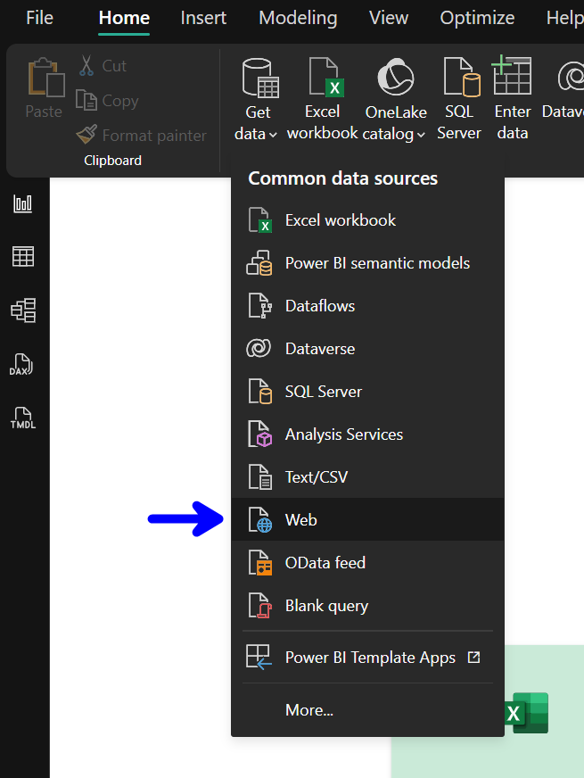
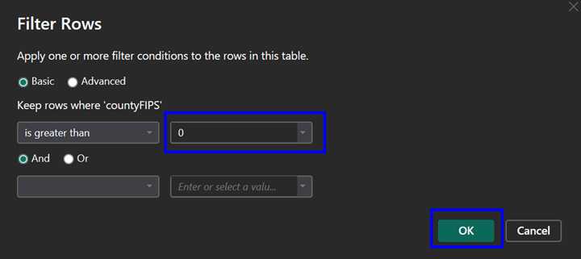
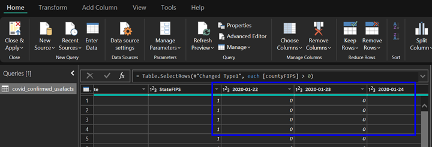
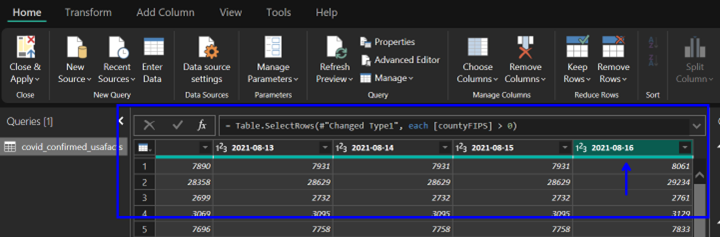

# Use Power BI Desktop to create a report on COVID-19 cases in the US

## Task List

- [Get data from web data source](#Get-data-from-web-data-source)
- [Transform and prepare data](#Transform-and-prepare-data)
- [Modify data formats and default aggregate functions](Modify-data-formats-and-default-aggregate-functions)
- [Create quick measures](Create-quick-measures)
- [Design main report page](Design-main-report-page)
- [Design drill through report page](Design-drill-through-report-page)
- [Review completed report](Review-completed-report)

### Get data from web data source

1. Open Power BI Desktop.  Click on the **Get Data** icon to create a new data set:

### Transform and prepare data

1. Open Power BI Desktop.
1. Type **sql** in the module search window and hit enter.  Drag and drop the **Import Data** module onto the experiment canvas:

1. The properties panel for the *Import Data* module should now be displayed on the right-hand side of the canvas.  Set the *Data source* to: **Azure SQL Database**

1. Continue to fill out the Azure SQL Database Properties using the values listed in the table:

    | Property | Value  |
    |------|------|
    |**Database server name**  | higheredu.database.windows.net|
    |**Database name**  | HigherED_DW|
    |**User name**  | utreader|
    |**Password**  | h00k'3mhornz|
    |**Accept any server certificate (insecure)**  | leave the box unchecked|
    |**Database query**  | SELECT * FROM MLInput.DropClass;|
    |**Use cached results**  | check the box|

    

1. Click on the **Save** icon at the bottom of the canvas to save the experiment.  Next, click on the **Run** icon at the bottom of the canvas and select **Run** to execute the modules included in the experiment.  

The *Experiment Properties* pane on the right-hand of the canvas should now show a *STATUS CODE* of **Running**:

### Modify data formats and default aggregate functions

### Create quick measures

### Design main report page

### Design drill through report page

### Review completed report

## *You have completed the Visual ML Classification workshop*

## [Back to Syllabus](readme.md)
