# Use Azure Machine Learning Studio to create, train, score and evaluate a model

## Task List

- [Create a Blank Experiment](#Create-a-Blank-Experiment)
- [Load Data from Azure SQL Server](#Load-Data-from-Azure-SQL-Server)
- [Transform and prepare data](#Transform-and-prepare-data)
- [Select classification algorithm](#Select-classification-algorithm)
- [Train model](#Train-model)
- [Score model](#Score-model)
- [Evaluate model](#Evaluate-model)

### Create a Blank Experiment

1. No experiments will exists when you first log into Azure Machine Learning Studio.  At the lower left hand corner click on the **+ NEW** icon to create a new experiment:
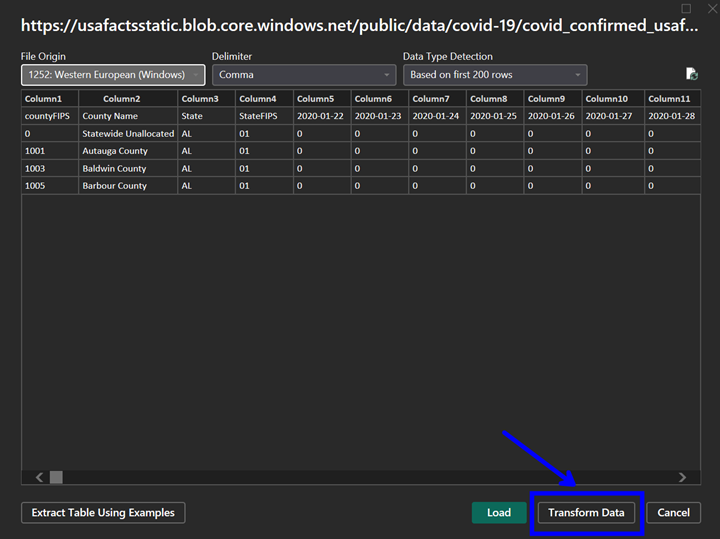
1. When creating a new experiment you can choose templates from the [Azure AI Gallery](https://gallery.azure.ai/), run through a guided *Experiment Tutorial* or create a *Blank Experiment*.  Click on **Blank Experiment**:
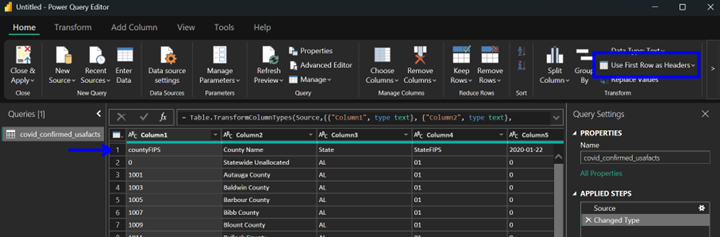
1. A new *blank experiment* should be created.  On the left-hand side is a catigorical grouping of the machine learning modules available, along with a search window in the upper left that can be used to filter the modules:

### Load Data from Azure SQL Server

1. Type **sql** in the module search window and hit enter.  Drag and drop the **Import Data** module onto the experiment canvas:

1. The properties panel for the *Import Data* module should now be displayed on the right-hand side of the canvas.  Set the *Data source* to: **Azure SQL Database**

1. Continue to fill out the Azure SQL Database Properties using the values listed in the table:

    | Property | Value  |
    |------|------|
    |**Database server name**  | higheredu.database.windows.net|
    |**Database name**  | HigherED_DW|
    |**User name**  | utreader|
    |**Password**  | h00k'3mhornz|
    |**Accept any server certificate (insecure)**  | leave the box unchecked|
    |**Database query**  | SELECT * FROM MLInput.DropClass;|
    |**Use cached results**  | check the box|

    

1. Click on the **Save** icon at the bottom of the canvas to save the experiment.  Next, click on the **Run** icon at the bottom of the canvas and select **Run** to execute the modules included in the experiment.  

The *Experiment Properties* pane on the right-hand of the canvas should now show a *STATUS CODE* of **Running**:

A *green checkmark* will be displayed on the right-hand side of the *Import Data* module if the SQL statement was successfully run against the Azure SQL Database:
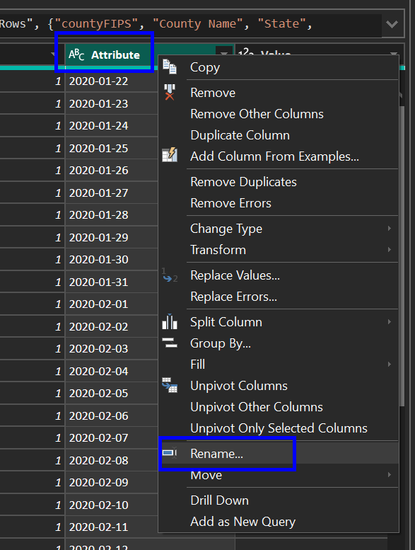
1. When building experiments modules can be connected to create a serialized execution pipeline.  Modules with **inputs** will have one or more *small circles* at the top of the module.  Modules with **outputs** will have one or more *small circles* at the bottom of the module.  Right-click on the *small circle* at the bottom of the *Import Data* module and select **Visualize**:

The *Results dataset* for the *Import Data* module should be displayed.  The visualization displays the number of rows and columns, sample data rows, descriptive statistics and attribute level distribution information:
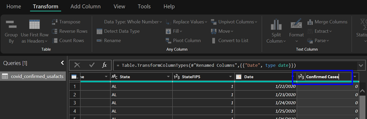

### Transform and prepare data

1. Type **select** in the module search window and hit enter.  Drag and drop the **Select Columns in Dataset** module onto the experiment canvas:
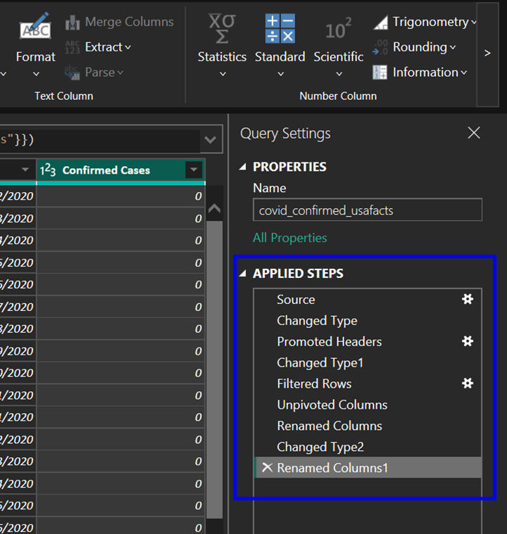
1. To create a machine learning pipeline, modules need to be connected.  To connect the output of the *Import Data* module to the input of the *Select Columns in Dataset* module, click and hold on the circle at the bottom of the *Import Data* module then drag the mouse currsor over the circle at the top of the *Select Columns in Dataset* module.  Release the mouse buttom to complete the connection:

1. The properties panel for the *Select Columns in Dataset* module should now be displayed on the right-hand side of the canvas.  Click on **Launch column selector**:
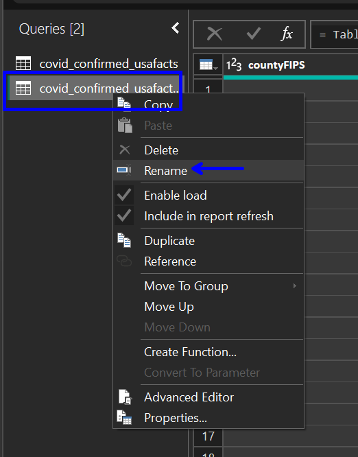
1. The *column selector* can be used to select specific columns from a data set *by name* or *by rules*.  Select **WITH RULES**, *Begin With* **NO COLUMNS** and create a rule to include the following columns: **Age, Class, CreditHours, Gender, MidTermGrade, Subject** and **Dropped**.  Click on the **checkmark** on the bottom right-hand side of the *column selector* to continue:
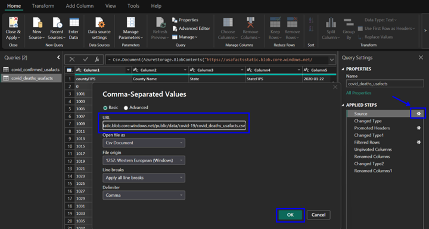
1. Click on the **Save** icon at the bottom of the canvas to save the experiment. Next, click on the **Run** icon at the bottom of the canvas and select **Run** to execute the modules included in the experiment.  Right-click on the **output** of the *Select Columns in Dataset* and select **Visualize** to review the dataset:

1. Type **meta** in the module search window and hit enter.  Drag and drop the **Edit Metadata** module onto the experiment canvas:
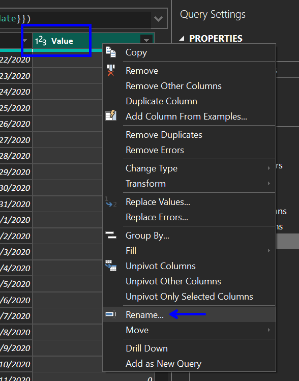
1. Connect the output from the *Select Columns in Dataset* module to the input for the *Edit Metadata* module.  The properties panel for the *Edit Metadata* module should now be displayed on the right-hand side of the canvas.  Click on **Launch column selector**:

1. Select **WITH RULES**, *Begin With* **NO COLUMNS** and create a rule to include *column type* **String**.  Create a rule to include the column **Dropped**.  Click on the **checkmark** on the bottom right-hand side of the *column selector* to continue:
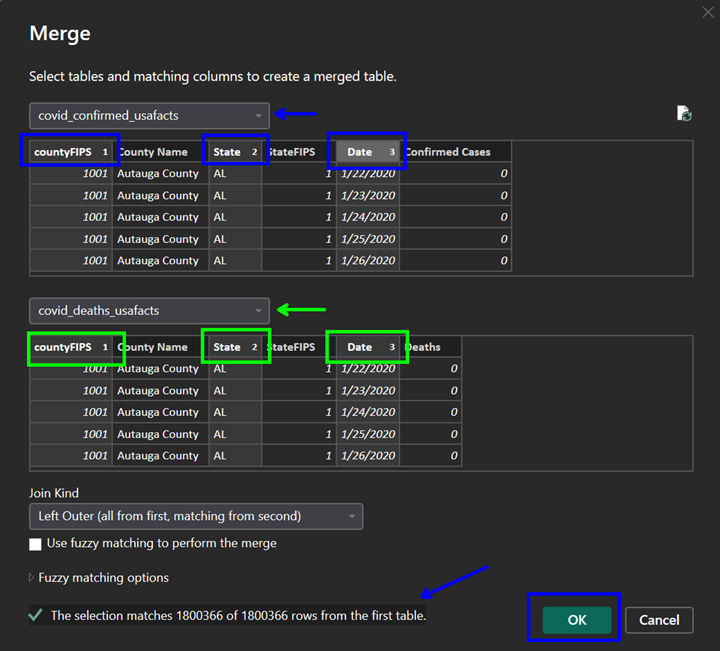
1. Continue to update the properties for th *Edit Metadata* module by setting *Catigorical* to **Make categorical**:

1. Type **normalize** in the module search window and hit enter.  Drag and drop the **Mormalize Data** module onto the experiment canvas:

1. Connect the output from the *Edit Metadata* module to the input for the *Normalize Data* module.  The properties panel for the *Normalize Data* module should now be displayed on the right-hand side of the canvas.  Leave the *Transformation method* set to the default of **ZScore**.  Click on **Launch column selector**:
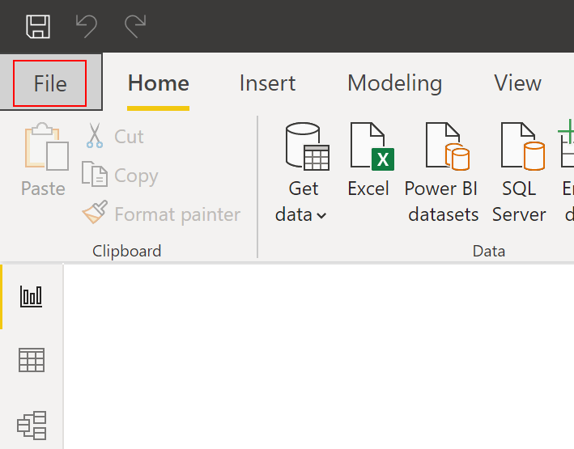
1. Select **WITH RULES**, *Begin With* **NO COLUMNS** and create a rule to include the column **Age**.  Click on the **checkmark** on the bottom right-hand side of the *column selector* to continue:

1. Type **split** in the module search window and hit enter.  Drag and drop the **Split Data** module onto the experiment canvas:
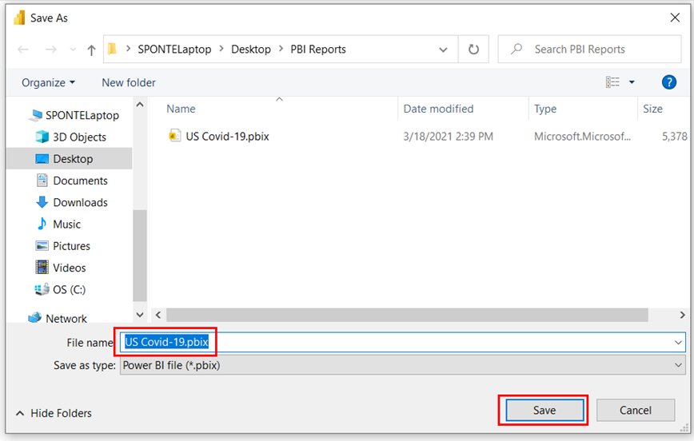
1. The *Split Data* module is used to split the dataset into a *training dataset* (70% of the rows) and a *testing dataset* (30% of the rows).  Connect the output from the *Normalize Data* module to the input for the *Split Data* module.  The properties panel for the *Split Data* module should now be displayed on the right-hand side of the canvas.  Set the *Fraction of rows in the first output dataset* property to **0.7**.  Set the *Random seed* property to some random number, like **1234**:

1. Click on the **Save** icon at the bottom of the canvas to save the experiment.  Next, click on the **Run** icon at the bottom of the canvas and select **Run** to execute the modules included in the experiment.  A *green checkmark* will be displayed on the right-hand side of each module if successfully run:

### Select classification algorithm

1. Selecting the best algorithm for a model is beyond the scope of this workshop.  The following documentation references provide a good description of some common trade offs when selecting algorithms:
    - [How to choose algorithms for Azure Machine Learning Studio](https://docs.microsoft.com/en-us/azure/machine-learning/studio/algorithm-choice)
    - [Machine learning algorithm cheat sheet for Azure Machine Learning Studio](https://docs.microsoft.com/en-us/azure/machine-learning/studio/algorithm-cheat-sheet)
1. In this workshop we are trying to predict if a student will drop a class prior to completion.  The model will need to predict whether **dropped** will be 1 or 0 for each row in the dataset. Type **two-class** in the module search window and hit enter.  Drag and drop the **Two-Class Logistic Regression** module onto the experiment canvas:
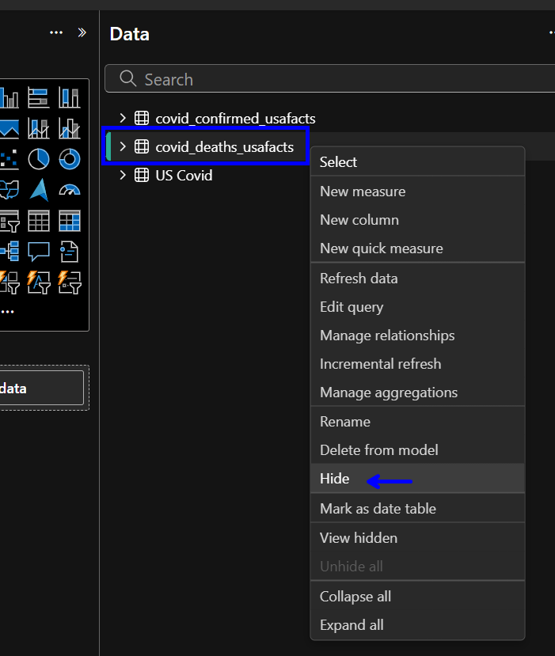

### Train model

1. Type **train model** in the module search window and hit enter.  Drag and drop the **Train Model** module onto the experiment canvas:
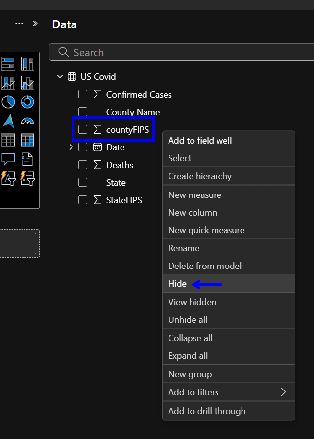
1. The *Train Model* module has an imput for the *algorithm* and an input for the *training dataset*.  Connect the output from the *Two-Class Logistic Regression* module to the left input for the *Train Model* module.  Connect the left output from the *Split Data* module to the right input for the *Train Model* module.  The properties panel for the *Train Model* module should now be displayed on the right-hand side of the canvas.  Click on **Launch column selector**:

1. Select **BY NAME** and add **Dropped** to the *SELECTED COLUMNS*.  Click on the **checkmark** on the bottom right-hand side of the *column selector* to continue:

### Score model

1. Type **score model** in the module search window and hit enter.  Drag and drop the **Score Model** module onto the experiment canvas:
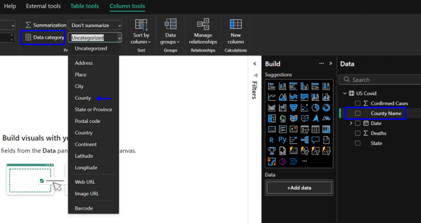
1. The *Score Model* module has an imput for the *trained model* and an input for the *testing dataset*.  Connect the output from the *Train Model* module to the left input for the *Score Model* module.  Connect the right output from the *Split Data* module to the right input for the *Score Model* module.

### Evaluate model

1. Type *evaluate model* in the module search window and hit enter.  Drag and drop the **Evaluate Model** module onto the experiment canvas:
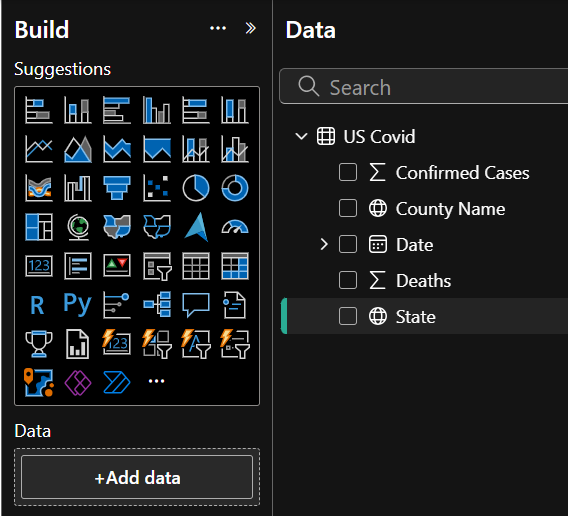
1. The *Evaluate Model* module has two imputs that can be used to compare two different scored models side-by-side.  Connect the output from the *Score Model* module to the left input for the *Evaluate Model* module.  Click on the **Save** icon at the bottom of the canvas to save the experiment.  Next, click on the **Run** icon at the bottom of the canvas and select **Run** to execute the modules included in the experiment.  

1. A *green checkmark* will be displayed on the right-hand side of each module if successfully run.  Right-click on the **output** of the *Score Model* module and select **Visualize** to review the dataset:
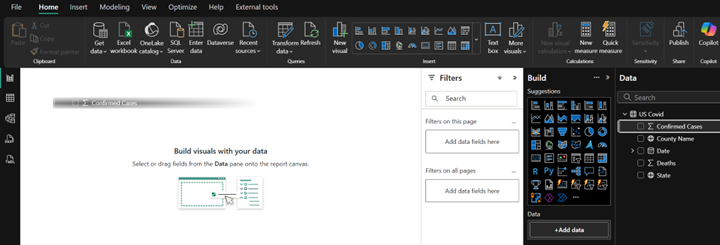
1. The output of the *Score Model* module should include a **Scored Label** and **Scored Probabilities** column.  The **Scored Label** is the predicted value for *dropped* and the **Scored Probabilities** is the probability of the *dropped* being true.
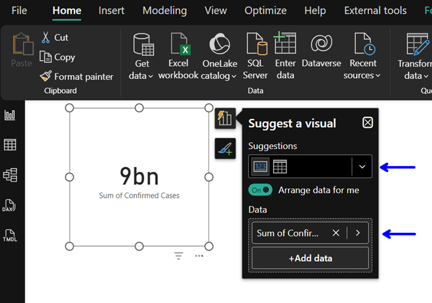
1. Right-click on the **output** of the *Evaluate Model* module and select **Visualize** to review the evaluation results:
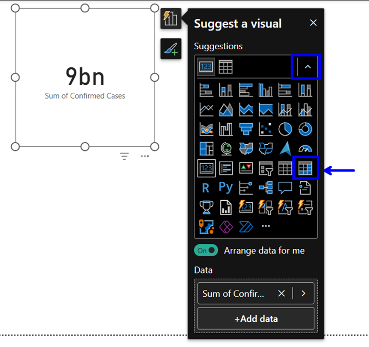
1. The **Acuracy** metric measures the goodness of a classification model as the proportion of true results to total cases.  **Accuracy** =  *(True Positive + True Negative) / Total Cases*.  Additional information on the metrics provided by the **Evaluate Model** module can be found here:  
    - [Evaluate Model Documentation](https://docs.microsoft.com/en-us/azure/machine-learning/studio-module-reference/evaluate-model)
    - [Using ROC plots and the AUC measure in Azure ML](https://blogs.msdn.microsoft.com/andreasderuiter/2015/02/09/using-roc-plots-and-the-auc-measure-in-azure-ml/)
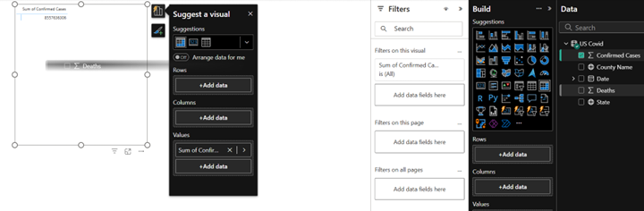

## *You have completed the Visual ML Classification workshop*

## [Back to Syllabus](readme.md)
