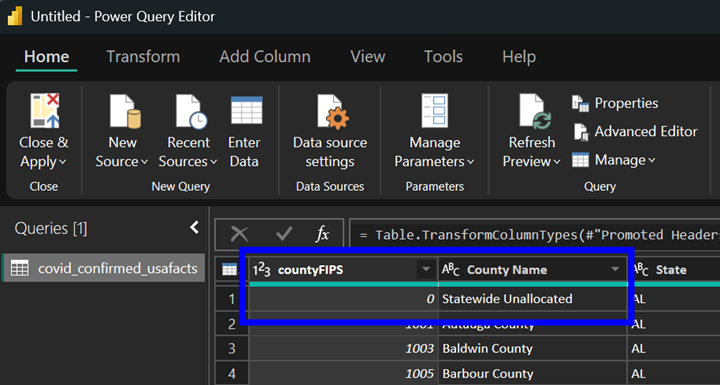

# Use Azure Machine Learning Studio to create, train, score and evaluate a model

## Task List

- [Create a Blank Experiment](#Create-a-Blank-Experiment)
- [Load Data from Azure SQL Server](#Load-Data-from-Azure-SQL-Server)

### Create a Blank Experiment

1. No experiments will exists when you first log into Azure Machine Learning Studio.  At the lower left hand corner click on the **+ NEW** icon to create a new experiment:

1. When creating a new experiment you can choose templates from the [Azure AI Gallery](https://gallery.azure.ai/), run through a guided *Experiment Tutorial* or create a *Blank Experiment*.  Click on **Blank Experiment**:

1. A new *blank experiment* should be created.  On the left-hand side is a catigorical grouping of the machine learning modules available, along with a search window in the upper left that can be used to filter the modules:

### Load Data from Azure SQL Server

1. Type **sql** in the module search window and hit enter.  Drag and drop the **Import Data** module onto the experiment canvas:

## *You have completed the Publish your Power BI report to the Power BI Service workshop*

## [Back to Syllabus](readme.md)
