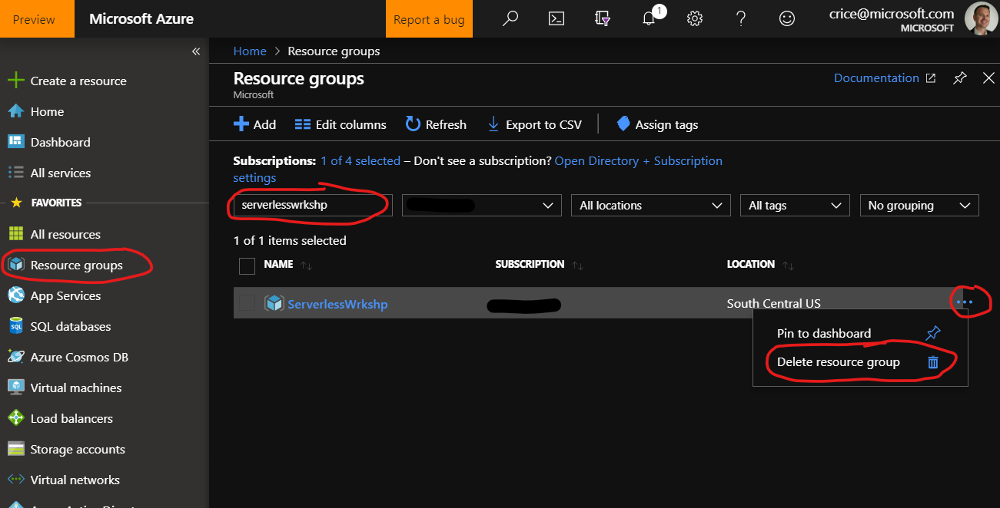

# Clean up your resources
If you created this workshop for a training tutorial and the resources that were generated no longer serve a purpose, be sure to clean up your resources to avoid future charges. You can clean up your resources quickly by deleting the resource group they were placed in.

1. From the Azure Portal, click on **Resource Groups** on the far-left navigation plane and search for the resource group that was created for the workshop (e.g. Serverlesswkrshp.) 

1. Next, click on the elipsis and choose **Delete Resource Group**.

    

1. Review the list of resources presented to ensure you are not inadvertently deleting a resource not belonging to this workshop. Next, type in the Resource Group Name in the text field and click on **Delete**

    

### [Back to Syllabus](./readme.md)