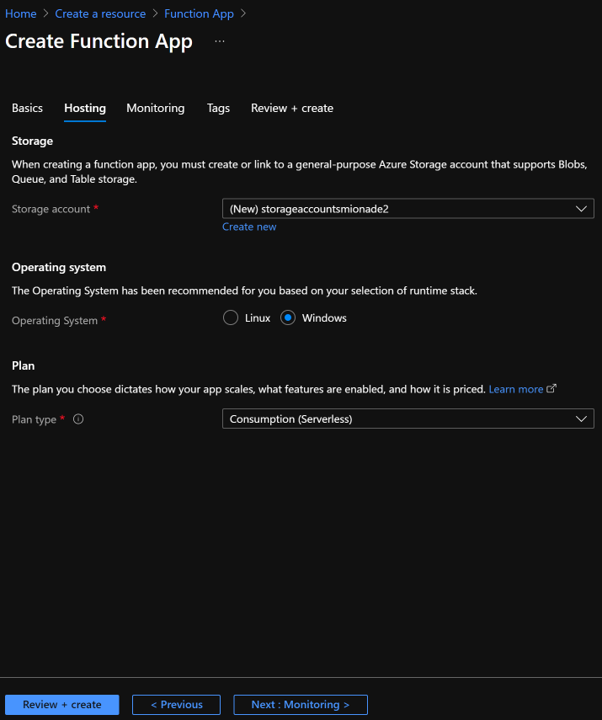
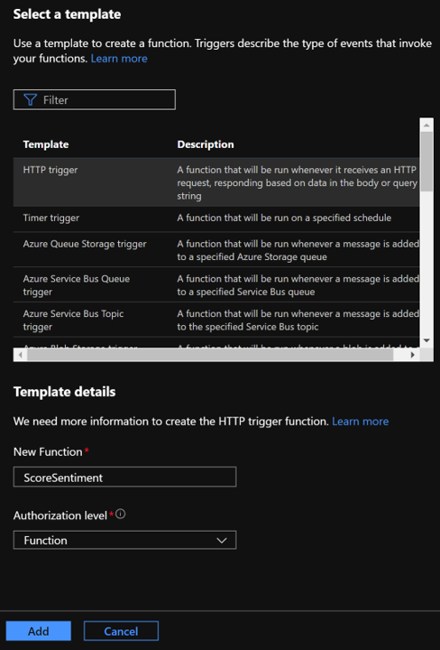

# Create a Function App
Functions provides a great way to offload processing tasks in a logic apps workflow. This tutorial uses an HTTP triggered function to process tweet sentiment scores from Cognitive Services and return a category value.


**Documentation: https://docs.microsoft.com/en-us/azure/azure-functions/**
### Prerequisite: [Create Cognitive Services Resources](./create-cognitive-services-resources.md)

## Tasks
- [Create the Function App](#Create-the-Function-App)
- [Create an HTTP triggered function](#Create-an-HTTP-triggered-function)


## Create the Function App
1. Click **Create a resource** in the upper left-hand corner of the Azure portal.
1. In the Search field, type in "Function" and choose "Function App"  

1. Click the **Create** button and fill out the resource creation form

    | Setting      |  Suggested value   | Description                                        |
    | --- | --- | --- |
    | **Name** | Your function name | Choose a globally unique name. |
    | **Subscription** | Your Subscription | The subscription associated with your account |
    | **Resource group** | ServerlessWkrshp | Use the same resource group for all services in this tutorial.|
    | **OS** | Windows | Choose Windows for .Net code.|
    | **Hosting Plan** | Consumption | Choose consumption to pay for only what you use.|
    | **Location** | South Central US | Use the location nearest you. |
    | **Runtime Stack** | .NET | Choose .NET for this tutorial.|
    | **Version** | 3.1 | Choose 3.1 for this tutorial.|
    | **Storage Account** | Create New | Create a new storage account for this function|

1. Click **Create** to create your resource. 




## Create an HTTP triggered function  

1. Expand your function app and click the **+ Add** button next to **Functions**. If this is the first function in your function app, select **Develop in portal**.

    

1. Next, select **HTTP trigger** and click **Add**. 

    

1. Click **Code + Test** and replace the contents of the `run.csx` file with the following code, then click **Save**:

    ```csharp
    #r "Newtonsoft.Json"
    
    using System;
    using System.Net;
    using Microsoft.AspNetCore.Mvc;
    using Microsoft.Extensions.Logging;
    using Microsoft.Extensions.Primitives;
    using Newtonsoft.Json;
    
    public static async Task<IActionResult> Run(HttpRequest req, ILogger log)
    {
        string category = "GREEN";
    
        string requestBody = await new StreamReader(req.Body).ReadToEndAsync();
        log.LogInformation(string.Format("The sentiment score received is '{0}'.", requestBody));
    
        string sentiment = requestBody;
    
        if(string.Equals(sentiment, "negative", StringComparison.CurrentCultureIgnoreCase))
        {
            category = "RED";
        }
        else if (string.Equals(sentiment, "neutral", StringComparison.CurrentCultureIgnoreCase) || string.Equals(sentiment, "mixed", StringComparison.CurrentCultureIgnoreCase)) 
        {
            category = "YELLOW";
        }
    
        return requestBody != null
            ? (ActionResult)new OkObjectResult(category)
            : new BadRequestObjectResult("Please pass a value on the query string or in the request body");
    }
    ```
    This function code returns a color category based on the sentiment score received in the request. 

1. To test the function, click **Test/Run** in the code editor toolbar to expand the Test tab. Type a value of `Negative` for the **Body**, and then click **Run**. A value of **RED** is returned in the body of the response. 

    

    

Now you have a function that categorizes sentiment scores. Next, you create a logic app that integrates your function with your Twitter and Cognitive Services API.

<br>

### Next: [Create a Logic App](./create-a-logic-app.md) ###
#### Previous: [Create Cognitive Services Resources](./create-cognitive-services-resources.md) ####
