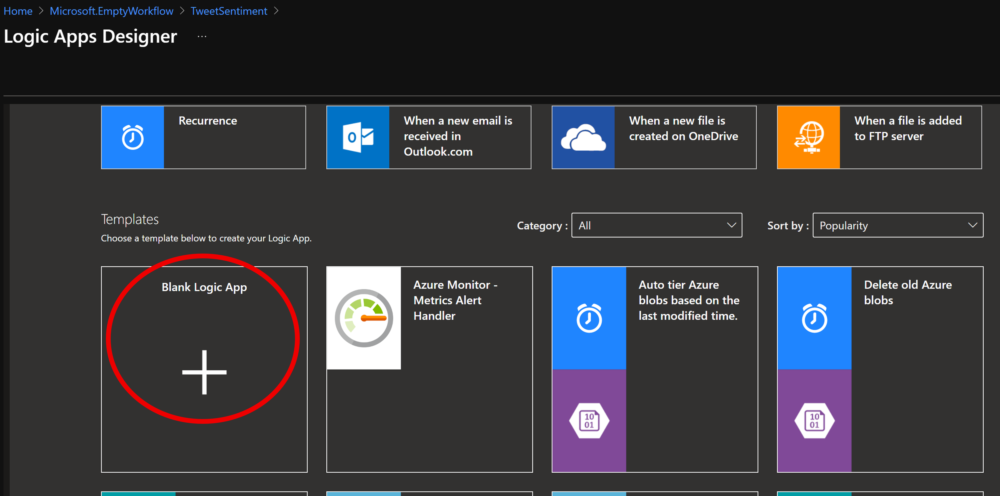
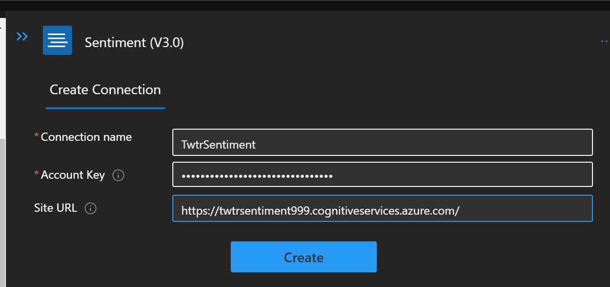

# Create a Logic App
Azure Logic Apps simplifies how you build automated scalable workflows that integrate apps and data across cloud services and on-premises systems. Learn how to create, design, and deploy logic apps that automate business processes with our quickstarts, tutorials, templates, and APIs.  
**Documentation: https://docs.microsoft.com/en-us/azure/logic-apps/**
### Prerequisite: [Create a Function App](./create-a-function-app.md) ###

## Tasks
- [Create the Logic App](#Create-the-Logic-App)
- [Connect to Twitter](#Connect-to-Twitter)
- [Initialize and Set Variables](#Initialize-and-Set-Variables)
- [Detect Tweet Language](#Detect-Tweet-Language)
- [Detect Sentiment](#Detect-Sentiment)
- [Connect sentiment output to your function](#Connect-sentiment-output-to-your-function)
- [Translate Tweet](#Translate-Tweet)
- [Email Tweet](#Email-Tweet)
- [Create a Profanity Filter](#Create-a-Profanity-Filter)
- [Retweet](#Retweet)


## Create the Logic App

1. In the Azure portal, click the **New** button found on the upper left-hand corner of the Azure portal.

2. Click **Web** > **Logic App**.
 
3. Then, type a value for **Name** like `TweetSentiment`, and use the settings as specified in the table.

    

    | Setting      |  Suggested value   | Description                                        |
    | ----------------- | ------------ | ------------- |
    | **Name** | TweetSentiment | Choose an appropriate name for your app. |
    | **Resource group** | ServerlessWkrshp | Choose the same existing resource group as before. |
    | **Location** | South Central US | Choose a location close to you. |    

4. Once you have entered the proper settings values, click **Create** to create your logic app. 

5. After the app is created, click your new logic app pinned to the dashboard. Then in the Logic Apps Designer, scroll down and click the **Blank Logic App** template. 

    

You can now use the Logic Apps Designer to add services and triggers to your app.

## Connect to Twitter
#### [Back to top](#Tasks)
First, create a connection to your Twitter account. The logic app polls for tweets, which trigger the app to run.

1. In the designer, click the **Twitter** service, and click the **When a new tweet is posted** trigger. Sign in to your Twitter account and authorize Logic Apps to use your account.

2. Use the Twitter trigger settings as specified in the table. 

    

    | Setting      |  Suggested value   | Description                                        |
    | ----------------- | ------------ | ------------- |
    | **Search text** | #Azure | Use a hashtag that is popular enough to generate new tweets in the chosen interval. When using the Free tier and your hashtag is too popular, you can quickly use up the transaction quota in your Cognitive Services API. |
    | **Interval** | 15 | The time elapsed between Twitter requests, in frequency units. |
    | **Frequency** | Minute | The frequency unit used for polling Twitter.  |

3.  Click  **Save** to connect to your Twitter account. 

Now your app is connected to Twitter. Next, you connect to text analytics to detect the sentiment of collected tweets.

## Initialize and Set Variables
#### [Back to top](#Tasks)

1. Click **New Step**, and then **Add an action**.

1. In **Choose an action**, type **Variables**, and then click the **Initialize Variable** action.

    

1. Set the **Name** and **Type** to the appropriate values, leave **Value** blank
    
    | Setting      |  Suggested value   | Description                                        |
    | ----------------- | ------------ | ------------- |
    | **Name** | tweet_text | The variable name to reference later. |
    | **Type** | String | The variable Type. |

1. Click **New Step**, and then **Add an action**.

1. In **Choose an action**, type **Variables**, and then click the **Initialize Variable** action.

    

1. Set the **Name** and **Type** to the appropriate values, leave **Value** blank

    | Setting      |  Suggested value   | Description                                        |
    | ----------------- | ------------ | ------------- |
    | **Name** | translated_text | The variable name to reference later. |
    | **Type** | String | The variable Type. |

    

1. Click **New Step**, and then **Add an action**.

1. In **Choose an action**, type **Variables**, and then click the **Set Variable** action.

    

1. Set the **Name** to *tweet_text*, Click on the **Value** textfield and choose *Tweet Text* rom the **Dynamic Content** pop-up.
    
    

## Detect Tweet Language
#### [Back to top](#Tasks)

1. Click **New Step**, and then **Add an action**.

1. In **Choose an action**, type **Translator**, and then click the **Detect Langauge** action.
   
    

1. Enter *TwtrTranslator* for **Connection Name** and the value of **Key1** of your translator resource, then hit **Create** to create the API connection to your resource.
 
    

1. Click inside of the **Text** field, and choose **tweet_text** from the **Dynamic Content** pop-up.

    

## Detect Sentiment
#### [Back to top](#Tasks)

1. Click **New Step**, and then **Add an action**.

1. In **Choose an action**, type **Text Analytics**, and then click the **Detect sentiment (preview)** action.

    

1. Type a connection name such as `TwtrSentiment`, paste the key for your Cognitive Services API and the Cognitive Services endpoint you set aside in a text editor, and click **Create**.

    

1. Click in the **Add new parameter** field and choose *Text*
    
    

1. Click in the **Text** field and choose *tweet_text* from the  **Dynamic Content** pop-up.

    

1. Click in the **Add new parameter** field and choose *Language*

    

1. Click in the **Language** field, scroll down and choose *Enter custom value*.

    

1. Next, choose **Language Code** from the **Dynamic Content** pop-up and enter **tweet_text** in the text box and then click on **New Step**.

    


Now that sentiment detection is configured, you can add a connection to your function that consumes the sentiment score output.

## Connect sentiment output to your function
#### [Back to top](#Tasks)
1. In the Logic Apps Designer, click **New step** > **Add an action**, filter on **Azure Functions** and click **Choose an Azure function**.

    
  
4. Select the function app you created earlier.

    

5. Select the function you created for this tutorial.

    

4. In **Request Body**, click **Score** and then **Save**.

    

Now, your function is triggered when a sentiment score is sent from the logic app. A color-coded category is returned to the logic app by the function. Next, you add an email notification that is sent when a sentiment value of **RED** is returned from the function. 


## Translate tweet
#### [Back to top](#Tasks)
The last part of the workflow is to trigger an email when the sentiment is scored as _RED_ and post a tweet when the sentiment is scored as _GREEN_. This topic uses an Outlook.com connector. You can perform similar steps to use a Gmail or Office 365 Outlook connector. We will also translate the tweet to English when emailing and add a profanity filter when tweeting. 

1. In the Logic Apps Designer, click **New step** > **Add a condition**. 

    

2. Click **Choose a value**, then click **Body**. Select **is equal to**, click **Choose a value** and type `RED`, and click **Save**. 

        

1. In **IF TRUE**, click **Add an action**, search for `Condition` and click on the **Condition** action.

        

1. In the **Choose a value** field, select **Language Code** from the **Dynamic Content** pop-up. 

    

1. In nested **IF TRUE**, click **Add an action**, search for `Translate` and click on the **Translate text (preview)** action. 

    

1. Set the **Target Language** to *English* and the **Text** field to *tweet_text* from the **Dynamic Content** pop-up.

    

1.  Click **Add an action**, search for `Variables` and click on the **Set Variable** action.

    

1. Set the **Name** to *translated_tweet*, Click on the **Value** textfield and choose *Translated Text* rom the **Dynamic Content** pop-up.

    

## Email Tweet
#### [Back to top](#Tasks)

1. Click the **Add an action** in the _PARENT_ conditional loop

    

1. Search for *Outlook* and click on **Office 365 Outlook**, then **Send an Email** 
    
    

1. Click on **Sign In** and proceed to sign in to create a connector using your Work/School account.

1. Add yourself to the **To** line

1. Set the **Subject** to *Negative #hookem  Tweet by:* followed by the *Tweeted by* value from the **Dynhamic Content** pop-up.
   
   

1. In the **Body**, add the following content from the **Dynamic Content** pop-up:

    | Content      |  Source   |
    | ----------------- | ------------ |
    | **translated_tweet** | Variables |
    | **tweet_text** | Variables  |
    | **Language Name** | Detect Language |
    | **Location** | When a new tweet is posted |
    | **Created at** | When a new tweet is posted |
    
    *You copy and paste the code below into the Body to append labels in front of variables*  
    ```ruby
        @{variables('translated_tweet')}
        Tweet: @{variables('tweet_text')}
        Language: @{body('Detect_language')?['Name']}
        Location: @{triggerBody()?['UserDetails']?['Location']}
        Date: @{triggerBody()?['CreatedAtIso']} 
    ```


    

## Create a Profanity Filter
#### [Back to top](#Tasks)

1. In the parent **IF FALSE** condition, click **Add an action**

    

1. Search for *profanity* and choose **Detect profanity and match against custom and shared blacklists (preview)**

    

1. Enter in the appropriate resource values
Now that the workflow is complete, you can enable the logic app and see the function at work, then click **Create**.

    | Name      |  Description   |
    | ----------------- | ------------ |
    | **Connection Name** | The Name of your Content Moderator resource |
    | **API Key** | Your Content Moderator API Key  |
    | **Site URL** | The regional cognitive services URL (*South Cental US:* https://southcentralus.api.cognitive.microsoft.com, *West US:* https://westus.api.cognitive.microsoft.com) |

      

1. Select *text/plain* for **Content Type**, click in the **Text Content** field and choose **See more** under **Variables** in the **Dynamic Content** pop-up.  
    
      

1. Next, choose *tweet_text* from the **Dynamic Content** pop-up.
    
      

1. Click **Add an action** under the profanity detector action, search for "condition" and choose the "Condition" action.
    
      

1. In the **Condition** action, click in the **Chose a value** field and choose **Detected Profanity Terms** from the **Dynamic Content** pop-up.
    
      

1. Set the **Choose a value** field to *null*
    
    


## Retweet
#### [Back to top](#Tasks)
1. In the child **IF TRUE** condition, select **Add an action**, search for **Twitter** and select **Post a Tweet**

     

1. Click on the **Search or filter parameters...** field and choose **Tweet text**

     

1. Click in the **Tweet Text** field and choose **tweet_text** from the **Dynamic Content** pop-up.

     

1. Click **Save**.

<br>

### Next: [Test the Workflow](./test-the-workflow.md) ###
#### Previous: [Create a Function App](./create-a-function-app.md) ####