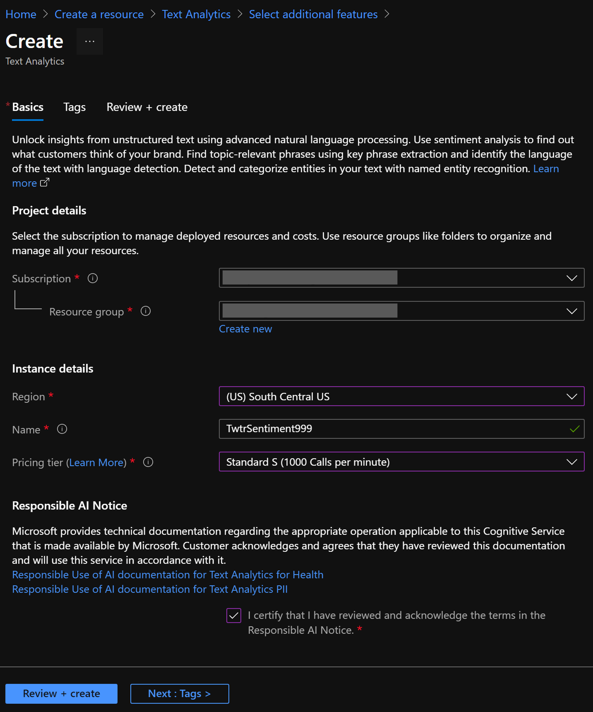

# Create Cognitive Services resources

The Cognitive Services APIs are available in Azure as individual resources. Use the Text Analytics API to detect the sentiment, Microsoft Translator to translate, and Content Modreator to detect profanity of the tweets being monitored. 

**Documentation: https://docs.microsoft.com/en-us/azure/cognitive-services/**
### Prerequisite: [Syllabus](./readme.md)

## Tasks
- [Create a Sentiment Analysis resource](#Create-a-Sentiment-Analysis-resource)
- [Create a Microsoft Translator resource](#Create-a-Microsoft-Translator-resource)
- [Create a Content Moderation resource](#Create-a-Content-Moderation-resource)

## Create a Sentiment Analysis resource

1. Sign in to the [Azure portal](https://portal.azure.com/).
1. Click **Create a resource** in the upper left-hand corner of the Azure portal.
1. In the Search field, type in "Text Analytics" and choose "Text Analytics"  

1. Click the **Create** button and fill out the resource creation form

    | Setting      |  Suggested value   | Description                                        |
    | --- | --- | --- |
    | **Name** | TwtrSentiment | Choose a unique account name. |
    | **Location** | South Central US | Use the location nearest you. |
    | **Pricing tier** | F0 | Start with the lowest tier. If you run out of calls, scale to a higher tier.|
    | **Resource group** | ServerlessWrkshp | Use the same resource group for all services in this tutorial.|

    >**NOTE:** If you are prompted to select additional features, click the "Skip this step" button
    
    >**NOTE:** You may receive an error message indicating that "Sub domain name 'YourName' is already used." In this case, choose another name for your Text Analytics resource

1. Click **Create** to create your resource.  

1. From your Resource Group, go to your Sentiment Analysis resource and make note of the **KEY 1** and **Endpoint** value.

## Create a Microsoft Translator resource
1. Click **Create a resource** in the upper left-hand corner of the Azure portal.
1. In the Search field, type in "Translator" and choose "Translator"  

1. Click the **Create** button and fill out the resource creation form

    | Setting      |  Suggested value   | Description                                        |
    | --- | --- | --- |
    | **Name** | TwtrTranslator | Choose a unique account name. |
    | **Subscription** | Your Subscription | The subscription associated with your account |
    | **Pricing tier** | F0 | Start with the lowest tier. If you run out of calls, scale to a higher tier.|
    | **Resource group** | ServerlessWrkshp | Use the same resource group for all services in this tutorial.|
    
1. Click **Create** to create your resource.  

1. From your Resource Group, go to your Translator resource and make note of the **KEY 1** value.

## Create a Content Moderation resource
1. Click **Create a resource** in the upper left-hand corner of the Azure portal.
1. In the Search field, type in "Content" and choose "Content Moderator"  

1. Click the **Create** button and fill out the resource creation form

    | Setting      |  Suggested value   | Description                                        |
    | --- | --- | --- |
    | **Name** | TwtrModerator | Choose a unique account name. |
    | **Subscription** | Your Subscription | The subscription associated with your account |
    | **Location** | South Central US | Use the location nearest you. |
    | **Pricing tier** | S0 | S0 allows for up to 10 calls per second|
    | **Resource group** | ServerlessWrkshp | Use the same resource group for all services in this tutorial.|
    
1. Click **Create** to create your resource.  

1. From your Resource Group, go to your Content Moderator resource and make note of the **KEY 1** value.
  

 

### Next: [Create a Function App](./create-a-function-app.md) ###
#### Previous: [Syllabus](./readme.md) ####
