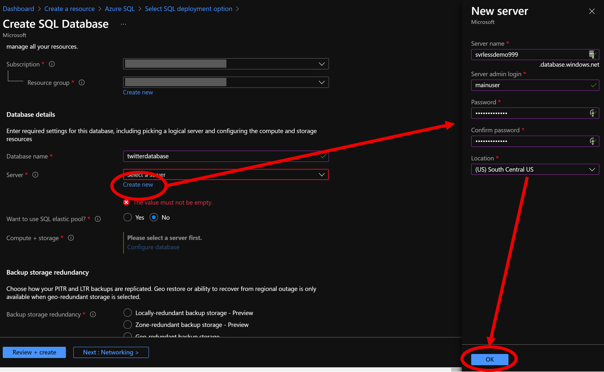
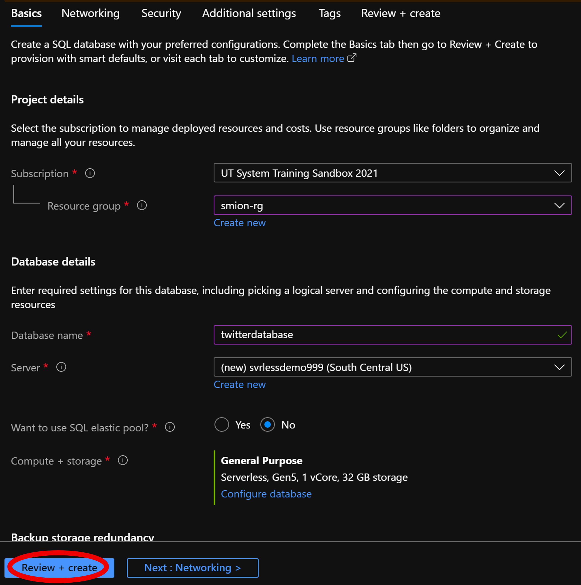

# Create SQL Serverless Database resources

Azure SQL Database serverless (preview) is a compute tier for single databases that automatically scales compute based on workload demand and bills for the amount of compute used per second. The serverless compute tier also automatically pauses databases during inactive periods when only storage is billed and automatically resumes databases when activity returns.

 **Documentation: https://docs.microsoft.com/en-us/azure/sql-database/sql-database-serverless**
### Prerequisite: [Syllabus](./readme.md)

## Create an Azure SQL Database

1. Sign in to the [Azure portal](https://portal.azure.com/).
1. Click **Create a resource** in the upper left-hand corner of the Azure portal.
1. In the Search field, type in "Azure SQL" and choose "Azure SQL"  

1. The following options will be presented, select **Single Database**
  
1. Click the **Create** button and fill out the resource creation form

    | Setting      |  Suggested value   | Description                                        |
    | --- | --- | --- |
    | **Resource group** | ServerlessWkrshp | Use the same resource group for all services in this tutorial.|
    | **Name** | twitterdatabase | Enter the name of the database. |
    | **Server** | svrlessdemo | Enter a unique name for the server. |
    | **Server Admin Login** | mainuser | This is the main user name.|
    | **Location** | South Central US | Use the location nearest you. |
    | **Pricing tier** | F0 | Start with the lowest tier. If you run out of calls, scale to a higher tier.|
    | **Resource group** | ServerlessWkrshp | Use the same resource group for all services in this tutorial.|

1. Configure database

1. Select serverless and click apply

1. Select Review and Create

