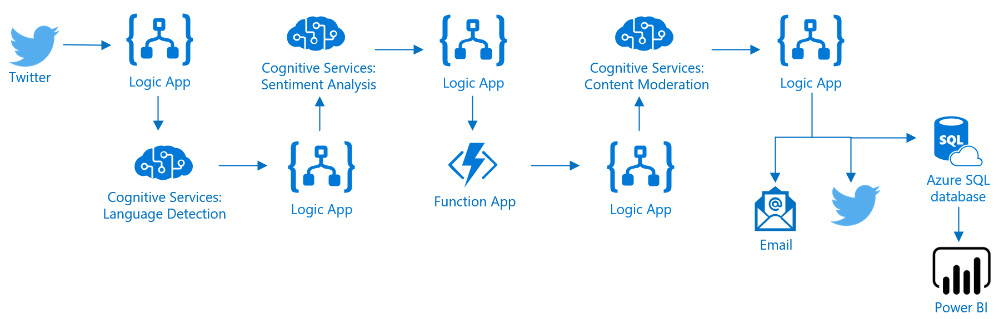

# Azure Serverless Workshop
**Function Apps, Logic Apps, and Cognitive Services**

Azure Functions integrates with Azure Logic Apps in the Logic Apps Designer. This integration lets you use the computing power of Functions in orchestrations with other Azure and third-party services. 

This tutorial shows you how to use Functions with Logic Apps and Cognitive Services on Azure to run sentiment analysis, language detection, translation, and a profanity filter on Twitter tweets.   

An HTTP triggered function categorizes tweets as green, yellow, or red based on the sentiment score. An email is sent that includes the original tweet and a translation if applicable when poor sentiment is detected. The tweet is retweeted if it has positive sentiment and profanity is not detected. 

In this tutorial, you learn how to:

> * Create a Cognitive Services API Resource.
> * Create a function that categorizes tweet sentiment.
> * Create a logic app that connects to Twitter.
> * Add sentiment detection, language detection, and content moderation to the logic app.
> * Translate text in the logic app
> * Connect the logic app to the function.
> * Send an email & retweet based on the response from the function.

## Prerequisites

+ An active [Twitter](https://twitter.com/) account. 
+ An [Outlook.com](https://outlook.com/) or [Office 365 Outlook](https://outlook.office.com) for account (for sending notifications).

## Syllabus
- [Create Cognitive Services Resources](./create-cognitive-services-resources.md)
- [Create a Function App](./create-a-function-app.md)
- [Create a Logic App](./create-a-logic-app.md)
- [Test the Workflow](./test-the-workflow.md)
- [Create Serverless SQL Database](./sql-database-access.md)
- [Access your SQL Database](./sql-database-access.md)
- [Clean up](./clean-up.md)
