# Create a function that integrates with Azure Logic Apps

Azure Functions integrates with Azure Logic Apps in the Logic Apps Designer. This integration lets you use the computing power of Functions in orchestrations with other Azure and third-party services. 

This tutorial shows you how to use Functions with Logic Apps and Cognitive Services on Azure to run sentiment analysis from Twitter posts. An HTTP triggered function categorizes tweets as green, yellow, or red based on the sentiment score. An email is sent when poor sentiment is detected. 


In this tutorial, you learn how to:

> * Create a Cognitive Services API Resource.
> * Create a function that categorizes tweet sentiment.
> * Create a logic app that connects to Twitter.
> * Add sentiment detection to the logic app. 
> * Add language detection to the logic app.
> * Add content moderation to the logic app.
> * Translate text in the logic app
> * Connect the logic app to the function.
> * Send an email & retweet based on the response from the function.

## Prerequisites

+ An active [Twitter](https://twitter.com/) account. 
+ An [Outlook.com](https://outlook.com/) or [Office 365 Outlook](https://outlook.office.com) for account (for sending notifications).

If you haven't already done so, complete these steps now to create your function app.

## Create a Cognitive Services resource

The Cognitive Services APIs are available in Azure as individual resources. Use the Text Analytics API to detect the sentiment of the tweets being monitored.

1. Sign in to the [Azure portal](https://portal.azure.com/).
1. Click **Create a resource** in the upper left-hand corner of the Azure portal.
1. In the Search field, type in "Text Analytics" and choose "Text Analytics"  

1. Click the **Create** button and fill out the resource creation form
    | Setting      |  Suggested value   | Description                                        |
    | --- | --- | --- |
    | **Name** | TwtrSentiment | Choose a unique account name. |
    | **Location** | South Central US | Use the location nearest you. |
    | **Pricing tier** | F0 | Start with the lowest tier. If you run out of calls, scale to a higher tier.|
    | **Resource group** | ServerlessWkrshp | Use the same resource group for all services in this tutorial.|
1. Click **Create** to create your resource.  

1. From your Resource Group, go to your Sentiment Analysis resource and make note of the **Key1** and **Endpoint** value.
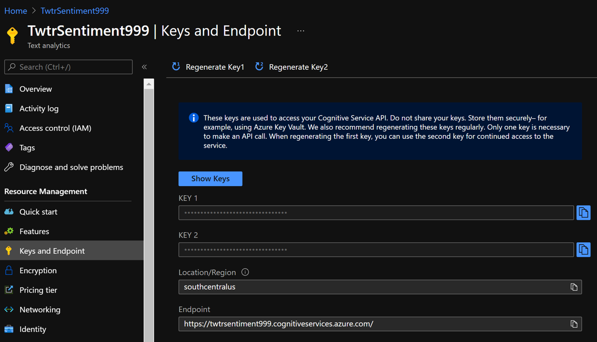

## Create a Microsoft Translator resource
1. Click **Create a resource** in the upper left-hand corner of the Azure portal.
1. In the Search field, type in "Translator" and choose "Text Translator"  

1. Click the **Create** button and fill out the resource creation form
    | Setting      |  Suggested value   | Description                                        |
    | --- | --- | --- |
    | **Name** | TwtrTranslator | Choose a unique account name. |
    | **Subscription** | Your Subscription | The subscription associated with your account |
    | **Pricing tier** | F0 | Start with the lowest tier. If you run out of calls, scale to a higher tier.|
    | **Resource group** | ServerlessWkrshp | Use the same resource group for all services in this tutorial.|
1. Click **Create** to create your resource.  

1. From your Resource Group, go to your Translator resource and make note of the **Key1** value.


## Create a Content Moderation resource
1. Click **Create a resource** in the upper left-hand corner of the Azure portal.
1. In the Search field, type in "Content" and choose "Content Moderator"  

1. Click the **Create** button and fill out the resource creation form
    | Setting      |  Suggested value   | Description                                        |
    | --- | --- | --- |
    | **Name** | TwtrModerator | Choose a unique account name. |
    | **Subscription** | Your Subscription | The subscription associated with your account |
    | **Location** | South Central US | Use the location nearest you. |
    | **Pricing tier** | S0 | S0 allows for up to 10 calls per second|
    | **Resource group** | ServerlessWkrshp | Use the same resource group for all services in this tutorial.|
1. Click **Create** to create your resource.  
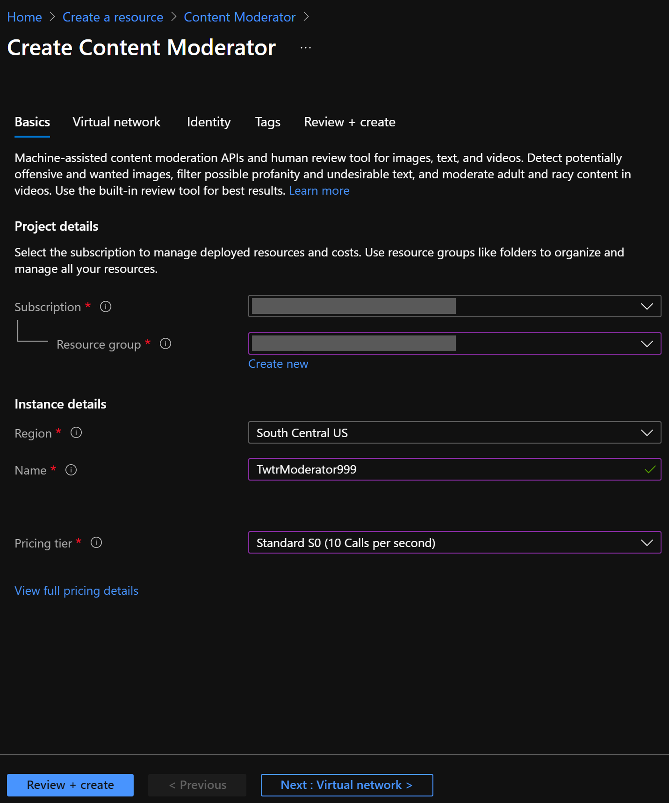
1. From your Resource Group, go to your Content Moderator resource and make note of the **Key1** value.


## Create the function app


Functions provides a great way to offload processing tasks in a logic apps workflow. This tutorial uses an HTTP triggered function to process tweet sentiment scores from Cognitive Services and return a category value.  

1. Click **Create a resource** in the upper left-hand corner of the Azure portal.
1. In the Search field, type in "Function" and choose "Function App"  
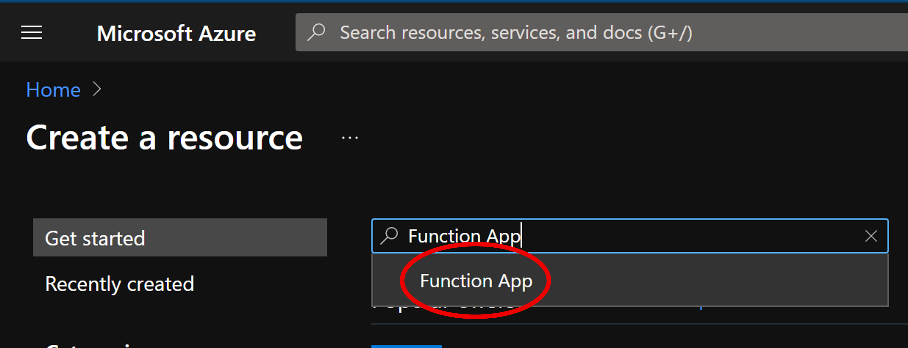
1. Click the **Create** button and fill out the resource creation form
    | Setting      |  Suggested value   | Description                                        |
    | --- | --- | --- |
    | **Name** | Your function name | Choose a globally unique name. |
    | **Subscription** | Your Subscription | The subscription associated with your account |
    | **Resource group** | ServerlessWkrshp | Use the same resource group for all services in this tutorial.|
    | **OS** | Windows | Choose Windows for .Net code.|
    | **Hosting Plan** | Consumption | Choose consumption to pay for only what you use.|
    | **Location** | South Central US | Use the location nearest you. |
    | **Runtime Stack** | .Net Core | Choose .Net Core for this tutorial.|
    | **Storage Account** | Create New | Create a new storage account for this function|

1. Click **Create** to create your resource.  
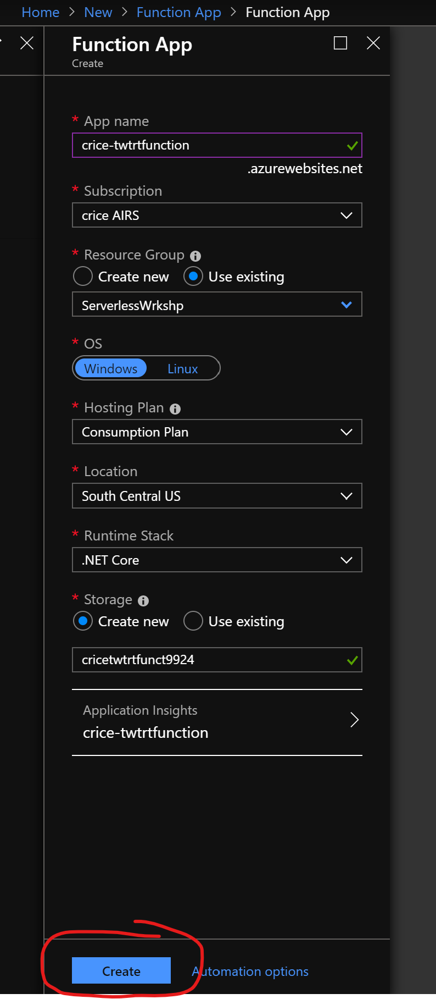]

## Create an HTTP triggered function  

1. Expand your function app and click the **+** button next to **Functions**. If this is the first function in your function app, select **In-portal**.

    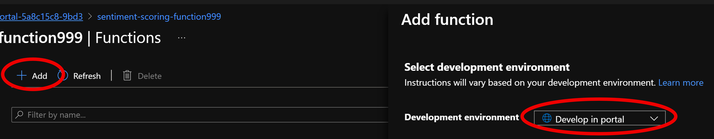

2. Next, select **Webhook + API** and click **Create**. 

    

3. Replace the contents of the `run.csx` file with the following code, then click **Save**:

    ```csharp
    #r "Newtonsoft.Json"
    
    using System;
    using System.Net;
    using Microsoft.AspNetCore.Mvc;
    using Microsoft.Extensions.Logging;
    using Microsoft.Extensions.Primitives;
    using Newtonsoft.Json;
    
    public static async Task<IActionResult> Run(HttpRequest req, ILogger log)
    {
        string category = "GREEN";
    
        string requestBody = await new StreamReader(req.Body).ReadToEndAsync();
        log.LogInformation(string.Format("The sentiment score received is '{0}'.", requestBody));
    
        double score = Convert.ToDouble(requestBody);
    
        if(score < .5)
        {
            category = "RED";
        }
        else if (score < .6) 
        {
            category = "YELLOW";
        }
    
        return requestBody != null
            ? (ActionResult)new OkObjectResult(category)
            : new BadRequestObjectResult("Please pass a value on the query string or in the request body");
    }
    ```
    This function code returns a color category based on the sentiment score received in the request. 

4. To test the function, click **Test** at the far right to expand the Test tab. Type a value of `0.2` for the **Request body**, and then click **Run**. A value of **RED** is returned in the body of the response. 

    

Now you have a function that categorizes sentiment scores. Next, you create a logic app that integrates your function with your Twitter and Cognitive Services API. 

## Create a logic app   

1. In the Azure portal, click the **New** button found on the upper left-hand corner of the Azure portal.

2. Click **Web** > **Logic App**.
 
3. Then, type a value for **Name** like `TweetSentiment`, and use the settings as specified in the table.

    

    | Setting      |  Suggested value   | Description                                        |
    | ----------------- | ------------ | ------------- |
    | **Name** | TweetSentiment | Choose an appropriate name for your app. |
    | **Resource group** | ServerlessWkrshp | Choose the same existing resource group as before. |
    | **Location** | South Central US | Choose a location close to you. |    

4. Once you have entered the proper settings values, click **Create** to create your logic app. 

5. After the app is created, click your new logic app pinned to the dashboard. Then in the Logic Apps Designer, scroll down and click the **Blank Logic App** template. 

    

You can now use the Logic Apps Designer to add services and triggers to your app.

## Connect to Twitter

First, create a connection to your Twitter account. The logic app polls for tweets, which trigger the app to run.

1. In the designer, click the **Twitter** service, and click the **When a new tweet is posted** trigger. Sign in to your Twitter account and authorize Logic Apps to use your account.

2. Use the Twitter trigger settings as specified in the table. 

    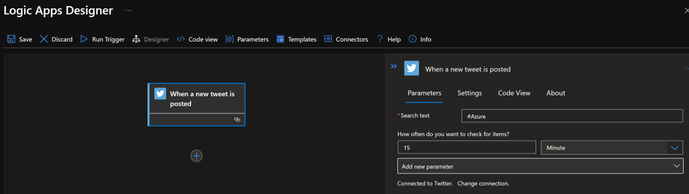

    | Setting      |  Suggested value   | Description                                        |
    | ----------------- | ------------ | ------------- |
    | **Search text** | #Azure | Use a hashtag that is popular enough to generate new tweets in the chosen interval. When using the Free tier and your hashtag is too popular, you can quickly use up the transaction quota in your Cognitive Services API. |
    | **Interval** | 15 | The time elapsed between Twitter requests, in frequency units. |
    | **Frequency** | Minute | The frequency unit used for polling Twitter.  |

3.  Click  **Save** to connect to your Twitter account. 

Now your app is connected to Twitter. Next, you connect to text analytics to detect the sentiment of collected tweets.

## Initialize and Set Variables
1. Click **New Step**, and then **Add an action**.
1. In **Choose an action**, type **Variables**, and then click the **Initialize Variable** action.
    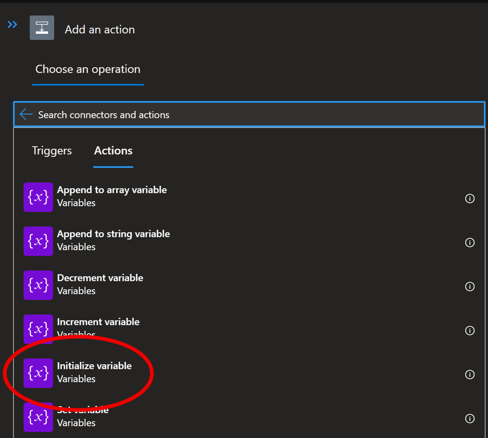
1. Set the **Name** and **Type** to the appropriate values, leave **Value** blank
    | Setting      |  Suggested value   | Description                                        |
    | ----------------- | ------------ | ------------- |
    | **Name** | tweet_text | The variable name to reference later. |
    | **Type** | String | The variable Type. |

1. Click **New Step**, and then **Add an action**.
1. In **Choose an action**, type **Variables**, and then click the **Initialize Variable** action.
    
1. Set the **Name** and **Type** to the appropriate values, leave **Value** blank
    | Setting      |  Suggested value   | Description                                        |
    | ----------------- | ------------ | ------------- |
    | **Name** | translated_text | The variable name to reference later. |
    | **Type** | String | The variable Type. |
    
1. Click **New Step**, and then **Add an action**.
1. In **Choose an action**, type **Variables**, and then click the **Set Variable** action.
    
1. Set the **Name** to *tweet_text*, Click on the **Value** textfield and choose *Tweet Text* rom the **Dynamic Content** pop-up.
    

## Detect Tweet Language
1. Click **New Step**, and then **Add an action**.
1. In **Choose an action**, type **Translator**, and then click the **Detect Langauge** action.
    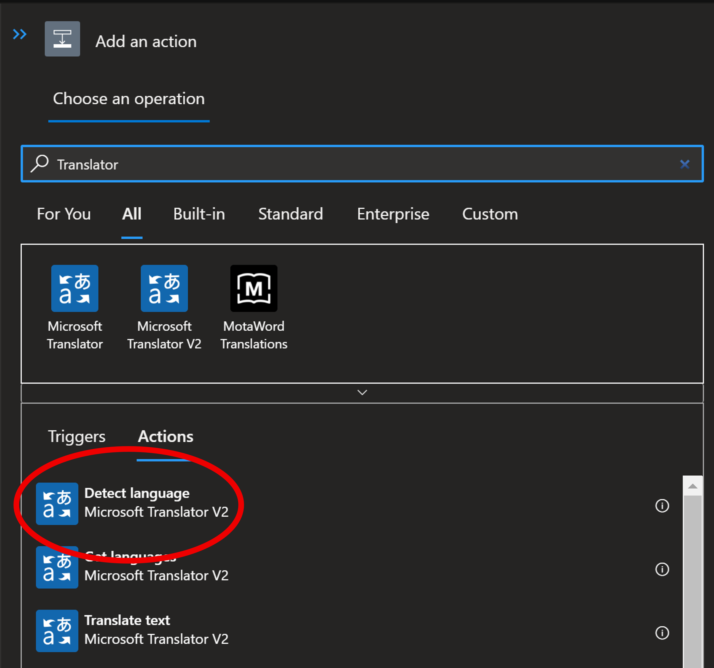
1. Enter *TwtrTranslator* for **Connection Name** and the value of **Key1** of your translator resource, then hit **Create** to create the API connection to your resource.
    
1. Click inside of the **Text** field, and choose **tweet_text** from the **Dynamic Content** pop-up.
    

## Detect Sentiment
1. Click **New Step**, and then **Add an action**.
1. In **Choose an action**, type **Text Analytics**, and then click the **Detect sentiment (preview)** action.
       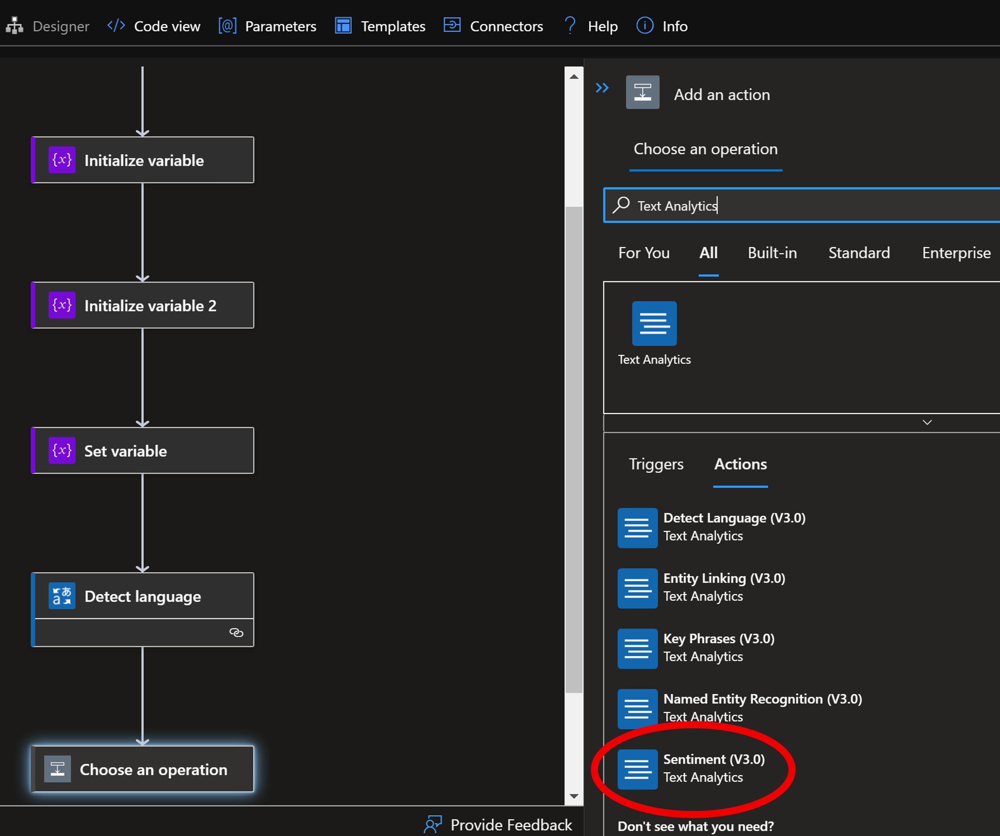
1. Type a connection name such as `TwtrSentiment`, paste the key for your Cognitive Services API and the Cognitive Services endpoint you set aside in a text editor, and click **Create**.
    
1. Click in the **Add new parameter** field and choose *Text*
    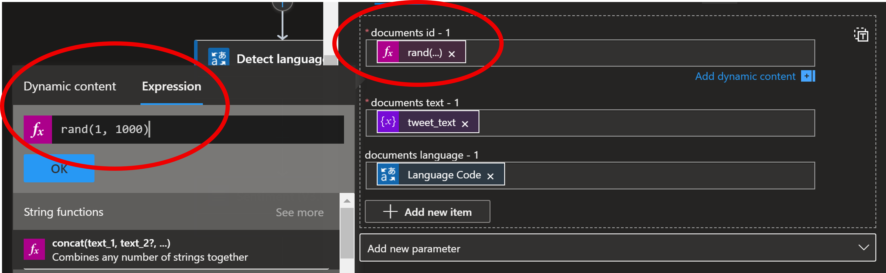
1. Click in the **Text** field and choose *tweet_text* from the  **Dynamic Content** pop-up.
    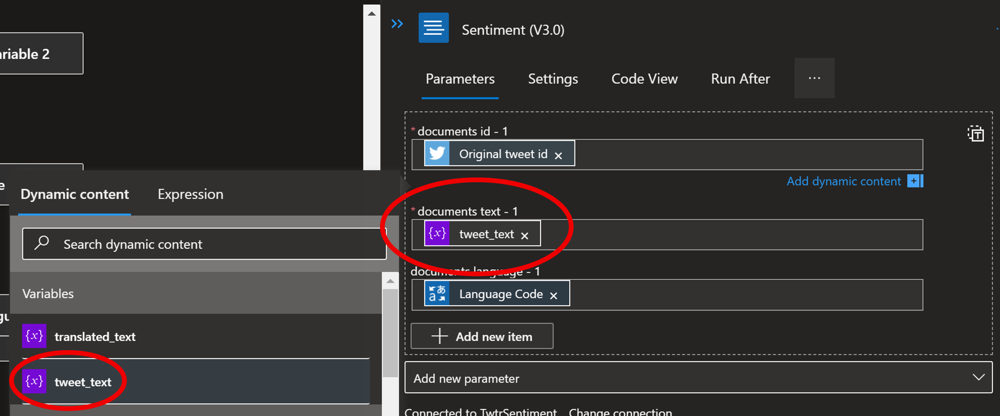
1. Click in the **Add new parameter** field and choose *Language*
    
1. Click in the **Language** field, scroll down and choose *Enter custom value*.
    
1. Next, choose **Language Code** from the **Dynamic Content** pop-up.
Next, enter **tweet_text** in the text box and then click on **New Step**.
    


Now that sentiment detection is configured, you can add a connection to your function that consumes the sentiment score output.

## Connect sentiment output to your function

1. In the Logic Apps Designer, click **New step** > **Add an action**, filter on **Azure Functions** and click **Choose an Azure function**.

    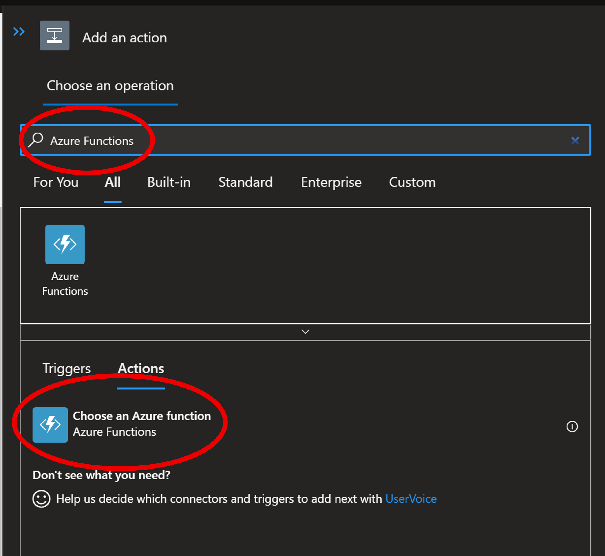
  
4. Select the function app you created earlier.

    

5. Select the function you created for this tutorial.

    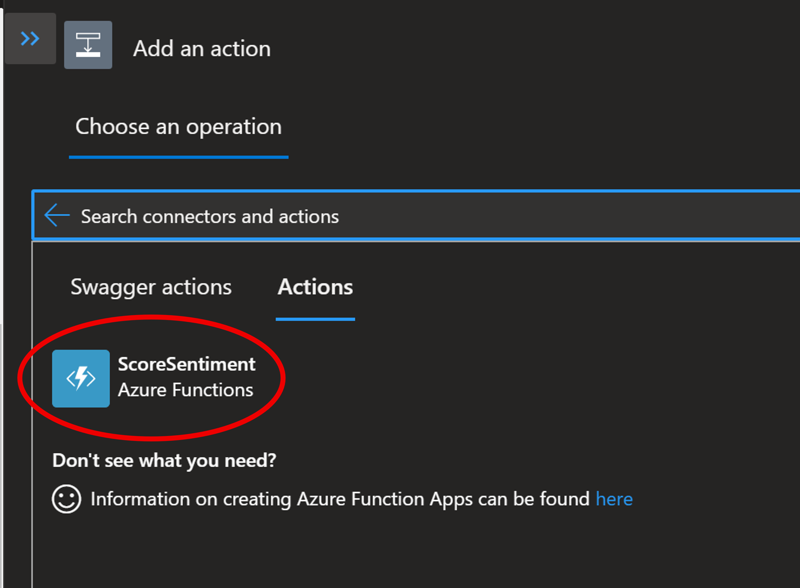

4. In **Request Body**, click **Score** and then **Save**.

    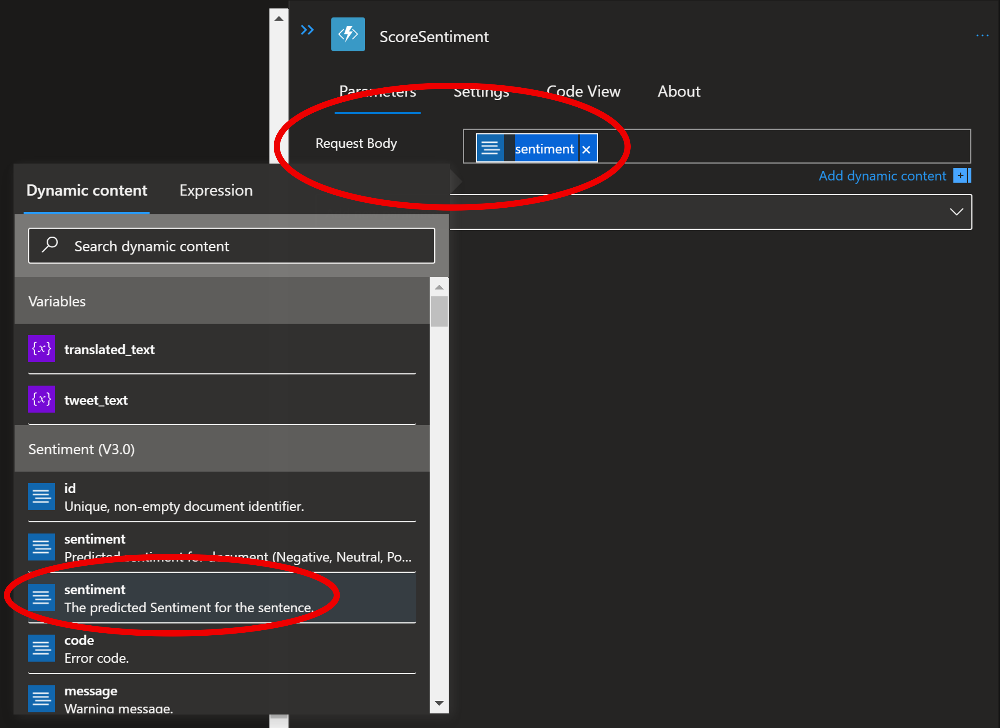

Now, your function is triggered when a sentiment score is sent from the logic app. A color-coded category is returned to the logic app by the function. Next, you add an email notification that is sent when a sentiment value of **RED** is returned from the function. 


## Translate tweet

The last part of the workflow is to trigger an email when the sentiment is scored as _RED_ and post a tweet when the sentiment is scored as _GREEN_. This topic uses an Outlook.com connector. You can perform similar steps to use a Gmail or Office 365 Outlook connector. We will also translate the tweet to English when emailing and add a profanity filter when tweeting. 

1. In the Logic Apps Designer, click **New step** > **Add a condition**. 

    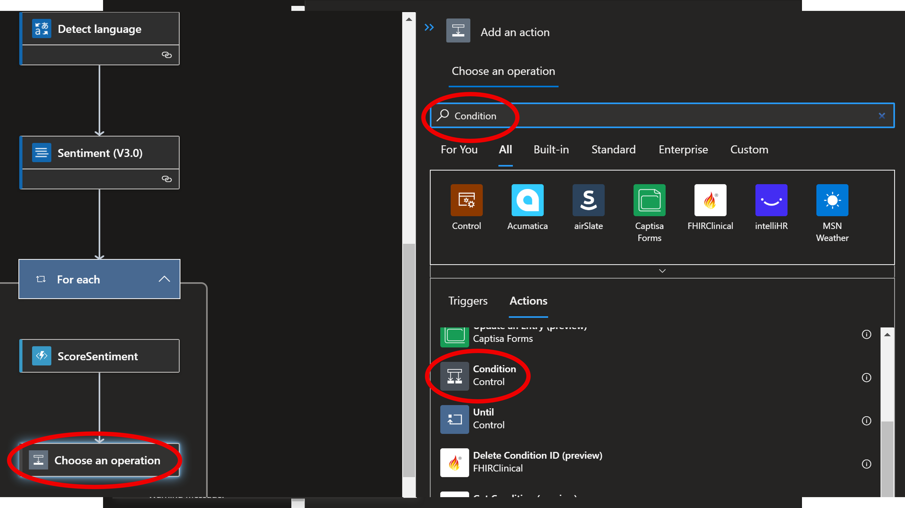

2. Click **Choose a value**, then click **Body**. Select **is equal to**, click **Choose a value** and type `RED`, and click **Save**. 

        

3. In **IF TRUE**, click **Add an action**, search for `Condition` and click on the **Condition** action.
        
1. In the **Choose a value** field, select **Language Code** from the **Dynamic Content** pop-up. 
    
1. In nested **IF TRUE**, click **Add an action**, search for `Translate` and click on the **Translate text (preview)** action. 
    
1. Set the **Target Language** to *English* and the **Text** field to *tweet_text* from the **Dynamic Content** pop-up.
    
1.  Click **Add an action**, search for `Variables` and click on the **Set Variable** action.
    
1. Set the **Name** to *translated_tweet*, Click on the **Value** textfield and choose *Translated Text* rom the **Dynamic Content** pop-up.
    

## Email Tweet
1. Click the **Add an action** in the _PARENT_ conditional loop
    
1. Search for *Outlook* and click on **Office 365 Outlook**, then **Send an Email** 
    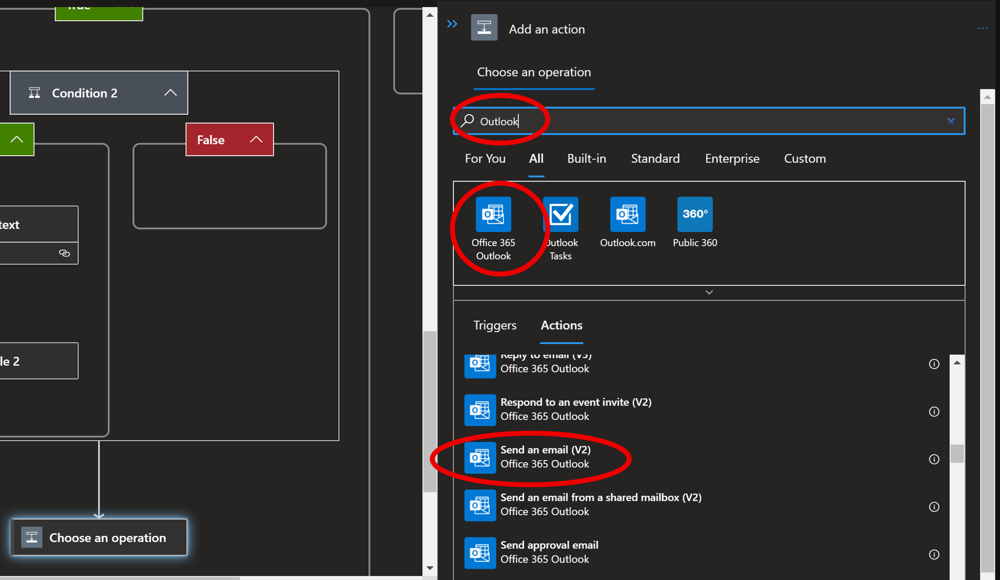
1. Click on **Sign In** and proceed to sign in to create a connector using your Work/School account. 
1. Add yourself to the **To** line
1. Set the **Subject** to *Negative #hookem  Tweet by:* followed by the *Tweeted by* value from the **Dynhamic Content** pop-up.
    
1. In the **Body**, add the following content from the **Dynamic Content** pop-up:
    - translated_tweet
    - tweet_text
    - Language Name
    - Location
    - Created

| Content      |  Source   |
| ----------------- | ------------ |
| **translated_tweet** | Variables |
| **tweet_text** | Variables  |
| **Language Name** | Detect Language |
| **Location** | When a new tweet is posted |
| **Created at** | When a new tweet is posted |
*You may append strings in front of the value to make more sense (e.g. "Tweet: " in front of tweet_text)*  


## Retweet
1. In the parent **IF FALSE** condition, click **Add an action**
    
1. Search for *profanity* and choose **Detect profanity and match against custom and shared blacklists (preview)**
    
1. Enter in the appropriate resource values
Now that the workflow is complete, you can enable the logic app and see the function at work, then click **Create**.

    | Name      |  Description   |
    | ----------------- | ------------ |
    | **Connection Name** | The Name of your Content Moderator resource |
    | **API Key** | Your Content Moderator API Key  |
    | **Site URL** | The regional cognitive services URL (*South Cental US:* https://southcentralus.api.cognitive.microsoft.com, *West US:* https://westus.api.cognitive.microsoft.com) |
  
4. Select *text/plain* for **Content Type**, click in the **Text Content** field and choose **See more** under **Variables** in the **Dynamic Content** pop-up.  
  

5. Finally, choose *tweet_text* from the **Dynamic Content** pop-up.
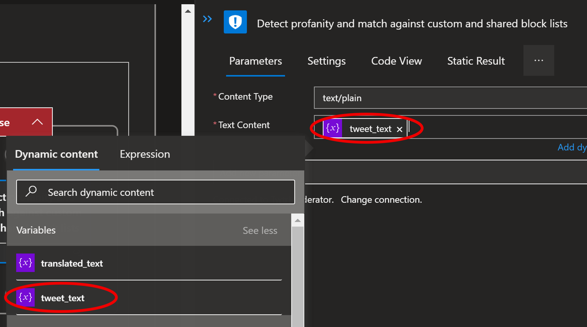  

6. Click **Add an action** under the profanity detector action, search for "condition" and choose the "Condition" action.
  

7. In the **Condition** action, click in the **Chose a value** field and choose **Detected Profanity Terms** from the **Dynamic Content** pop-up.
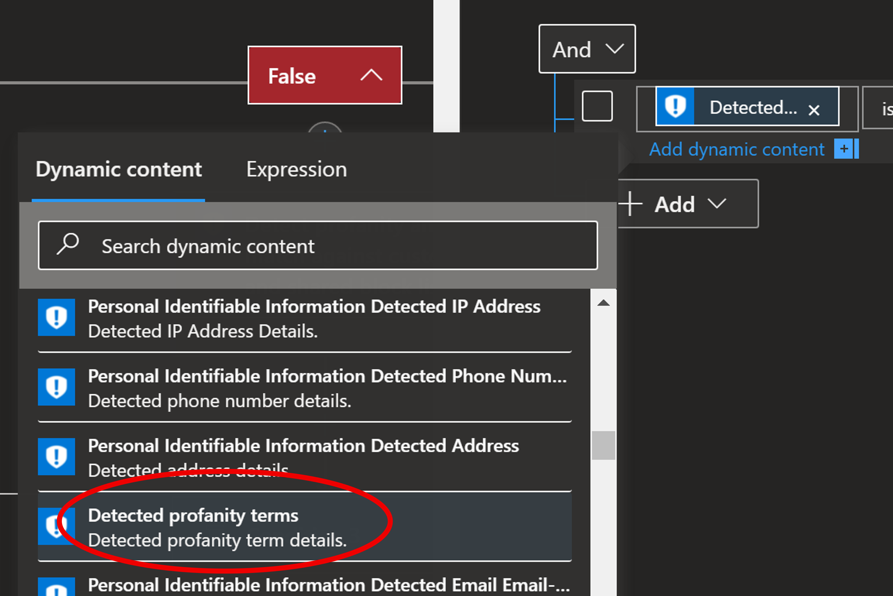  

8. Set the **Choose a value** field to *null*
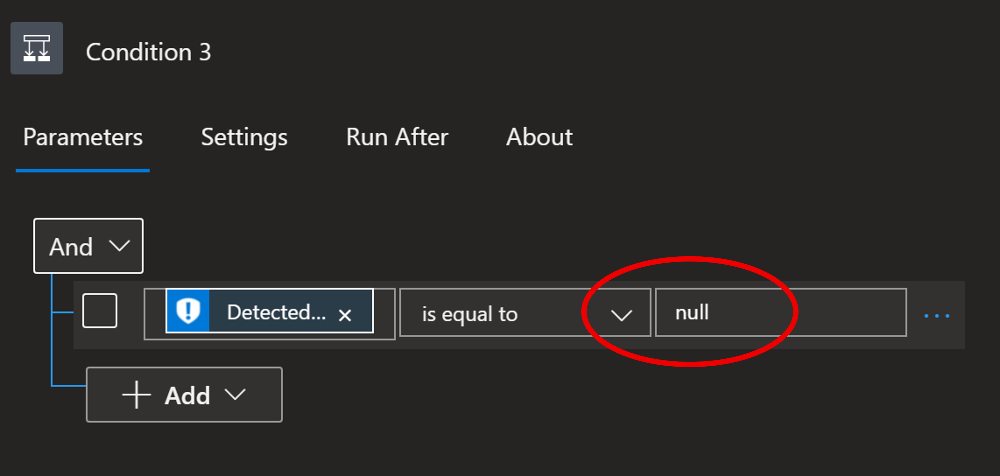 

9. In the child **IF TRUE** condition, select **Add an action**, search for **Twitter** and select **Post a Tweet**
 
10. Click on the **Search or filter parameters...** field and choose **Tweet text**
 
11. Click in the **Tweet Text** field and choose **tweet_text** from the **Dynamic Content** pop-up.
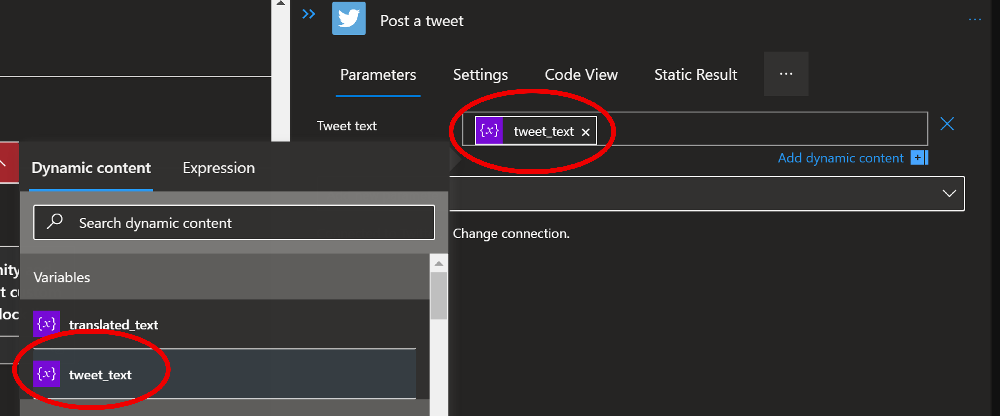 
12. Click **Save**.
## Test the workflow

1. In the Logic App Designer, click **Run** to start the app.

2. In the left column, click **Overview** to see the status of the logic app. 
 
    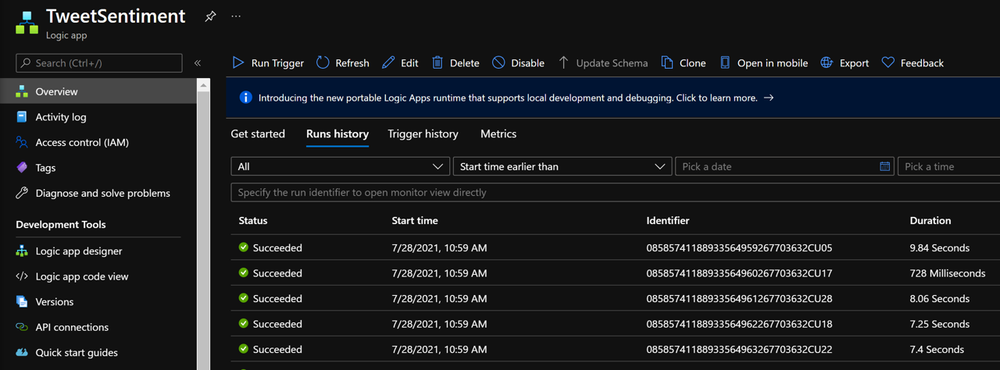  

3. (Optional) Click one of the runs to see details of the execution.  
4. Go to your function, view the logs, and verify that sentiment values were received and processed.
 
    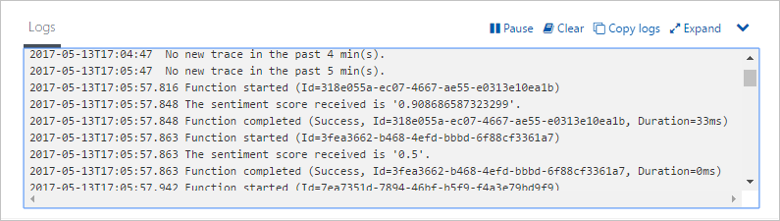

5. When a potentially negative sentiment is detected, you receive an email. If you haven't received an email, you can change the function code to return RED every time:

    ```csharp
    return (ActionResult)new OkObjectResult("RED");
    ```

    After you have verified email notifications, change back to the original code:

    ```csharp
    return requestBody != null
        ? (ActionResult)new OkObjectResult(category)
        : new BadRequestObjectResult("Please pass a value on the query string or in the request body");
    ```

    > [!IMPORTANT]
    > After you have completed this tutorial, you should disable the logic app. By disabling the app, you avoid being charged for executions and using up the transactions in your Cognitive Services API.

Now you have seen how easy it is to integrate Functions into a Logic Apps workflow.

## Disable the logic app

To disable the logic app, click **Overview** and then click **Disable** at the top of the screen. Disabling the app stops it from running and incurring charges without deleting the app.

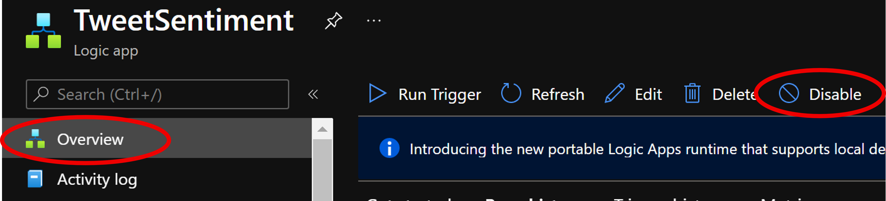

## Next steps

In this tutorial, you learned how to:

> * Create a Cognitive Services API Resource.
> * Create a function that categorizes tweet sentiment.
> * Create a logic app that connects to Twitter.
> * Add sentiment detection to the logic app. 
> * Add language detection to the logic app.
> * Add content moderation to the logic app.
> * Translate text in the logic app
> * Connect the logic app to the function.
> * Send an email & retweet based on the response from the function.
