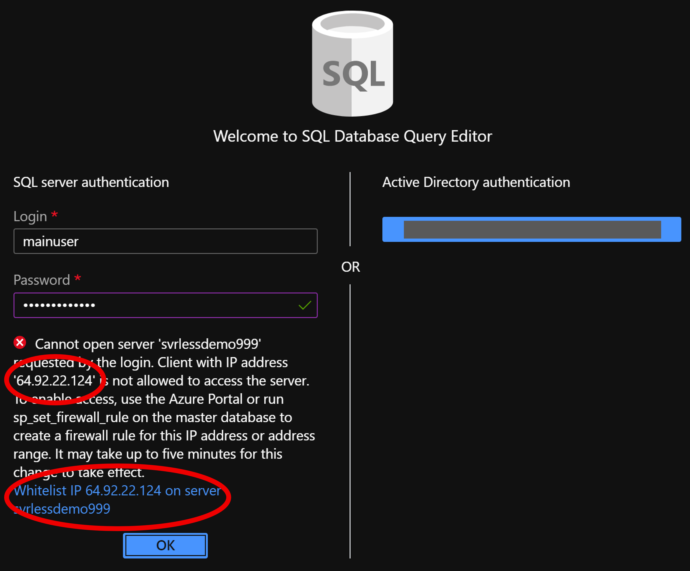

# Configure Database Access & Add Tables

We will need to configure firewall for access & add a database to collect the data

 **Documentation: https://docs.microsoft.com/en-us/azure/sql-database/sql-database-firewall-configure**
### Prerequisite: [Syllabus](./readme.md)

## Configure Access

1. Navigate to your created resource and click on the query editor option

1. Enter your password: **#Welcome1023#**
1. You will receive and error, you need to configure the firewall for access to your local computer:
    1. Copy the ip address displayed on the message
    1. Click on the **Set server firewall link**

1. At the firewall settings:
    1. Click on the On Button for Allow Azure services and resources to access this server
    1. Enter a name for the IP rule name: **Query editor**
    1. Paste your IP Address to the Start Id and End IP
    1. Click Save    
    
    1. Go back to query editor
    
    1. Click on OK    
    
