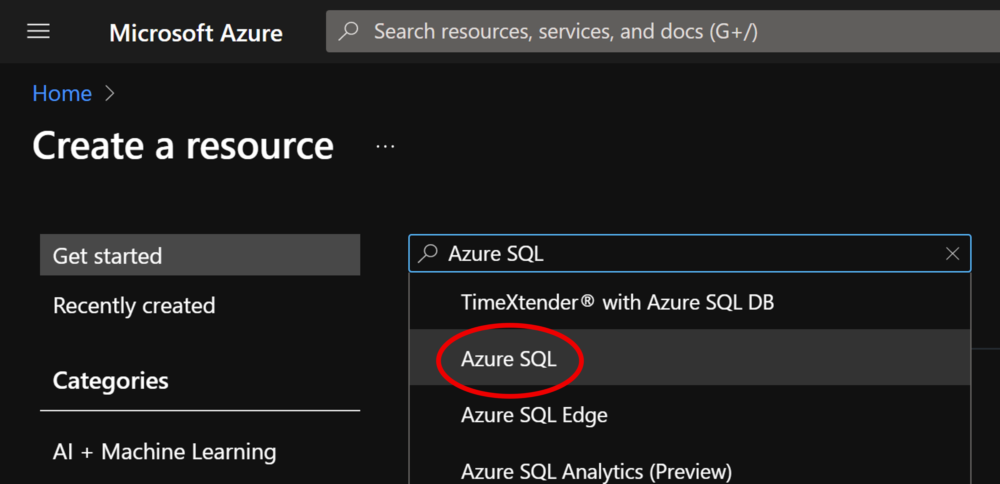
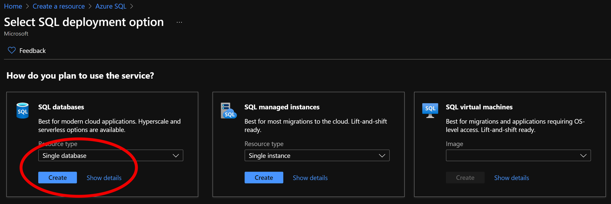

# Configure Database Access & Add Tables

We will need to configure firewall for access & add a database to collect the data

 **Documentation: https://docs.microsoft.com/en-us/azure/sql-database/sql-database-firewall-configure**
### Prerequisite: [Syllabus](./readme.md)

## Configure Access

1. Navigate to your created resource and click on the query editor option

1. Enter your password: **#Welcome1023#**
1. You will receive and error, you need to configure the firewall for access to your local computer, click on the set server firewall option

1. The following options will be presented, select **Single Database**
 
1. Click the **Create** button and fill out the resource creation with the following parameters:

    | Setting      |  Suggested value   | Description                                        |
    | --- | --- | --- |
    | **Resource group** | ServerlessWkrshp | Use the same resource group for all services in this tutorial.|
    | **Name** | twitterdatabase | Enter the name of the database. |
    | **Server** | svrlessdemo | Enter a unique name for the server. |
    | **Server Admin Login** | mainuser | This is the main user name.|
    | **Location** | South Central US | Use the location nearest you. |
    | **Pricing tier** | F0 | Start with the lowest tier. If you run out of calls, scale to a higher tier.|
    | **Resource group** | ServerlessWkrshp | Use the same resource group for all services in this tutorial.|
