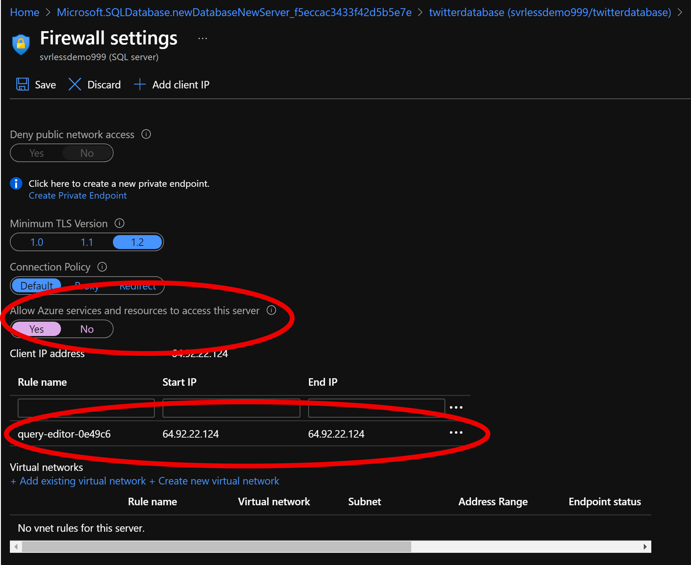
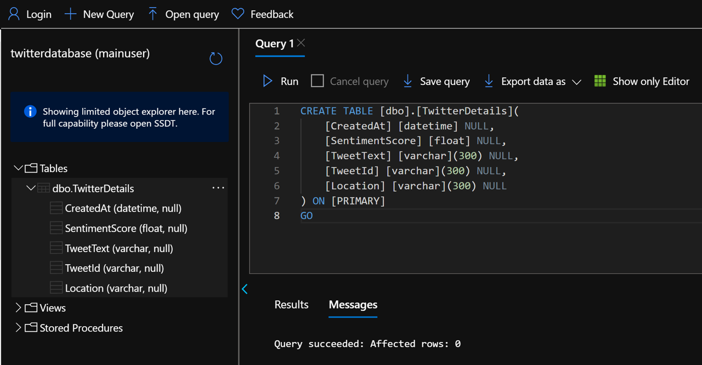

# Configure Database Access & Table

We will need to configure firewall for access & add a database to collect the data

<br>**Documentation: https://docs.microsoft.com/en-us/azure/sql-database/sql-database-firewall-configure**
### Prerequisite: [Syllabus](./readme.md)

## Configure Access

1. Navigate to your created resource and click on the query editor option

1. Enter your password: **#Welcome1023#**
1. You will receive and error, you need to configure the firewall for access to your local computer:
    1. Click on the **Whitelist IP** link located just above the **OK** button

1. Click the **Overview** link in the left navigation, then click the **Set server firewall** link in the Overview page toolbar

1. At the firewall settings:
    1. Click on the **Yes** button for **Allow Azure services and resources to access this server**
    1. Verify that a **Rule** has been added that matches your Public IP
    1. Click Save
    
    1. Go back to query editor
    1. Click on the **OK** button
1. You should see the query editor

1. In the query window copy the following SQL statment and click Run

```sql
 CREATE TABLE [dbo].[TwitterDetails](
	[CreatedAt] [datetime] NULL,
	[SentimentScore] [varchar](300) NULL,
	[TweetText] [varchar](300) NULL,
	[TweetId] [varchar](300) NULL,
	[Location] [varchar](300) NULL
) ON [PRIMARY]
GO
```
1. You should see the created table 


### Next: [Save Twitter Sentiment to SQL](./sql-save-twitter-to-sql.md) ###

#### Previous: [Create Serverless SQL Database](./create-serverless-sql.md) ####

