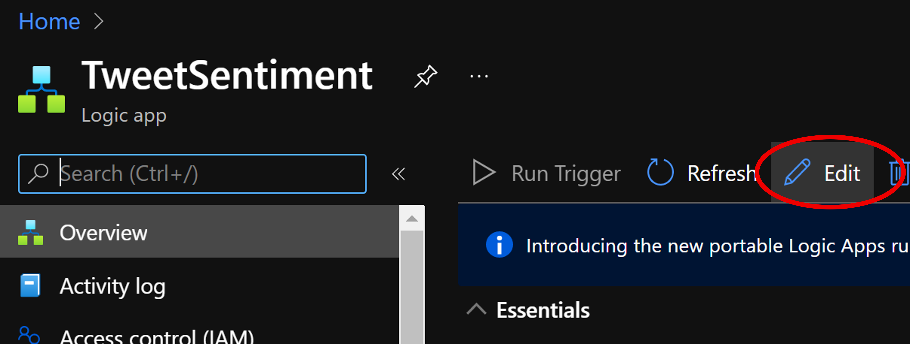
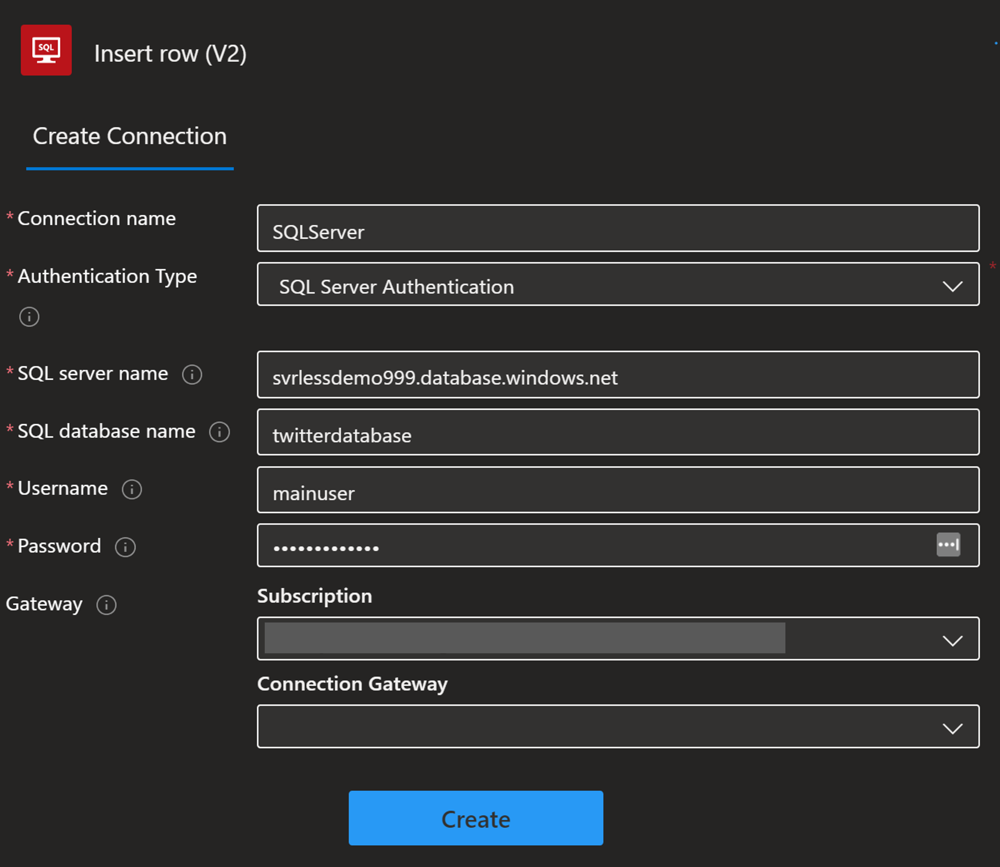

# Insert Records into Database

We will edit the previously created Logic App to save results to SQL

### Prerequisite: [Syllabus](./readme.md)

## Edit Logic App
1. Edit Existing logic app

1. Scroll to the bottom of the flow and click plus sign
1. Search for SQL
1. Select SQL option
1. Select Insert Row

1. Database options will show up, please select **svrlessdemo**
1. Enter user name: **mainuser**
1. Password: **#Welcome1023#**

1. Click on parameters and select all the fields on the table

1. Match database fields to parameters

1. Click Save

 

### Next: [Visualize Data](./visualize-data.md) ###
#### Previous: [Configure Database Access & Table](./sql-database-access.md) ####
