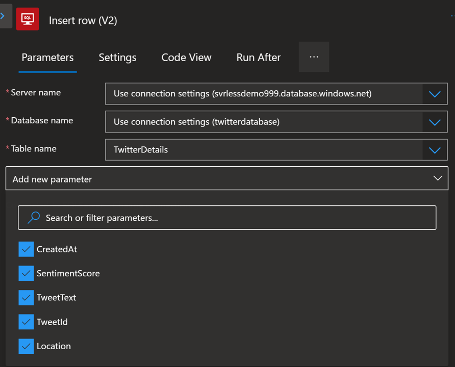
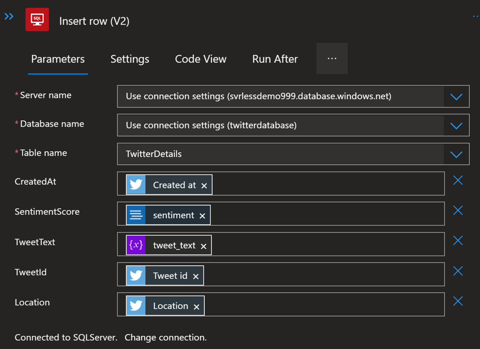

# Insert Records into Database

We will edit the previously created Logic App to save results to SQL

### Prerequisite: [Syllabus](./readme.md)

## Collect SQL Server Information
You will need two pieces of information about the SQL Database in the steps that follow. Follow this procedure to identify those values.
1. Navigate to the **twitterdatabase** SQL database that was created in the last procedure
1. Click the **Overview** option in the left-hand navigation menu

1. Note the **SQL database name** in the top-left portion of the **Overview** page
1. Note the **Server name** at the top of the second column of information

## Edit Logic App
1. Edit Existing logic app

1. Scroll to the bottom of the flow and click **+** sign at the bottom of the **For each** block, then click **Add an action**
1. Search for "SQL Server"
1. Select **SQL Server** Connector
1. Find and Select **Insert row (V2)**

1. The **Create Connection** options should be set according to this table:
    | Setting      |  Value   | Description                                        |
    | --- | --- | --- |
    | **Connection name** | SQL Server | This is the name of the Connection that will be used in Logic Apps actions. |
    | **Authentication Type** | SQL Server Authentication | This choice indicates that we will provide a Username and Password. |
    | **SQL server name** | <enter the **Server name** value you captured> | This is the value that ends with database.windows.net.|
    | **SQL database name** | <enter the **SQL database name** value you captured> | This value indicates the name of the particular Azure SQL database that will be used in this Logic App.|
    | **Username** | <enter the SQL admin Username for the database> | For the purposes of this workshop the SQL admin account will be used, but in Production configurations, you'd use an appropriately configured account.|
    | **Password** | <enter the SQL admin Password for the database> | For the purposes of this workshop the SQL admin account will be used, but in Production configurations, you'd use an appropriately configured account.|
1. Click the **Create** button
1. The **Insert row (V2)** options should be set according to this table:
    | Setting      |  Value   | Description                                        |
    | --- | --- | --- |
    | **Server name** | **Use connection settings** | Choosing this value will inherit the Server name from the Connection that was created. |
    | **Database name** | **Use connection settings** | Choosing this value will inherit the Database name from the Connection that was created. |
    | **Table name** | **TwitterDetails** | This is the name of the database table that was created in the previous procedure. |
    | **Add new parameter** | Expand this section and make sure that all column names are checked | Values for every column will be provided in this Logic App. |
1. Click on the arrow in the **Add new parameter** row to collapse the selection box and make the columns assignable
1. Match database fields to the following parameters:
    | Setting | Dynamic Content Item | 
    | --- | --- |
    | **CreatedAt** | When a new tweet is posted...Created at |
    | **SentimentScore** | Sentiment (V3.0)...sentiment (Predicted sentiment for document) |
    | **TweetText** | Variables...tweet_text |
    | **TweetId** | When a new tweet is posted...Tweet id |
    | **Location** | When a new tweet is posted...Location |
    
1. Click **Save** to commit the Logic App changes

 

### Next: [Visualize Data](./visualize-data.md) ###
#### Previous: [Configure Database Access & Table](./sql-database-access.md) ####
