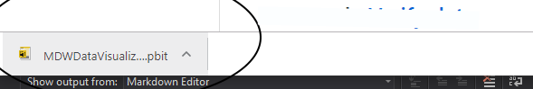
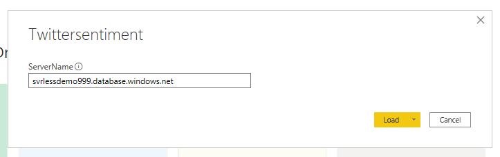
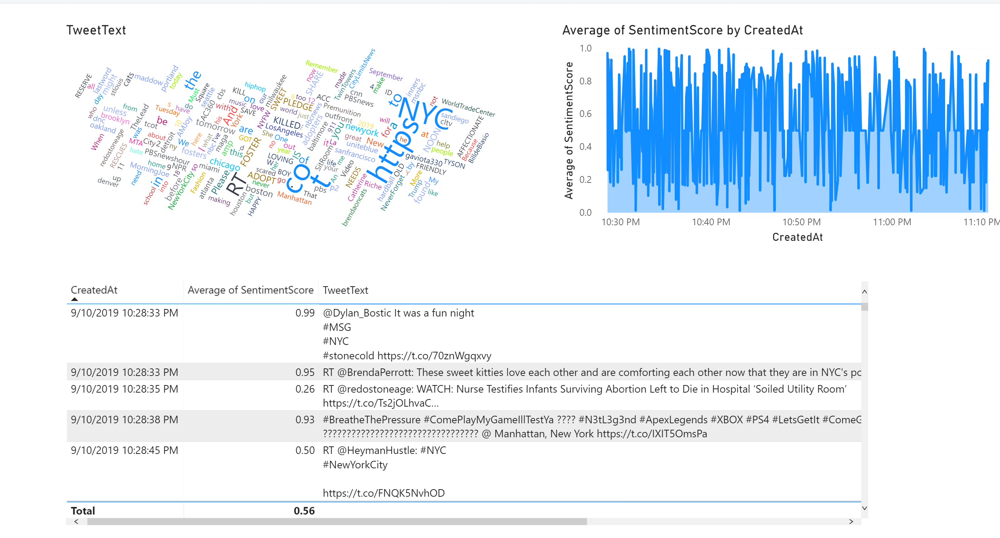

# Visualize Data With Power BI

## Download Power BI
* Power BI Desktop App 
      • Best option for Windows 10 desktops 
	  • Does not require Administrative rights to install 
      • Automatically updates when monthly Power BI Desktop updates are released
       https://www.microsoft.com/en-us/p/power-bi-desktop/9ntxr16hnw1t?activetab=pivot:overviewtab
 
* Power BI Desktop Installer 
  https://aka.ms/pbiSingleInstaller
  
### Prerequisite: [Syllabus](./readme.md)

## Download Power BI Sample Report
1. 
1. Open downloaded report   

1. User the following parameters
   - **Server name**: svrlessdemo.database.windows.net
   - **Authentication**: Database
   - **User Name**: mainuser
   - **Password**: #Welcome1023#
 

1. This is the report view
   
   

## Congratulations, you have completed this Hands-On-Lab! 

> **NOTE:** Don't forget to delete your resource group.
