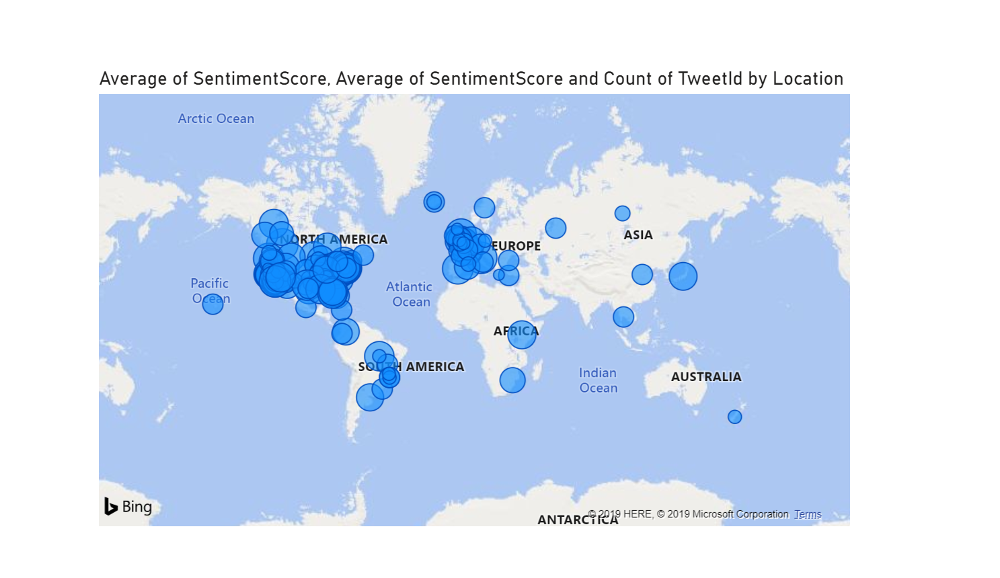

# Visualize Data With Power BI

## Download Power BI
* **Power BI Desktop App**
   - Best option for Windows 10 desktops 
   - Does not require Administrative rights to install 
   - Automatically updates when monthly Power BI Desktop updates are released
   - https://www.microsoft.com/en-us/p/power-bi-desktop/9ntxr16hnw1t?activetab=pivot:overviewtab
 
* **Power BI Desktop Installer**
  - https://aka.ms/pbiSingleInstaller
  
### Prerequisite: [Syllabus](./readme.md)

## Collect SQL Server Information
You will need two pieces of information about the SQL Database in the steps that follow. Follow this procedure to identify those values.
1. Navigate to the **twitterdatabase** SQL database that was created in the last procedure
1. Click the **Overview** option in the left-hand navigation menu

1. Note the **Server name** at the top of the second column of information

## Download Power BI Sample Report
1. [Download sample report](https://github.com/Microsoft-USEduAzure/workshops/blob/master/serverless/media/Twittersentiment.pbit?raw=true)
1. Open downloaded report   

1. Enter following parameters
- **Server name**: This is the Azure SQL Server name that was noted earlier in this procedure

- **Authentication**: Database
- **User Name**: mainuser
- **Password**: #Welcome1023#

   This is the report view

   
   

## Congratulations, you have completed this Hands-On-Lab! 

> **NOTE:** Don't forget to delete your resource group.
=======
1. [Download template report](./media/Twittersentiment.pbit)
1. Open downloaded report   

1. User the following parameters
   - **Server name**: svrlessdemo.database.windows.net
 
   - **Authentication**: Database
   - **User Name**: mainuser
   - **Password**: #Welcome1023# 

1. This is the report view
   
   

## Congratulations, you have completed this Hands-On-Lab! 

### Next: [Clean Up](./clean-up.md) ###
#### Previous: [Insert Records into Database](./sql-save-twitter-to-sql.md) ####

