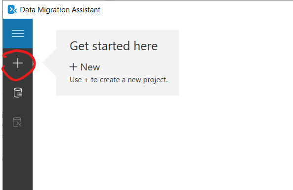
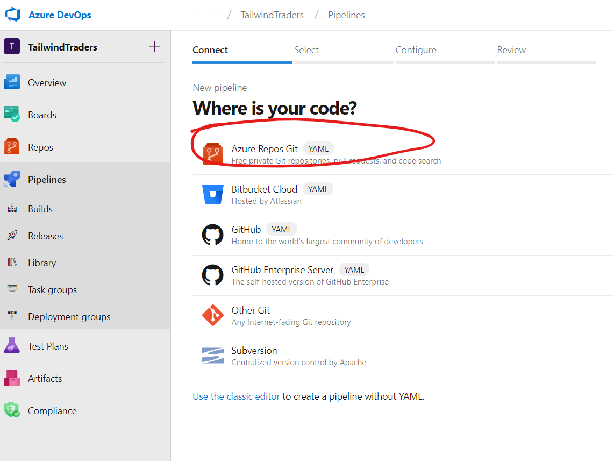
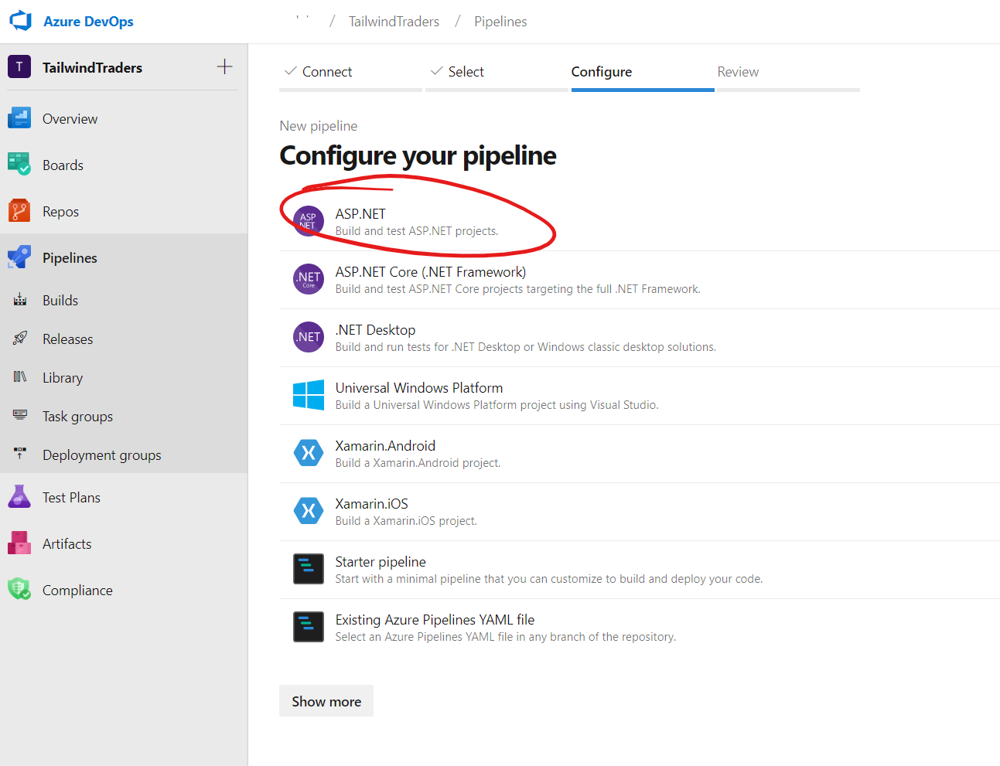
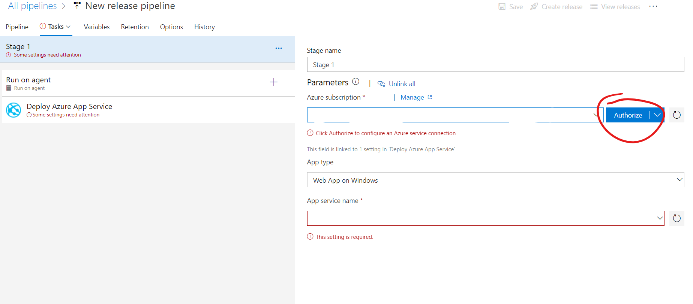
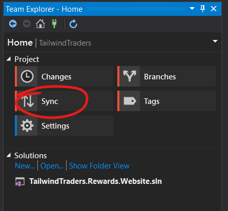
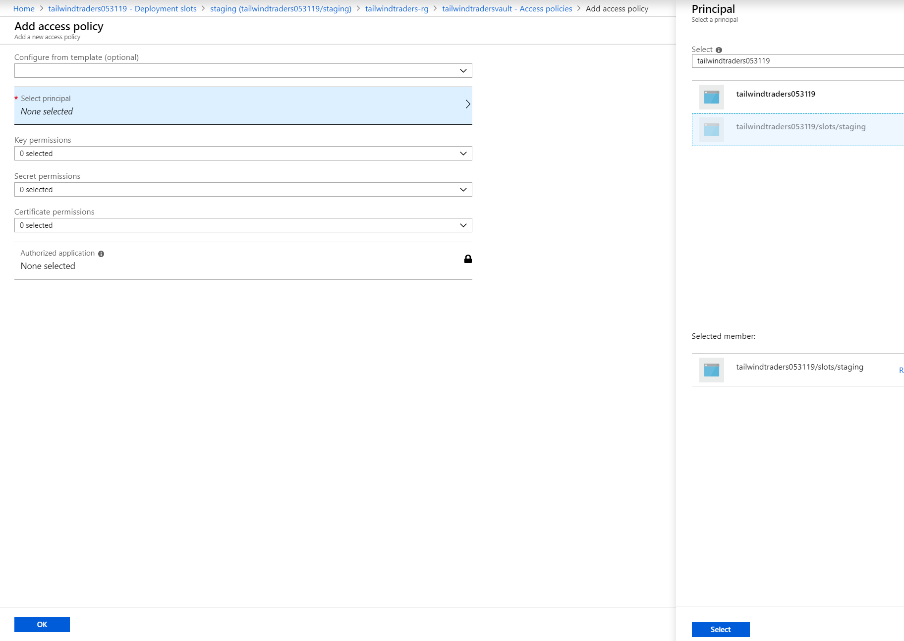
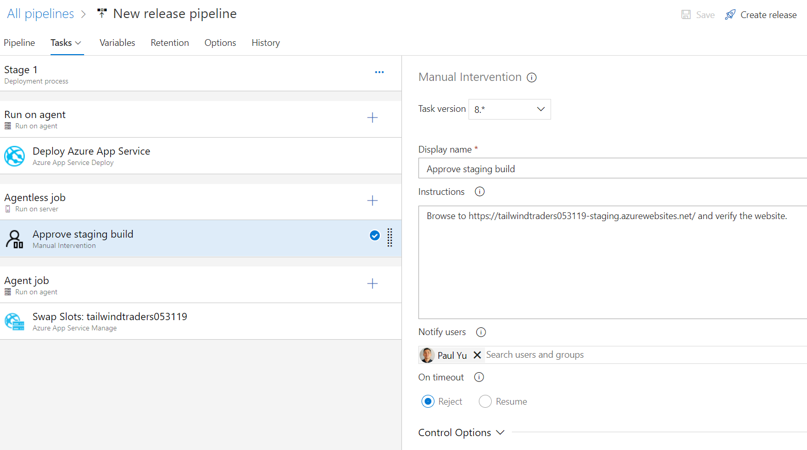

# Azure Focus Hours - Web App Migration

## Table of Contents
[Workshop Environment Setup](#workshop-environment-setup)

[Install and run solution locally](#install-and-run-solution-locally)

[Azure Cloud Shell](#azure-cloud-shell)

[Azure Resource Group](#azure-resource-group)

[Azure SQL](#azure-sql)

[Azure App Service](#azure-app-service)

[Azure Key Vault](#azure-key-vault)

[Publish Website to Azure App Service](#publish-website-to-azure-app-service)

[Azure Repos](#azure-repos)

[Azure Pipelines Build](#azure-pipelines-build)

[Azure Pipelines Release](#azure-pipelines-release)

[Azure Boards](#azure-boards)

[App Service Deployment Slots](#app-service-deployment-slots)

___

## [Workshop Environment Setup](workshop-environment-setup)

To complete this workshop you will need to have a Windows PC and the following applications installed

> NOTE: This workshop assumes that you have access to Azure and some familiarity with Visual Studio and SQL Server Management Studio.

- [Visual Studio 2017 or higher (preferably 2019)](https://visualstudio.microsoft.com/downloads/)

  - [Installation documentation](https://docs.microsoft.com/en-us/visualstudio/install/update-visual-studio?view=vs-2019)

  - Make sure to install the following

    - Web & Cloud

      - ASP.NET and web development

      - .NET Framework 4.6.1, 4.6.2, 4.7, 4.7.1

    - Azure development

      

  - Open Visual Studio and make sure to sign in using the same account you use for the Azure Portal

- [SQL Server Express or Developer](https://www.microsoft.com/en-us/sql-server/sql-server-downloads)

- [SQL Server Management Studio](https://docs.microsoft.com/en-us/sql/ssms/download-sql-server-management-studio-ssms?view=sql-server-2017)

- [Git for Windows](https://git-scm.com/downloads)

- [Database Migration Assistant](https://www.microsoft.com/en-us/download/details.aspx?id=53595)

## [Install and run solution locally](install-and-run-solution-locally)

The solution consists of a ASP.NET WebForms website and SQL Server database. We'll migrate these components to Azure

### Download sample files

1. Download [TailwindTraders.zip](sample/TailwindTraders.zip)

1. If you have a source code repository path on your machine that you normally use, you can skip this step; otherwise, create a new directory on your machine using Command Prompt

    ```cmd
    mkdir c:\source\repos
    ```

1. Unzip TailwindTraders.zip to c:\source\repos using Windows Explorer

### Import TailwindTraders database

1. Open SQL Server Management Studio and connect to the local server

1. Right-click **Databases** and click **Import Data-tier Application…**

    

1. In the Import Settings page, browse for the TailwindTraders.bacpac files in the TailwindTraders\Database folder and click Next complete the import

    

1. In the Database Settings page, leave all the default values and click Next then Finish on the Summary page to begin the import. 

    

    

    

### Run the website locally

1. Open the TailwindTraders.Rewards.Website.sln file using Visual Studio

1. Build the solution and make sure there are no errors

1. Run the solution and verify the site is running

> You're now ready to proceed with the workshop!

## [Azure Cloud Shell](azure-cloud-shell)

Azure resources can be provisioned using the Azure Portal website. As an alternative you can provision your resources using the Azure CLI on Azure Cloud Shell. You can click the shell icon in the upper right section of the Azure portal.


If this is the first time you are using the shell you will be prompted to select an environment and will be prompted to create a free storage account for scratch space. Select Bash for now; you can always change the environment as needed in the Cloud Shell.


If wish to follow along with the Azure CLI Bash commands you'll need to enter

```bash
rg=<REPLACE_WITH_YOUR_RESOURCE_GROUP_NAME>
loc=<REPLACE_WITH_YOUR_PREFERRED_REGION>
dbserver=<REPLACE_WITH_YOUR_DB_SERVER_NAME>
dbname=TailwindTraders
user=<REPLACE_WITH_YOUR_USERNAME>
pass=<REPLACE_WITH_YOUR_PASSWORD>
appserviceplan=<REPLACE_WITH_YOUR_APP_SERVICE_PLAN_NAME>
appservicename=<REPLACE_WITH_YOUR_APP_SERVICE_NAME>
kvname=<REPLACE_WITH_YOUR_KEYVAULT_NAME>
connstringkey=TailwindTradersConn
```

> NOTE: dbserver and appservicename must be globally uniquue to all of Azure

## [Azure Resource Group](azure-resource-group)

Create a new resource group which will be a logical container for all our Azure resources for this workshop

1. In the Azure Portal, click on **+ Create a resource**, type in the word "resource" in the text box, then click on the Resource group item form the list

    

1. Click on the Create button in the resource description page, enter the resource group information, then click on **Review + Create**

    

    

Alternatively, enter the following command in Cloud Shell

```bash
az group create -n $rg -l $loc
```

## [Azure SQL](azure-sql)

In this exercise, we'll use a tool called Database Migration Assistant to evaluate and migrate both our TailwindTraders database schema and data. Before we start the database migration, we'll need to create a Azure SQL instance first.

### Create a new Azure SQL server

1. In Azure Portal, click on + Create a resource and click on SQL Database

    

1. Select your resource group, enter TailwindTraders as the database name, then click on Create new and enter the server details then click Select. For now, we'll keep the defaults for the compute and storage settings. Click Review + create, then Create to provision the resource.

    

Alternatively, you can execute the following commands using Cloud Shell

```bash
az sql server create -g $rg -l $loc -n $dbserver -u $user -p $pass

az sql db create -g $rg -s $dbserver -n $dbname -e Basic --service-objective Basic
```

### Find your public client IP and enable it through the Azure SQL Firewall

1. In Azure Portal, navigate to your new SQL Server. The easiest way to do this would be to navigate to your resource group and view the list of resources in the group. You'll notice there is a SQL server and SQL database here. We'll need to access the SQL server to configure a firewall rule. Click on the SQL server resource.

    

1. In the SQL server blade, click on Firewalls and virtual networks, + Add client IP, then click Save

    

> Alternatively, you can execute the following command using Cloud Shell

> You can browse to https://www.ipchicken.com/ and note your public IP address

```bash
az sql server firewall-rule create -g $rg -s $dbserver -n ClientIP --start-ip-address <ENTER_YOUR_IP_ADDRESS> --end-ip-address <ENTER_YOUR_IP_ADDRESS>
```

> If you want to use the Azure portal to query the database, you will have to enable access to the SQL Server from all Azure services using the rule below

```bash
az sql server firewall-rule create -g $rg -s $dbserver -n AzureServices --start-ip-address 0.0.0.0 --end-ip-address 0.0.0.0
```

### Now that we have a SQL server and database on Azure, we'll begin migrating our on-premises database

1. Open Data Migration Assistant on your PC

1. Click the plus button to create a new project

    

1. Select Migration as the Project Type, enter a project name, keep all defaults, and click Create

    

1. Connect to the source server (local database server)

    1. Enter local database server credentials and click connect

    1. Select TrailwindTraders database and click Next

        

1. Connect to the target server (Azure SQL database server)

    1. Enter Azure SQL database server credentials and click connect

    1. Select TrailwindTraders database and click Next

        

1. Select all the tables to be migrated and click Generate SQL script

    

1. Review the generated script then click Deploy schema

    

1. Review the deployment results then click Migrate data

    

1. Review the data to be migrated then click Start data migration

    

    

1. You can connect to the Azure SQL database using either SSMS or the Azure Portal to verify the data

## [Azure App Service](azure-app-service)

One half of our solution has been deployed to Azure. Next, we'll create an App service plan and web app and publish our application using Visual Studio.

### Create a new app service plan

1. In Azure portal, click on + Create a resource, then Web, then Web App

    

1. In the web app configuration page, select your resource group, enter a globally unique web app name, select Code as the publish mechanism, select ASP.NET V4.7 as the runtime stack, and create a new app plan name

    

> Alternatively, you can enter the following commands in Cloud Shell

```bash
az appservice plan create -g $rg -n $appserviceplan --sku S1
az webapp create -g $rg  --plan $appserviceplan --name $appservicename
```

## [Azure Key Vault](azure-key-vault)

Instead of storing connection strings in web.config or within App Service settings, we'll use a KeyVault to store the secret and use it within our App Service. In this exercise, we'll create a new Azure KeyVault and store our database connection string as a secret. To allow our App Service access to the secret stored in key vault, we'll create a new Managed Service Identity

REFERENCE: https://docs.microsoft.com/en-us/azure/key-vault/tutorial-net-create-vault-azure-web-app

### Create a new Key Vault

1. In Azure Portal, click on + Create a resource, type in "key vault" into the search box and click on Key Vault from the list. Click create on the next page.

    

1. Enter a new key vault name, select the resource group, select your resource group, leave the remaining fields at their defaults and click on Create

    

> Alternatively you can enter the following command in Cloud Shell

```bash
 az keyvault create -g $rg -n $kvname -l $loc
```

### Get the connection string for the database

1. In the Azure Portal, navigate to your SQL database resource, click on Connection Strings blade and copy the connection string

    

1. Copy the connection string and paste into your favorite text editor and update the User ID and Password values. Keep the connection string handy for the next step

> Alternatively you can enter the following command in Cloud Shell. The results of the command will not show the actual username and password so you will have to replace the \<username> and \<password> placeholders with your server credentials. Copy this value and modify in your favorite text editor

```bash
az sql db show-connection-string -s $dbserver -n $dbname -c ado.net
```

### Add database connection string as new secret

1. In Azure Portal, navigate back to your KeyVault and click on Secrets to open the blade and click + Generate/Import

    

1. In the Create a secret blade, enter a name, paste in the connection string value and click Create

    

> Alternatively you can enter the following command in Cloud Shell

```bash
az keyvault secret set --vault-name $kvname --name $connstringkey --value "Server=tcp:tailwindtradersdbserver060319.database.windows.net,1433;Database=TailwindTraders;User ID=<username>;Password=<password>@123;Encrypt=true;Connection Timeout=30;"
```

### Verify the secret

1. In the Secrets blade, click on the new secret, then click on the current version, then click show secret value to verify the connection string is correct. Copy the Secret identifier value as we will be using this in our app service configuration.

    

> Alternatively you can enter the following command in Cloud Shell. Copy and paste the JSON output into your favorite text editor and make node of the id value

```bash
az keyvault secret show --name $connstringkey --vault-name $kvname
```

### Create a system managed identity

1. In the Azure Portal, go to your app service resource, click on the Identity blade, click On to enabled the system assigned managed identity and click Save

    

    

### Assign permissions for your app

1. In Azure Portal, navigate back to your Key Vault resource and click on Access Policies then click on Add new

    

1. In the new policy blade click on Select principal and search for your app name. Click on the app name that is found in the directory then click Select

    

1. For Secret permissions select Get and List options, click OK then click Save

    

1. You should now see two access policies; one for your account, and another for the application

    

> Alternatively you can enter the following commands in Cloud Shell. Copy and paste the JSON output into your favorite text editor as we'll need the principalId

```bash
az webapp identity assign -g $rg --name $appservicename
az keyvault set-policy --name $kvname --object-id <ENTER_PRINCIPALID_FROM_PREVIOUS_COMMAND> --secret-permissions get list
```

### Add a new connection string to the app service

1. In Azure Portal, navigate back to the app service, click on the Configuration blade, and click + New connection string

    

1. For the connection string, enter the name as dbContext and add the value as the Secret Identifier you copied from a previous step wrapped around a special call with Microsoft Key Vault as displayed in the following screen shot. Also make sure the Type is set to SQLAzure and click Update. **BE SURE TO CLICK SAVE IN THE CONFIGURATION BLADE!!**

    

> Alternatively you can enter the following command in Cloud Shell. SecretUri is the id value of the connection string secret

```bash
az webapp config connection-string set -g $rg -n $appservicename -t SQLAzure --settings dbContext='@Microsoft.KeyVault(SecretUri=<ENTER_YOUR_SECRET_URI)'
```

1. Now that the app service is configured we can publish our code and test

## [Publish Website to Azure App Service](publish-website-to-azure-app-service)

We are now ready to deploy the website to Azure App Service. We'll start by publishing the project using Visual Studio. Later in this workshop will set this up for CI/CD

1. Open TailwindTraders solution in Visual Studio

1. Right click the project and click Publish

1. Click App Service > Select existing radio button > Publish

    

1. In the publish window, make sure you are logged into your Azure account and have it selected

1. Select your subscription

1. Expand the resource group for our workshop, select your App Service, and click OK

    

1. Verify the app is running by browsing to your app service URL

> NOTE: It will take a few minutes for your application to publish and Visual studio should automatically open your web app in a browser when publishing is complete

1. Close Visual Studio

## [Azure Repos](azure-repos)

Now that we've migrated out application to Azure, let's sprinkle in some DevOps!

1. Open Git Bash

1. Navigate to your TailwindTraders directory

    ``bash
    cd source/repos/TailwindTraders
    ```

1. Initialize Git repo

    ```bash
    git init
    ```

1. Using web browser, navigate to https://raw.githubusercontent.com/github/gitignore/master/VisualStudio.gitignore and copy the contents to your clipboard

1. Add .gitignore to ignore temporary files, build results and files generated by Visual Studio by typing the heredoc command in Git Bash

    ```bash
    cat << EOF > .gitignore
    ```

1. Paste the content into the Git Bash window, hit Enter key to enter a new line, then type EOF to close the file input

1. Add .gitignore to the repo. We need to add this now before adding the remaining files to ensure files we want ignored are ignored

    ```bash
    git add .gitignore
    ```

1. Commit the changes to the repo

    ```bash
    git commit -m 'Adding .gitignore'
    ```

1. Now that the Visual Studio files are being ignored, we can add the rest of the content to the repo and commit

    ```bash
    git add .
    git commit -m 'Initialize repo'
    ```

1. Using web browser, navigate to https://dev.azure.com

1 Create an organization (or use existing if you already have one)

1. Create a new private project named TailwindTraders using Git version control

    

1. Click on Repos, then Files

1. Copy the command to push from an existing repository

    

1. Paste the command in your Git Bash window

1. Navigate back to Azure Repos, refresh the Files page and verify the code has been pushed to the repo

## [Azure Pipelines Build](azure-pipelines-build)
So we have published our web application using Visual Studio but in the wise words of Scott Hanselman, "freinds don't let freinds right-click and publish". We will implement a CI pipeline to automate our builds.

1. In Azure DevOps click on Pipelines then Build, and click the New pipeline button

    

1. Select Azure Repos Git when asked for the location of your code

    

1. Select TailwindTraders when asked for your repository

    

1. Select ASP.NET for the pipeline project

    

1. A YAML-based build configuration will be automatically generated and committed into the root of your repository. By default, each commit will trigger a new build. Click Save and run to test.

    > Two options here to go with either YAML or Classic. YAML is good because the release flow is committed to the repo

    

    

1. The default YAML configuration does not include a talk to publish the build Artifacts. In order to configure our Continuous Delivery we'll need to add a new task.

1. Navigate back to Pipelines and click Edit in your new build definition

    

1. In the yaml editor, click enter to add new lines, then in the tasks selector, type in the word "artifact" and click on Publish Build Artifacts. Leave all defaults and click Add

    

1. You should see a new task added to the YAML file. Click Save and the build will be queued for execution

    

## [Azure Pipelines Release](azure-pipelines-release)

To complete our CI/CD automation, we'll configure a continuous delivery pipeline.

1. In Azure DevOps, click on Pipelines then Releases. Click on New pipeline

    

1. We'll be deploying to Azure App Service

    

1. In the release pipeline stages, click on the job/task link

    

1. Select your Azure subscription and click the Authorize button to link the pipeline talk to your Azure subscription

    

1. After the subscription has been linked, you may need to click on the refresh button next to App service name drop down then select your app service and click Save

    

1. Back in the Pipeline tab, add your build artifact and click Add

    

1. Click Save then Create a new release

## [Azure Boards](azure-boards)

If you noticed, there is a bug in our application. As customer information is loaded and displayed on the page, the orders list includes orders for ALL customers. A correction should be made so that only orders for the customer in context is displayed. We'll create a new work item in Azure Boards and assign it to a sprint for fixing.

1. In Azure DevOps, click on Boards, then Sprint, then on + New Work Item

    

1. In Azure DevOps, click on Boards, then Sprint, then on + New Work Item

1. Enter the following items into the work item and click Save & Close

    

1. Open the work item, assign to yourself, and change the state to Doing. Open the work item menu to create a new branch

    

    

1. With the new branch created, we call pull from the git repo and begin working on a fix in Visual Studio. Open Visual Studio and open the Team Explorer window and click on Sync. From the Sync window, click Pull

    

    

> Alternatively, you can enter the following command in your Git Bash window

```bash
git pull
```

1. Navigate back to Team Explorer, click on branches, expand remotes/origin, right click your new branch created in Azure DevOps and click Checkout

    

1. To fix the error, open Default.aspx.cs, navigate to line 174 in the code and uncomment

    

1. Run the solution and verify the bug has been resolved

1. Back in Team Explorer, click on changes and commit your change to the local git repo then click Commit All

    

1. Click on the Sync tab and push the change to the remote repo

    

1. Navigate back to Azure DevOps and click on Repos --> Files. You will see that the push has been recorded and here you can create a pull request to merge the change back into the master branch. Click on Create a pull request.

    

    

1. Review the pull request and click Complete

    

1. The work item should now be in the done column

    

## [App Service Deployment Slots](app-service-deployment-slots)

Before we queue a new release, we will create a new deployment slot in the App Service and stage our build before releasing to production. This way we can validate our changes in a production environment before we do the final release.

1. In Azure App Portal navigate to the App Service, click on the Deployment slots blade and create a new deployment slot

    

1. Name the deployment slot "staging" and select to clone from your production app service

    

1. Create a new System Managed Identity for the new staging slot and a new access policy in Azure Key Vault. Refer to the Azure Key Vault tasks in this workshop to configure. Here are the high level steps

    1. Create a new System Managed Identity

        

    1. Create a new Access Policy in Azure Key Vault and allow Get and List permission on the new staging slot identity

        

    > Alternatively you can enter the following command in Cloud Shell

    ```bash
    az webapp deployment slot create --name $appservicename --resource-group $rg --slot staging 

    az webapp identity assign -g $rg --name $appservicename --slot staging

    az keyvault set-policy --name $kvname --object-id <ENTER_YOUR_PRINCIPAL_ID> --secret-permissions get list
    ```

1. Navigate to the newly created staging URL and verify the website is fully configured

1. Now, navigate back to your Release configuration in Azure DevOps. Click on the jobs and tasks link and configure to deploy to the staging slot.

    

1. Click on the Deploy Azure App Service task, and check the Deploy to Slot or App Service Environment checkbox. From there, select the resource group and slot and click save then create a new release to deploy.

    

1. Navigate to the stinging site URL to verify the changes

1. When ready you can swap the slots in Azure App Service to enable the changes on Staging as production

    

### Now let's add a pipeline task to send an email requesting approval and auto-swap on approval

REFERENCE: https://blogs.msdn.microsoft.com/ukhybridcloud/2018/03/19/azure-devops-automate-app-service-slot-swaps-in-your-vsts-release-pipeline/

1. Add a new Agentless job to the pipeline tasks. Within the agentless job, add a new Manual intervention task and name it "Approve staging build". Enter a user to notify (yourself) and click Save

    

1. Add a new Agent job and a Azure App Service Manage task. Select your subscription, set the action to Swap Slots and select staging as the source slot to be swapped with production. Click save and create a new release.

    

1. Create a new build and confirm that the build is halted while it awaits an approval. Once the approval is submitted, verify that the produciton slot swap occurs.

## Performance testing and autoscaling

## Authentication using Azure AD
