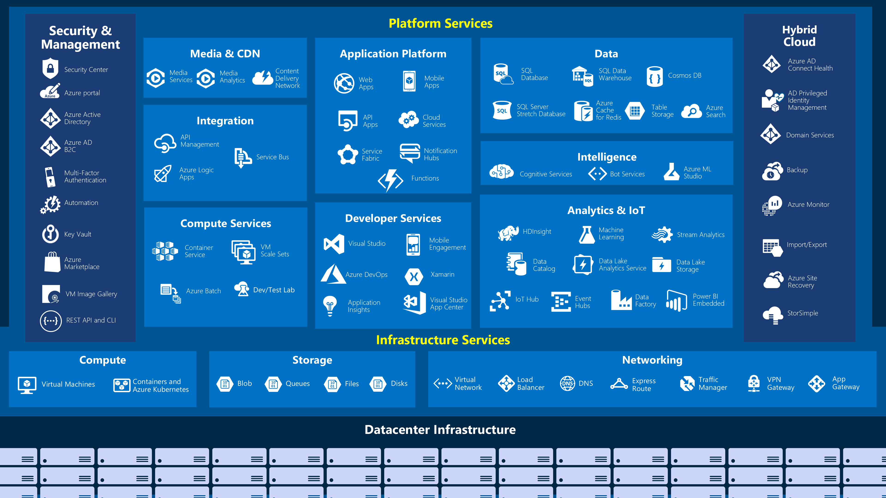

# Microsoft Azure Core Concepts

An overview of resource organization, Azure services, and access. 

#### Previous:  [Azure Fundamentals Home](../ReadMe.md)

## Azure Management and Access Terminology ##
1. [**Azure Resource Manager**](https://docs.microsoft.com/en-us/azure/azure-resource-manager/resource-group-overview)
    - Deployment and Management service for Azure
    - Enables CRUD operations of Azure resources
    - JSON templates
    - API-driven, actions may be taken via:
        - [Azure Portal](https://docs.microsoft.com/en-us/azure/azure-portal/azure-portal-overview)
        - [PowerShell](https://docs.microsoft.com/en-us/powershell/azure/overview?view=azps-2.4.0)
        - [Azure CLI](https://docs.microsoft.com/en-us/cli/azure/get-started-with-azure-cli?view=azure-cli-latest) (Windows, Mac, Linux, and Browser)
        - [REST APIs](https://docs.microsoft.com/en-us/rest/api/azure/)
        - [Client SDKs](https://azure.microsoft.com/en-us/downloads/)
        - [Automation Tools](https://docs.microsoft.com/en-us/azure/virtual-machines/windows/infrastructure-automation) (e.g. Azure DevOps, Ansible, Chef, Puppet, Terraform)
1. [**Role Based Access Control**](https://docs.microsoft.com/en-us/azure/role-based-access-control/overview) ("RBAC")
    - Manage access and permissions to Azure Resources based on roles with fine-grained control
    - Generic Roles ([Link to all built-in roles](https://docs.microsoft.com/en-us/azure/role-based-access-control/built-in-roles))
        - **Owner:** Full access
        - **Contributor:** Create and manage all resources, cannot grant access to others
        - **Reader:** Can only view resources
        - **User Access Administrator:** Can only manage access
    - Can be applied to users (accounts), groups, service accounts, or managed identity
    - Examples
        - Allow a group to manage virtual machines, and another group to manage virtual networks
        - Allow a user to manage all resources in a subscription
        - Allow group to view costs
1. [**Azure Policy**](https://docs.microsoft.com/en-us/azure/governance/policy/overview)
    - Enforce rules and effects over Azure Resources
    - Evaluate for non-compliance with standards and SLAs
    - Default allow and explicit deny
    - Example: Only deploy resource in the United States
1. [**Azure Active Directory**](https://docs.microsoft.com/en-us/azure/active-directory/fundamentals/active-directory-whatis) ("Azure AD"/"AAD")
    - Cloud-based identity and access management service
    - Can be synced to on-premise Active Directory
1. **Azure Account**
    - Azure AD account (e-mail/UPN) used to authenticate and access Azure
    - Can be associated with mulitple subscriptions
    - Can be the same credentials as on-premise AD login

## Azure Resource Hierarchy Terminology ##

1. [**Azure Resource**](https://azure.microsoft.com/en-us/services/)
    - Any entity managed by Azure
    - Example: Virtual Machine, Virtual Network, Database, Storage Account
    - Resources *must* be deployed into a Resource Group
    - Resources inherit RBAC and Policy from Resource Groups
1. [**Azure Resource Group**](https://docs.microsoft.com/en-us/azure/azure-resource-manager/resource-group-overview#resource-groups)
    - Logical container to organize and manage resources together 
    - Each resource can only be in one Resource Group, but you *can* move a resource to another Resource Group
    - Use Resource Groups for: Lifecycle Management, Project Organization, etc. 
    - Resource Groups inherit RBAC and Policy from Subscriptions
1. [**Azure Subscription**](https://docs.microsoft.com/en-us/azure/architecture/cloud-adoption/governance/resource-consistency/azure-resource-access#what-is-an-azure-subscription)
    - Logical construct that groups together resource groups and their resources
    - Each resource is associated with one subscription
    - Boundary for administration, security, policy, and billing
    - Subscriptions inherit RBAC and Policy from Management Groups
1. [**Management Group**](https://docs.microsoft.com/en-us/azure/governance/management-groups/)
    - Bulk manage access, policy, and compliance for Azure Subscriptions
    - Hierarchy of nested Management Groups and Subscriptions
    - Role Based Access Control (RBAC) inherited by child resources (Subscriptions, Resource Groups, and Resources) unless modified

### Azure Resource Hierarchy ###

### Azure Resource Inheritance ###

## Azure Services ##
### [Directory of Azure Cloud Services](https://azure.microsoft.com/en-us/services/) ###

## Next:  [Create a Resource Group](../CreateResourceGroup/CreateResourceGroup.md)

### Additional References: ###
- [Microsoft Cloud Adoption Framework](https://docs.microsoft.com/en-us/azure/architecture/cloud-adoption/)
- [AWS to Azure Service Comparison](https://docs.microsoft.com/en-us/azure/architecture/aws-professional/services)