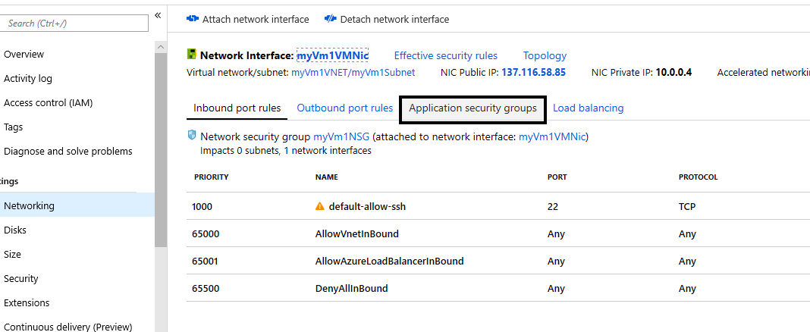

[](https://nodesource.com/products/nsolid)

[](https://travis-ci.org/joemccann/dillinger)

# Backup a VM in Azure

In this document you will learn how to:

- Create application security groups
- Create a network security group
- Create security rules
- Add security rules to existing Vm
- Test security rules

----

## Create application security groups

Create an application security group with az network asg create. An application security group enables you to group servers with similar port filtering requirements. The following example creates two application security groups.

```sh
az network asg create --resource-group AzureLab --name myAsgWebServers --location eastus2

az network asg create --resource-group AzureLab --name myAsgMgmtServers --location eastus2
```

Further documentation:  [Network Security Group]

## Create a network security group

A network security group contains security rules. Security rules specify a source and destination. Sources and destinations can be application security groups.

```sh
az network nsg create --resource-group AzureLab --name myNsg
```

----

## Create security rules

Create a security rule with az network nsg rule create. The following example creates a rule that allows traffic inbound from the internet to the myWebServers application security group over ports 80 and 443:

```sh
az network nsg rule create \
  --resource-group AzureLab \
  --nsg-name myNsg \
  --name Allow-Web-All \
  --access Allow \
  --protocol Tcp \
  --direction Inbound \
  --priority 100 \
  --source-address-prefix Internet \
  --source-port-range "*" \
  --destination-asgs "myAsgWebServers" \
  --destination-port-range 80 443
```

The following example creates a rule that allows traffic inbound from the Internet to the myMgmtServers application security group over port 22:

```sh
az network nsg rule create \
  --resource-group AzureLab \
  --nsg-name myNsg \
  --name Allow-SSH-All \
  --access Allow \
  --protocol Tcp \
  --direction Inbound \
  --priority 110 \
  --source-address-prefix Internet \
  --source-port-range "*" \
  --destination-asgs "myAsgMgmtServers" \
  --destination-port-range 22
```

## Attach security Rules to Existing VM

In the portal browse to your resource group and select Vm1, select Networking Option


Select Application Security Groups



Click on Configure Application Security Groups, Select myAsgMgmtServers


You will now see the application security groups attached to MyVm1


## Test security rules

Log into you MyVm1, let's get the IP Adress

```sh
az vm show -g AzureLab -n myVm1 -d
```

```sh
az backup job list --resource-group AzureLab --vault-name myRecoveryServicesVault --output table
```

Output should look like this:

```sh
Name      Operation        Status      Item Name    Start Time UTC       Duration
--------  ---------------  ----------  -----------  -------------------  --------------
a0a8e5e6  Backup           InProgress  myVm1         2019-09-19T03:09:21  0:00:48.718366
fe5d0414  ConfigureBackup  Completed   myVm1         2019-09-19T03:03:57  0:00:31.191807

```


[Network Security Group]: <https://docs.microsoft.com/en-us/azure/virtual-network/tutorial-filter-network-traffic-cli>

