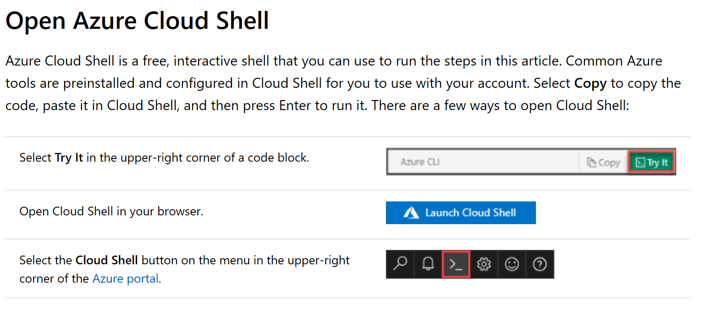

# Open Azure CLI

### Alternatively: Install Azure CLI Locally ###
The Azure CLI is a command-line tool providing a great experience for managing Azure resources. The CLI is designed
to make scripting easy, query data, support long-running operations, and more. Try it today and find out what the CLI has to offer!

* [Install on Windows](https://github.com/MicrosoftDocs/azure-docs-cli/blob/master/docs-ref-conceptual/install-azure-cli-windows.md)
* [Install on macOS](https://github.com/MicrosoftDocs/azure-docs-cli/blob/master/docs-ref-conceptual/install-azure-cli-macos.md)
* Install on Linux or [Windows Subsystem for Linux (WSL)](https://github.com/MicrosoftDocs/azure-docs-cli/blob/master/windows/wsl/about)
  * [Install with apt on Debian or Ubuntu](https://github.com/MicrosoftDocs/azure-docs-cli/blob/master/docs-ref-conceptual/install-azure-cli-apt.md)
  * [Install with yum on RHEL, Fedora, or CentOS](https://github.com/MicrosoftDocs/azure-docs-cli/blob/master/docs-ref-conceptual/install-azure-cli-yum.md)
  * [Install with zypper on openSUSE or SLE](https://github.com/MicrosoftDocs/azure-docs-cli/blob/master/docs-ref-conceptual/install-azure-cli-zypper.md)
  * [Install from script](https://github.com/MicrosoftDocs/azure-docs-cli/blob/master/docs-ref-conceptual/install-azure-cli-linux.md)
* [Run in Docker container](https://github.com/MicrosoftDocs/azure-docs-cli/blob/master/docs-ref-conceptual/run-azure-cli-docker.md)

[Next -> Create a Resource Group]

 [Next -> Create a Resource Group]:<https://github.com/Microsoft-USEduAzure/workshops/blob/master/AzureFundamentals/CreateResourceGroup/CreateResourceGroup.md>

