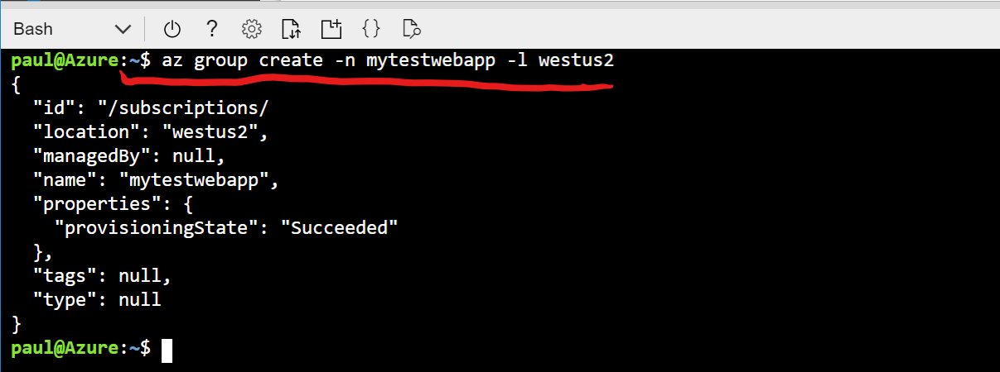

# Create Azure Resource Group

## Task: Create resource group using Azure CLI

1. In Azure Portal, open Cloud Shell

1. Execute the following command using Bash

    ```
    az group create -n <ENTER_YOUR_RESOURCE_GROUP_NAME> -l <ENTER_LOCATION_NAME>
    ```

    

## Next task: [Create Azure App Service Plan](../azure-app-service/create-azure-app-service-plan.md)