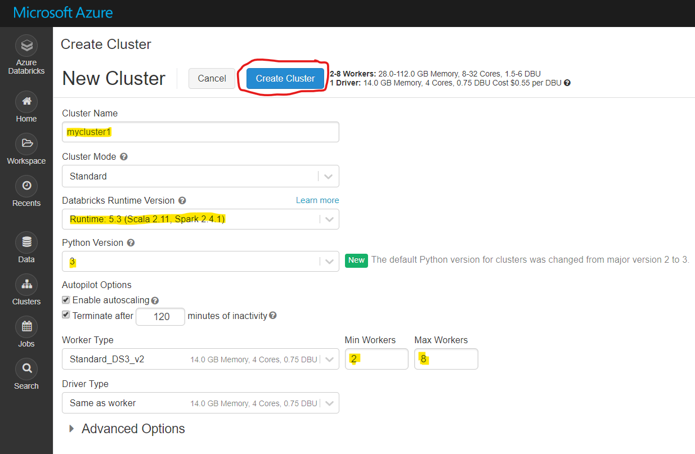
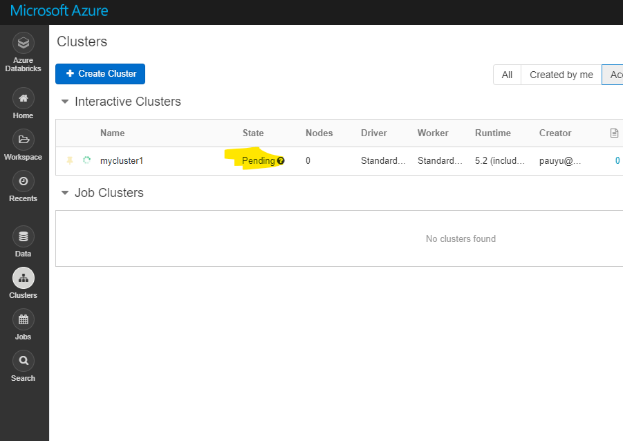

# Create Spark Cluster

## Pre-requisite task: 
- [Provision Azure Databricks](azure-databricks/provision-azure-databricks.md)

## Task: Create new Spark cluster

1. In the Databricks home page, click the **New Cluster** link under **Common Tasks**

    
    
1. Enter a cluster name, ensure the approrpriate **Databricks Runtime** and **Python** versions are selected, ensure **Terminate after** is checked and set the appropriate number of **Min** and **Max Workers**. You can default the rest of the settings. Click **Create Cluster**.

    

1. Wait for the cluster to be created.

    

## Next task: 
 - [ELT with Azure Databricks in Python](elt-python-databricks.md)
 - [ELT with Azure Databricks in SQL](elt-sql-databricks.md)