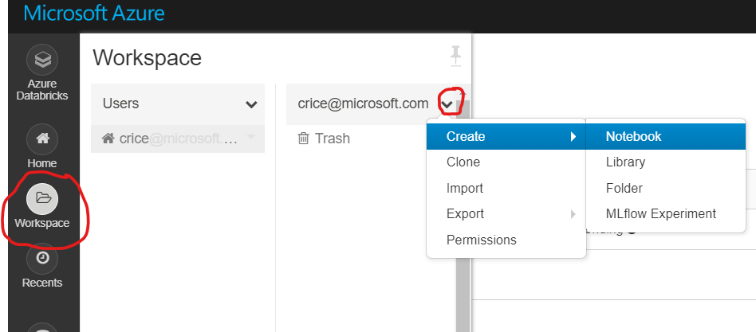
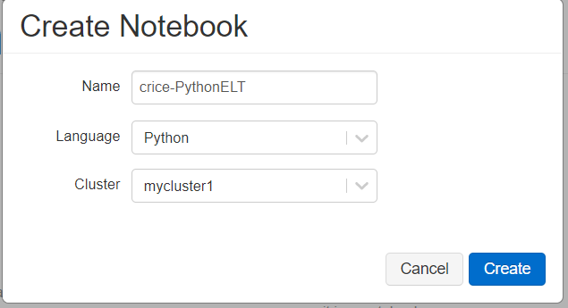

# ELT in Python with Azure Databricks

This walkthrough will familiarize yourself with extraction, loading, and transformation with Azure Databricks in Python. 

### Pre-requisites:
  
    - Create a Databricks Workspace
    
    - Create Azure SQL Databases

### Task: Create a Python Notebook

1. In the Databricks navigtation pane (on the left,) click on the **Workspace** button. Then, click the *down* arrow to expand the menu, then navigate to **Create** and **Notebook.**

1. Enter a Notebook name, select **Python** as the language and click **Create.**

### Task: Ingest from SQL Server with Python

1. Define SQL Server Connection paramters and build JDBC URL
    - **jdbcHostname:** *SQL Server Hostname*
    - **jdbcDatabase:** *Database Name*
    - **jdbcPort:** *SQL Server Port Number*
    - **jdbcUrl:** *JDBC connection string URL*
    - **username:** *SQL Server Read-access Username*
    - **password:** *Password*

    ***Note:** Ideally you would utilize **[Azure Key Vault](https://docs.azuredatabricks.net/user-guide/secrets/secret-scopes.html#akv-ssl)** or **Azure Databricks [Secret Scopes](https://docs.azuredatabricks.net/user-guide/secrets/secret-scopes.html)** to store and access secrets such as hostname, username, and password.