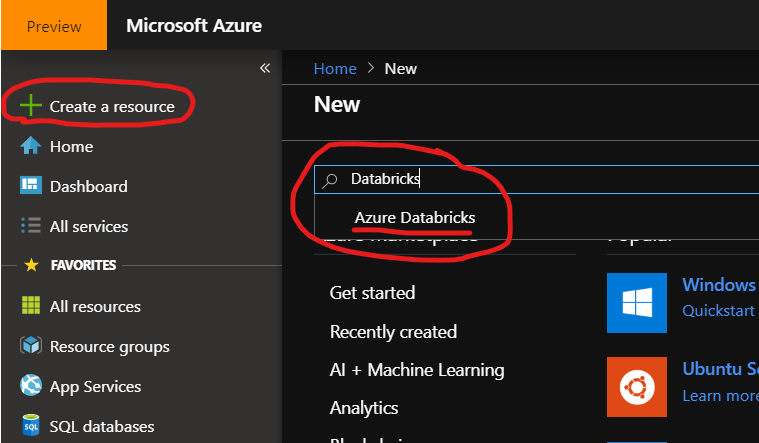
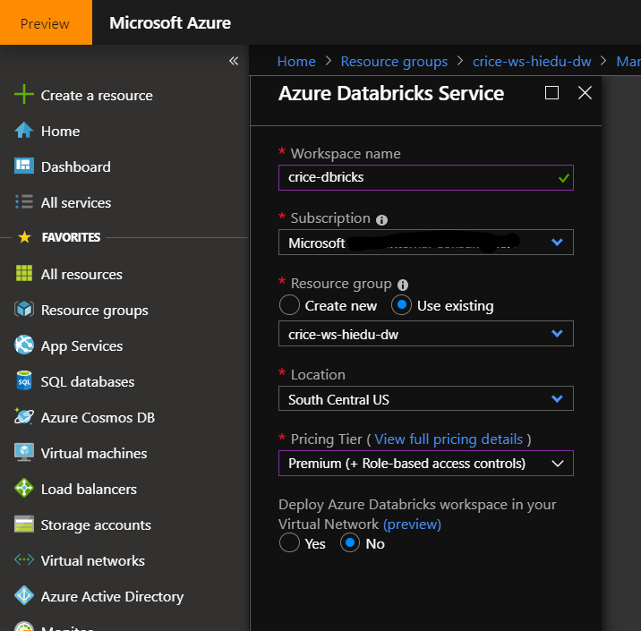
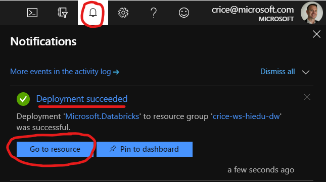
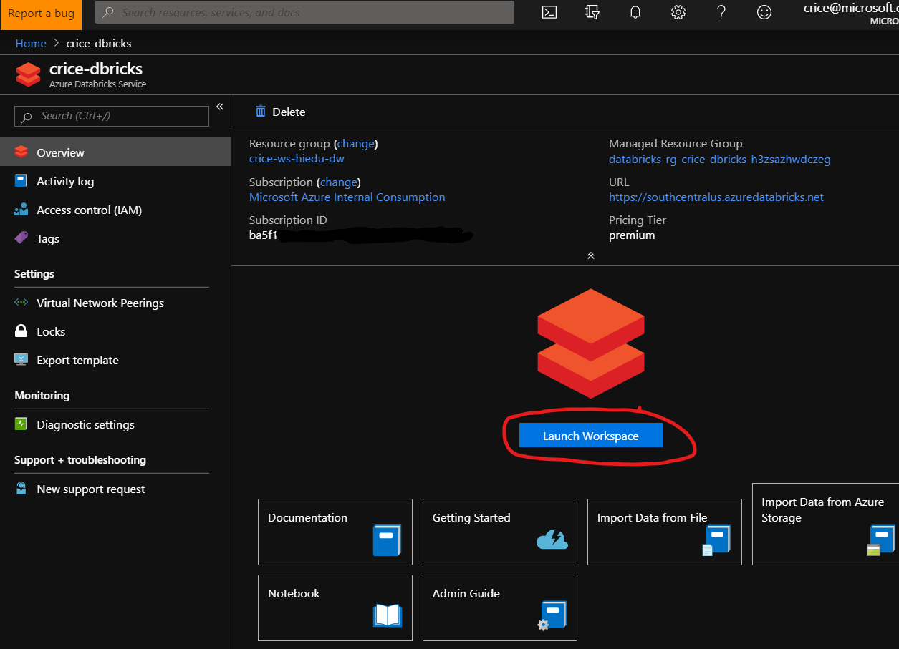

# Provision an Azure Databricks Workspace

This walkthrough will familiarize yourself with extraction, loading, and transformation with Azure Databricks in Python. 

### Task: Provision Azure Databricks Service ###

1. In the [ LINK ] Azure Portal, click the **+Create a resource** link at the top left of the screen.

1. In the *Search the Marketplace* field, type **Databricks** and select **Azure Databricks** from the list of options that appear 

1. Click **Create** button

1. Enter the following and click **Create**:
    - Workspace name: *Enter your workspace name*
    - Subscription: *Select your Azure Subscription*
    - Resource Group: *Select or Create a Resource Group* 
    - Location: *Select the Azure Region closest to your data source*
    - Pricing Tier: *Select Premium*

1. Click **Create** 
1. Check the **Notifications** icon in the upper right and wait until you see **Deployment Succeeded,** then click on the **Go to resource** button.

1. Click the **Launch Workspace** button to navigate to your Azure Databricks workspace.

## Next task: [Create Spark cluster](create-spark-cluster.md)