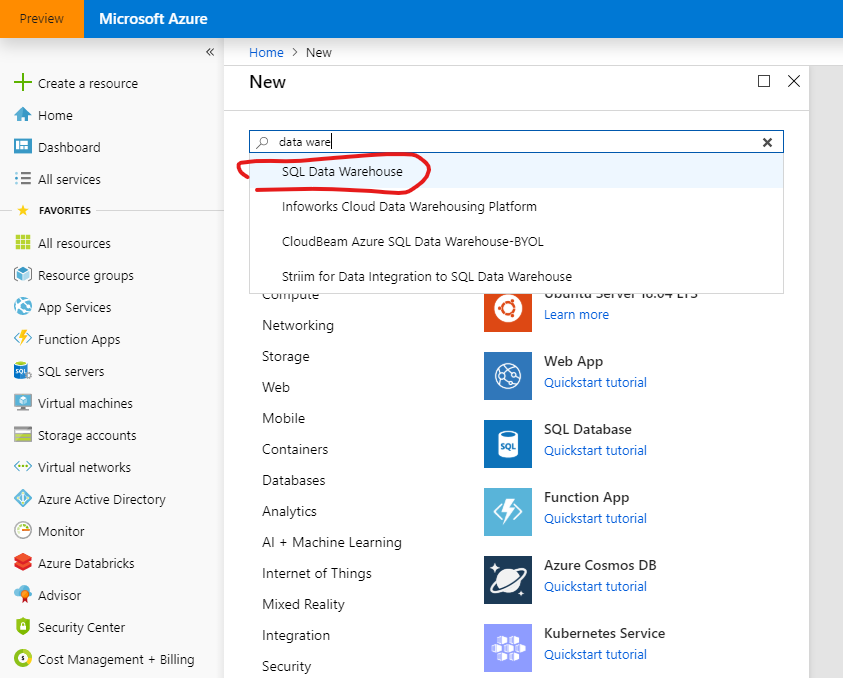
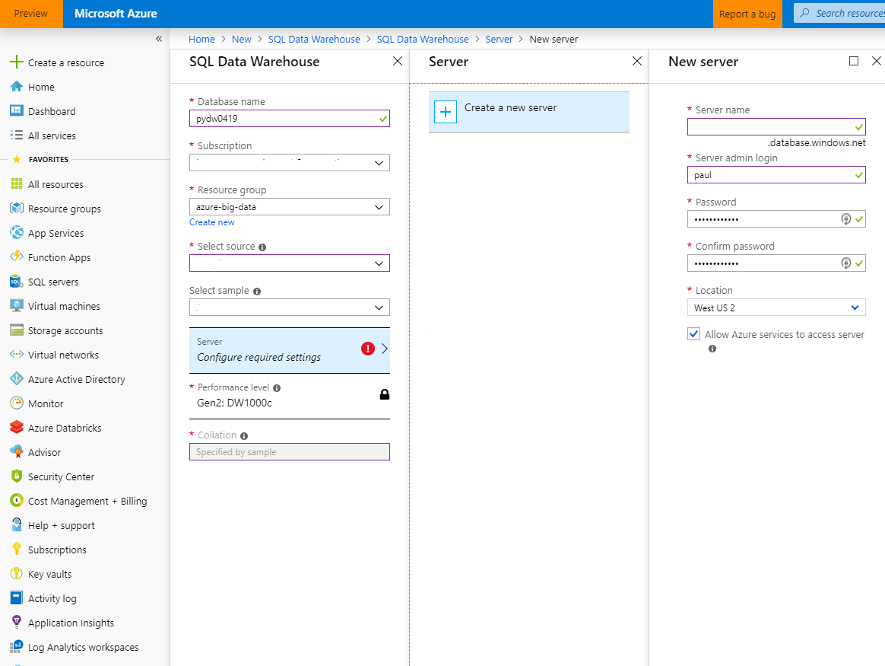
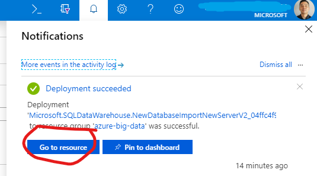
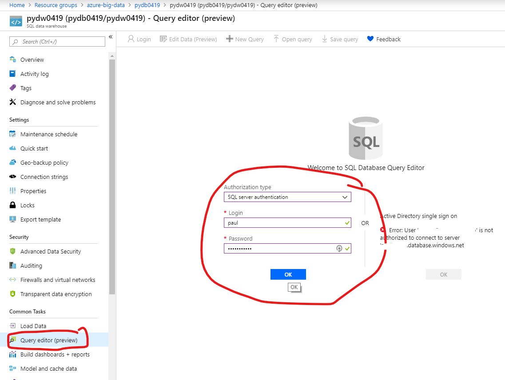
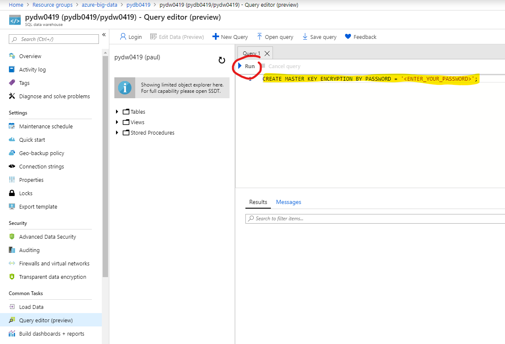
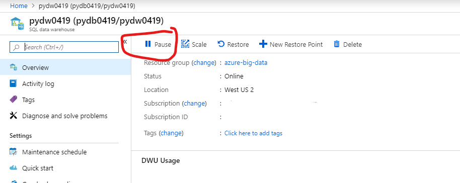

# Provision Azure SQL Data Warehouse

## Pre-requisite task: [Create Azure Resource Group](../azure-resource-group/create-resource-group.md)

## Task: Create Azure SQL Data Warehouse

### We'll be creating this resource to store our cleaned data which will be loaded from our Azure Databricks notebook.

1. In the [Azure Portal](https://portal.azure.com), click **+Create a resource** link at top left of the page.

1. In the Azure Marketplace search bar, type **data warehouse** and click on **SQL Data Warehouse** that appears in the drop down list

    

1. Click the **Create** button.

1. Enter the following and click **Create**:
    - Name: *Enter your data warehouse name*
    - Subscription: *Select your subscription*
    - Resource Group: *Select your resource group*
    - Select source: *Select Blank database*
    - Server: *Click on **Configure required settings** and click the **Create a new server** button, configure the server details then click on the **Select** button in the **New server blade**.*
        
        

    - Click the **Create** button at the bottom of the SQL Data Warehouse blade.
    
1. Check the **Notifications** icon in the upper right and wait until you see **Deployment succeeded** then click the **Go to resource** button.

    

1. Navigate to the **Query editor** blade and login using your server credentials

    

1. In the query editor, enter the following command and click the **Run** button

        CREATE MASTER KEY ENCRYPTION BY PASSWORD = '<ENTER_YOUR_PASSWORD>';
        
    

1. Make sure to click on the **Pause** button to ensure you are not being billed while the not actively working with the Data Warehouse. We'll turn this on when ready.

    

## Next task: [Create Azure Data Factory V2](../azure-data-factory-v2/provision-azure-data-factory-v2.md)
