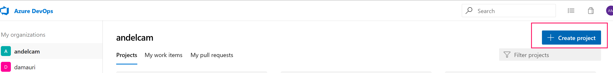
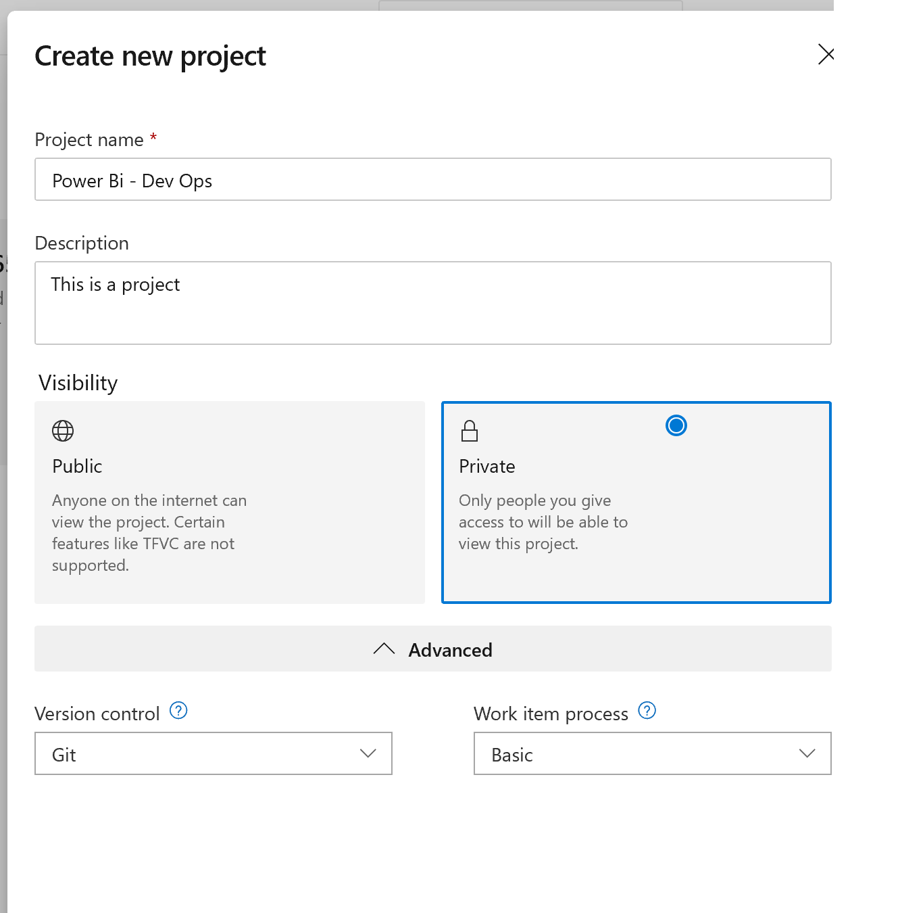

# Create an Azure DevOps Project

[Login] into your Azure DevOps Account and create a new project

 

 Select default settings

   

  Next: [Loading your Power BI Report to a Repository]
  
   [login]:https://azure.microsoft.com/en-us/services/devops/
   [Loading your Power BI Report to a Repository]:<https://github.com/Microsoft-USEduAzure/workshops/tree/master/powerbi-devops/2-CreateVisualStudioProject/ReadMe.md>
