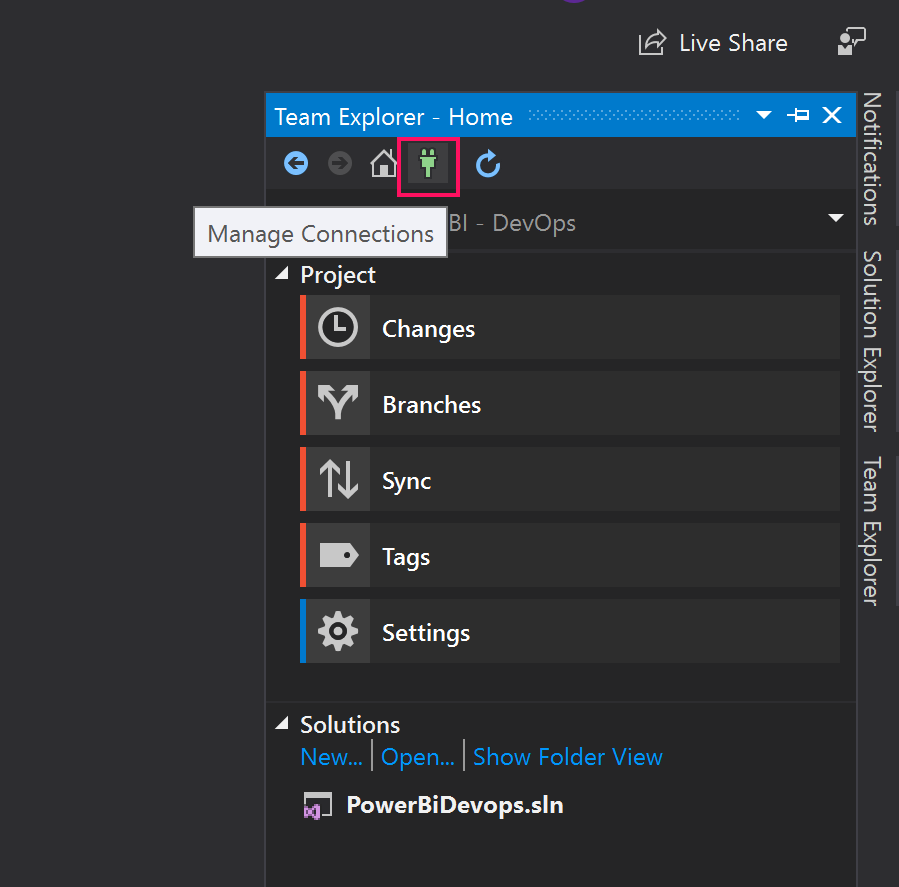
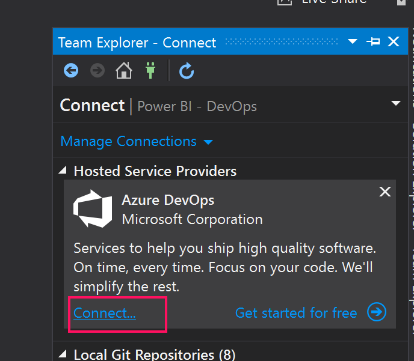
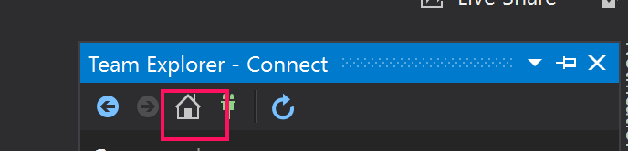
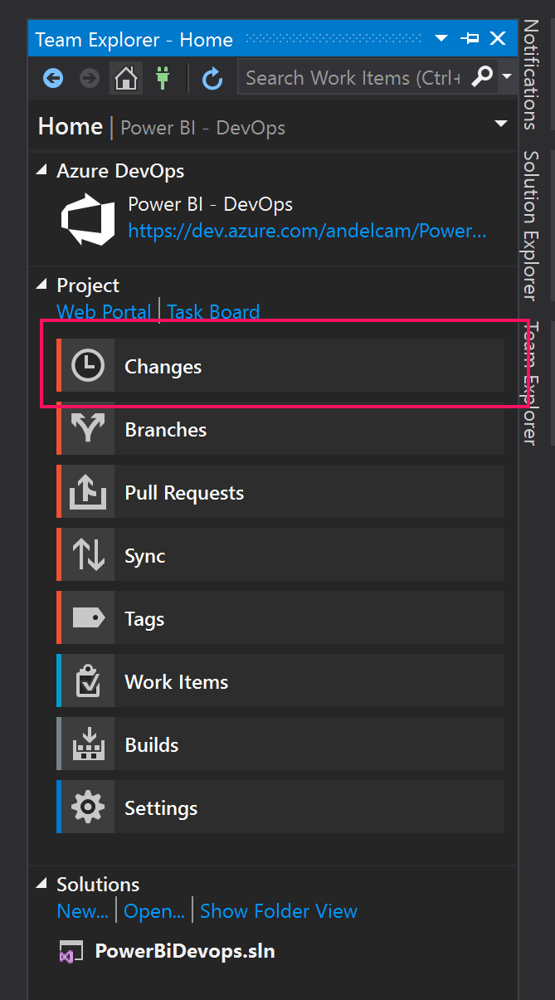
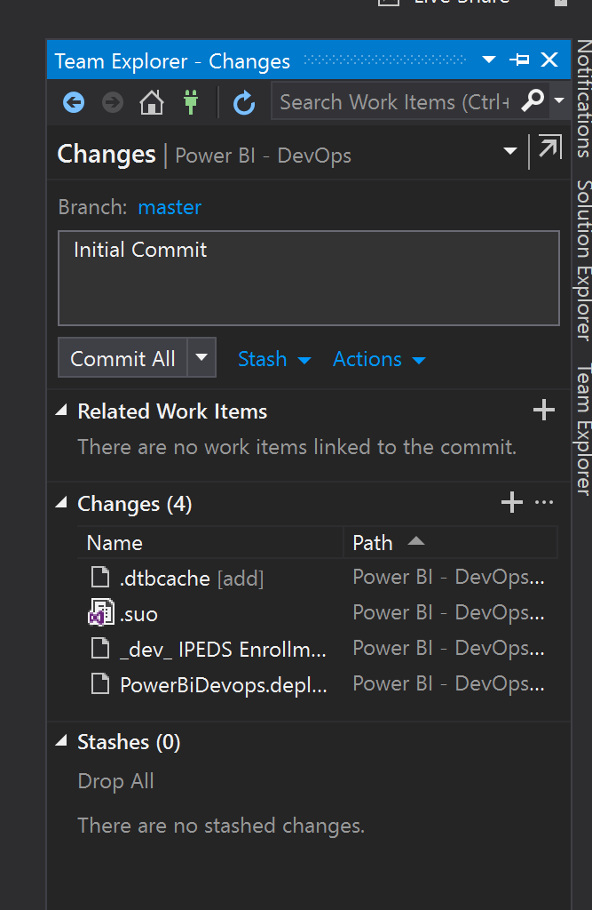
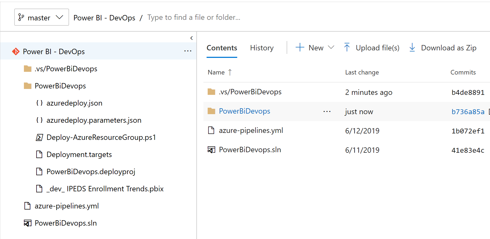

# Link Visual Studio to DevOps

## Link Accounts

Open Team Explorer and select Manage Connections

 

 Select Connect to Azure DevOps

 

## Check your code

Select the home tab for team explorer

Select changes option

on the text box, type initial commit and click on commit all

## Check out your committed files

Go back to your Azure DevOps dashboad, select your Power Bi - DevOps project and click on Repor - Files, you should see your newly checked-in files

Next: [Configure Power Bi]

[Configure Power Bi]:<https://github.com/Microsoft-USEduAzure/workshops/tree/master/powerbi-devops/4-ConfigurePowerBi/ReadMe.md>
