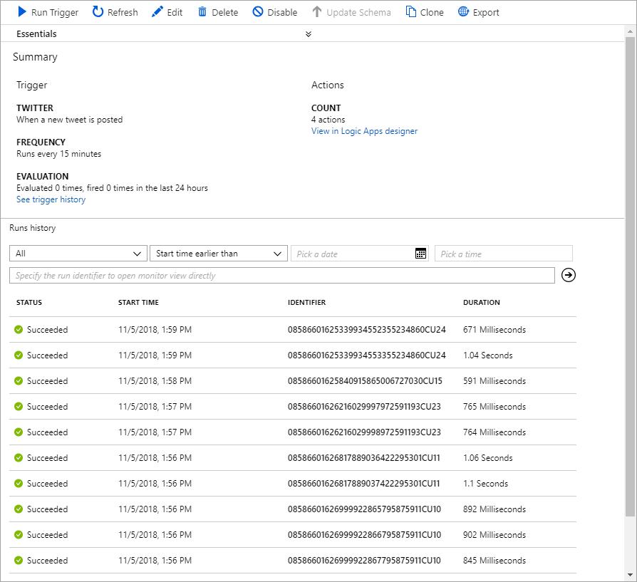
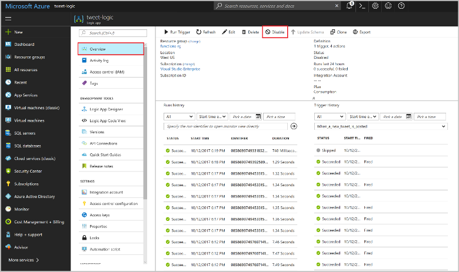

# Test the workflow

1. In the Logic App Designer, click **Run** to start the app.

2. In the left column, click **Overview** to see the status of the logic app. 
 
      

3. (Optional) Click one of the runs to see details of the execution.  
4. Go to your function, view the logs, and verify that sentiment values were received and processed.
 
    

5. When a potentially negative sentiment is detected, you receive an email. If you haven't received an email, you can change the function code to return RED every time:

    ```csharp
    return (ActionResult)new OkObjectResult("RED");
    ```

    After you have verified email notifications, change back to the original code:

    ```csharp
    return requestBody != null
        ? (ActionResult)new OkObjectResult(category)
        : new BadRequestObjectResult("Please pass a value on the query string or in the request body");
    ```

    > [!IMPORTANT]
    > After you have completed this tutorial, you should disable the logic app. By disabling the app, you avoid being charged for executions and using up the transactions in your Cognitive Services API.

Now you have seen how easy it is to integrate Functions into a Logic Apps workflow.

## Disable the logic app

To disable the logic app, click **Overview** and then click **Disable** at the top of the screen. Disabling the app stops it from running and incurring charges without deleting the app.

