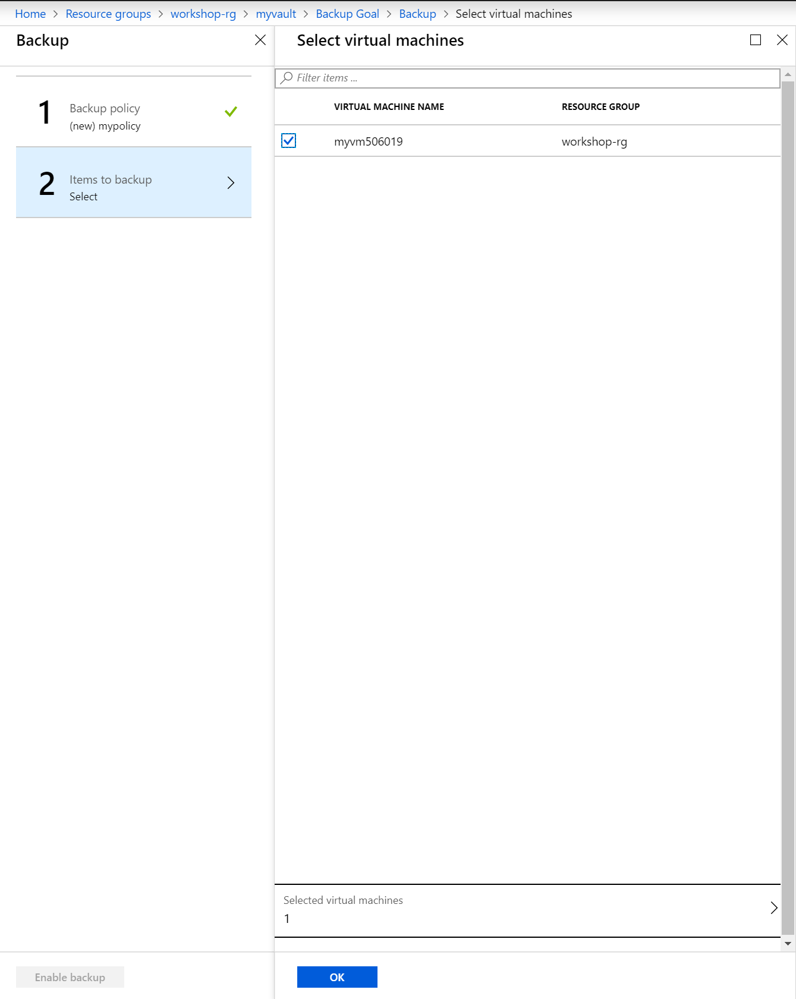

# Azure Backup

## Task: Configure Recovery Services Vault

### [Pre-requisite Task: Create Linux Virtual Machine and install NGINX web server](../azure-virtual-machine/provision-linux-vm.md)

1. In Azure Portal, click **+ Create a resource**, type *backup* in the search box, and click on *Backup and Site Recovery (OMS)*

    

1. Click the **Create** button

    

1. Enter vault name, make sure it is in the same location as your VM, and click the **Create** button

    

1. When the resource has been provisioned, click the **Go to resource** button from the notification area

    

1. In the Recovery Vault blade, click on the **Backup** button

    

1. Click the **Backup** button and configure a new backup policy

    

    

1. Select the virtual machines to backup

    

1. Back in the Recovery Vault blade, click on **Backup** again to reload the pane and click the **Backup now** button. The initial process can take several hours to complete

    

1. You can view the progress of the backup in the **Backup jobs** blade

    

1. To restore the VM from the backed up item, follow the the instructions [here](https://docs.microsoft.com/en-us/azure/backup/backup-azure-arm-restore-vms)