# Virtual Machine

## Task: Create Linux Virtual Machine and install NGINX web server

1. In Azure Portal, click **+ Create a resource** button then click on **Ubuntu Server 18.04 LTS**

    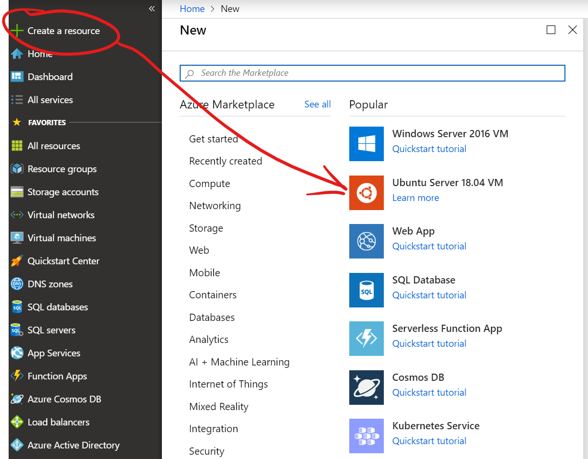

1. Configure basic VM setttings and click the **Next: Disks >** button

    - Select your resource goup

    - Select your region

    - For authentication type, use password and make sure it meets password requirements

        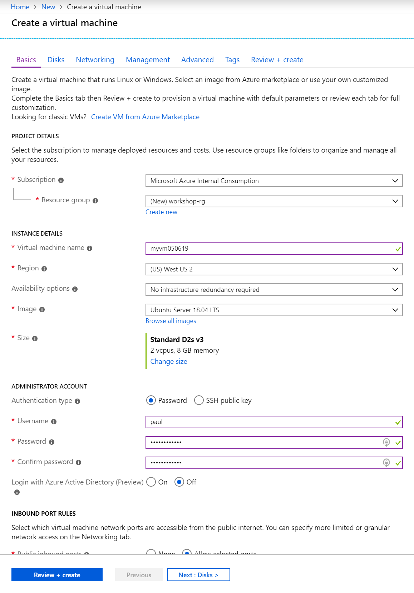

1. Configure VM disk and click the the **Next: Networking >** button

    - For OS disk type, select **Standard SSD**

        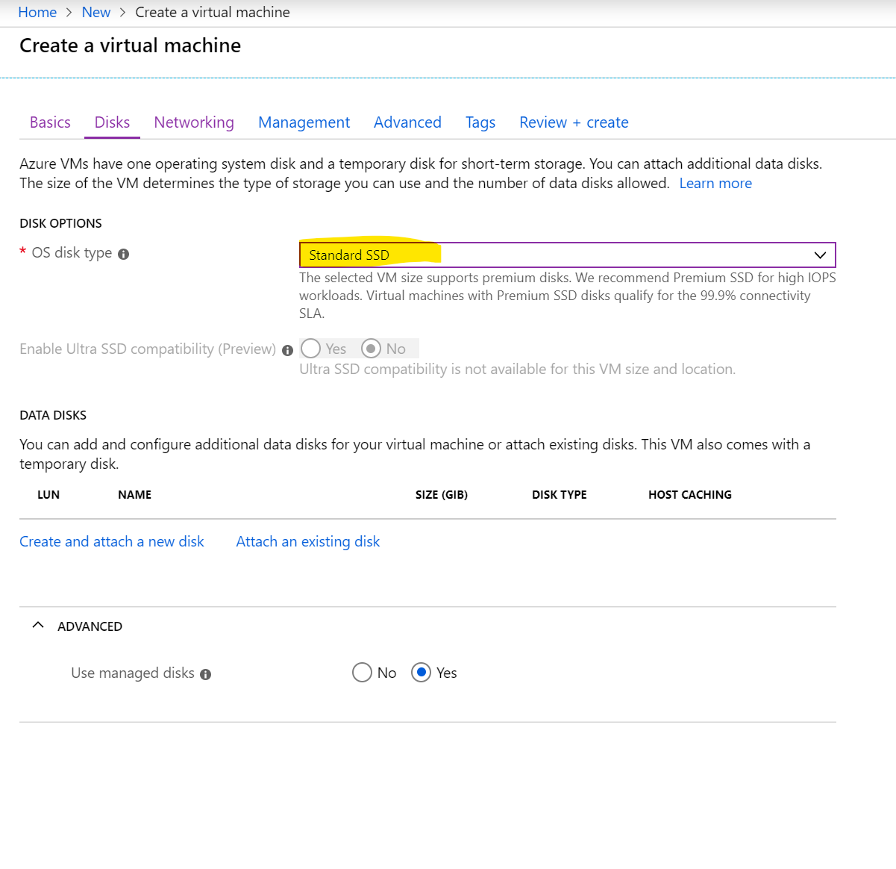

1. Configure VM networking and click the **Next: Advanced >** button

    - Keep networking defaults, but open up SSH and HTTP ports on the VM

        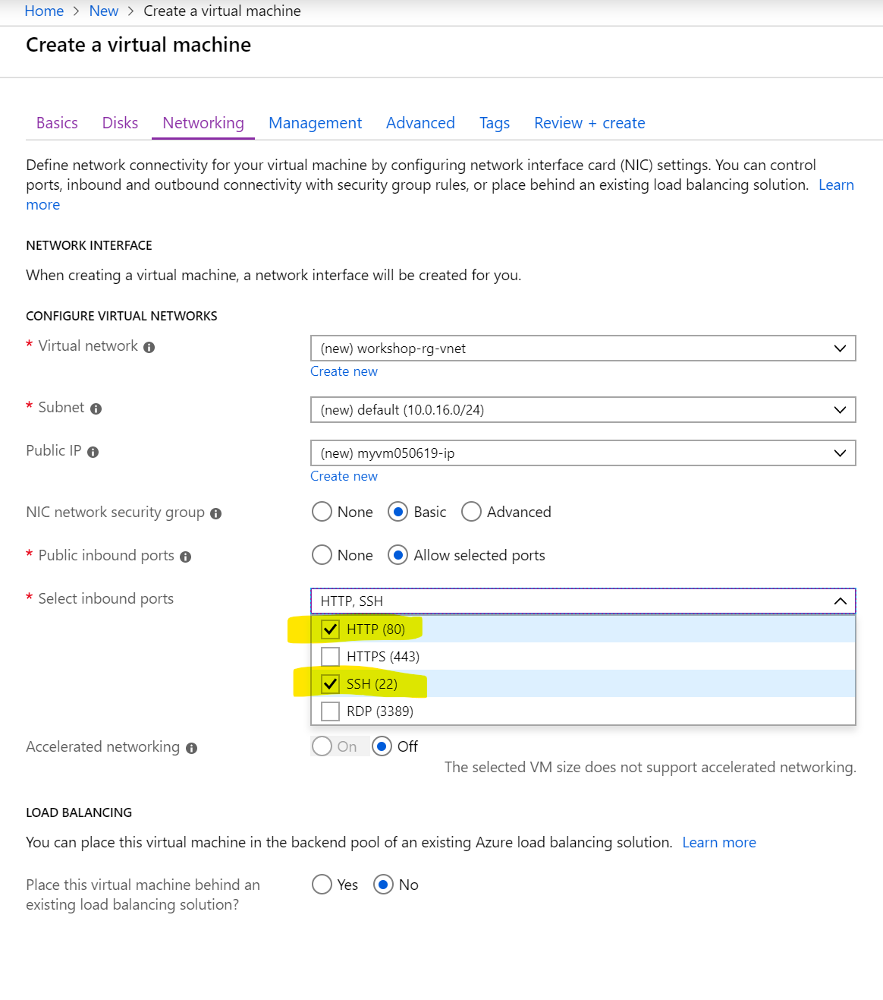

1. Configure advanced settings and click the **Review + Create >** button

    - Enable autoshutdown and configure a time. This setting is usefull for DEV/TEST environments and will deallocate machines to not incur costs

        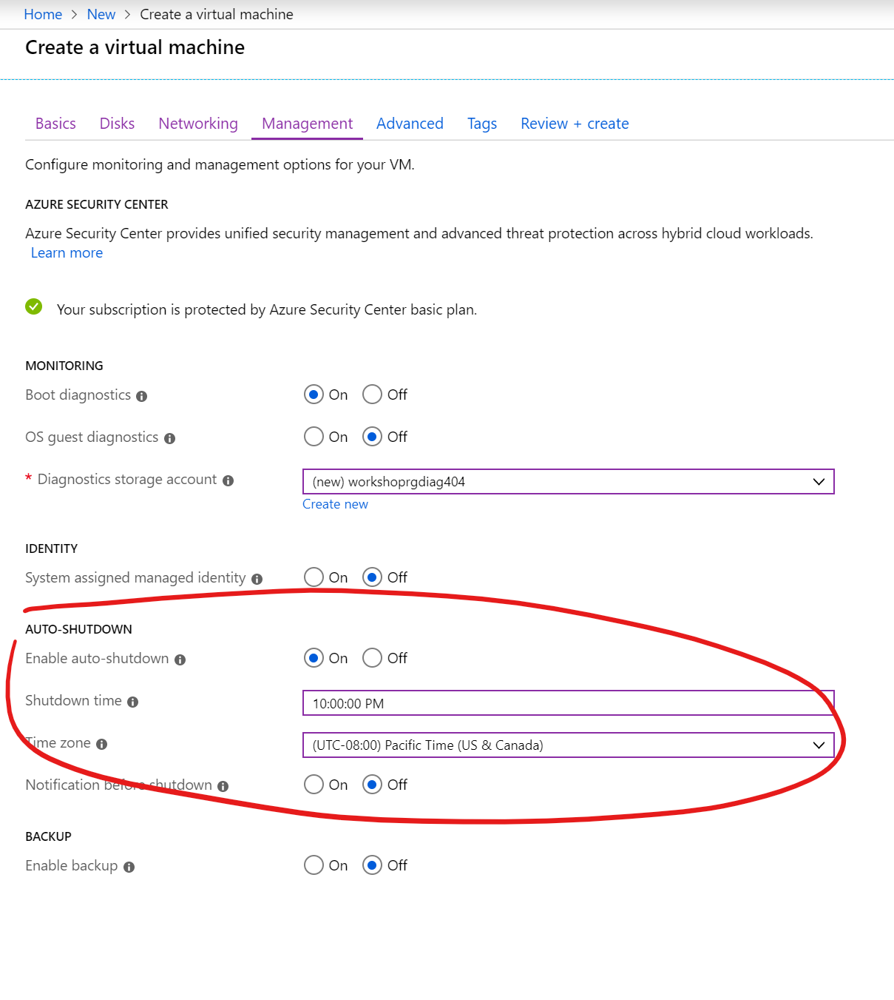

1. After VM has been created, go to the resource and note the Public IP address

1. Open Cloud Shell and connect to the VM using Bash

    ```
    ssh <user>@<publicip>
    ```

    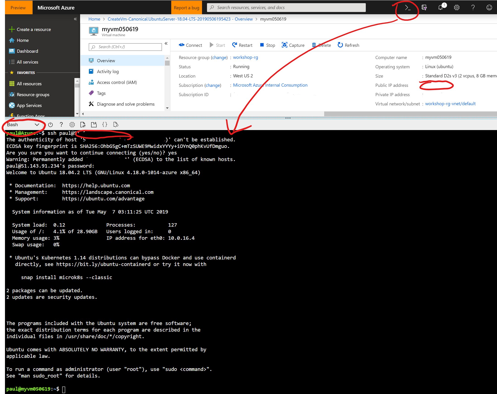

1. Install a web server on the VM by executing the following commands:

    ```
    sudo apt -y update
    sudo apt -y install nginx
    ```

1. Verfiy the web server was installed by browsing to the IP address in a web browser and you should see the following text

    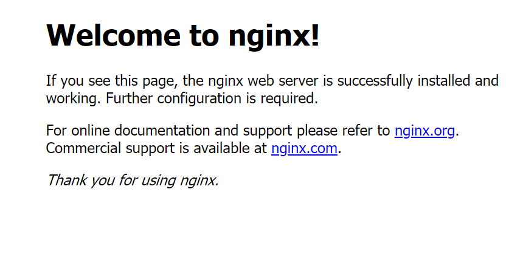

1. Navigate back to the VM blade, and click the **Disks** button

    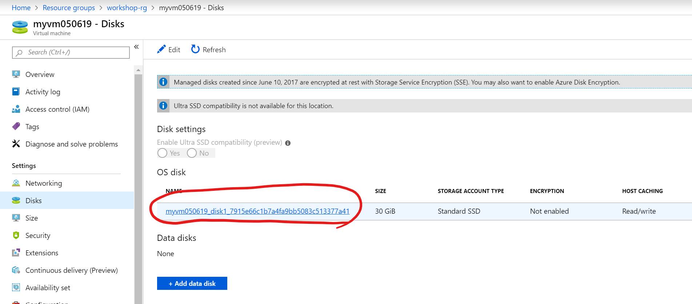

1. Click on the **Create snapshot** button

    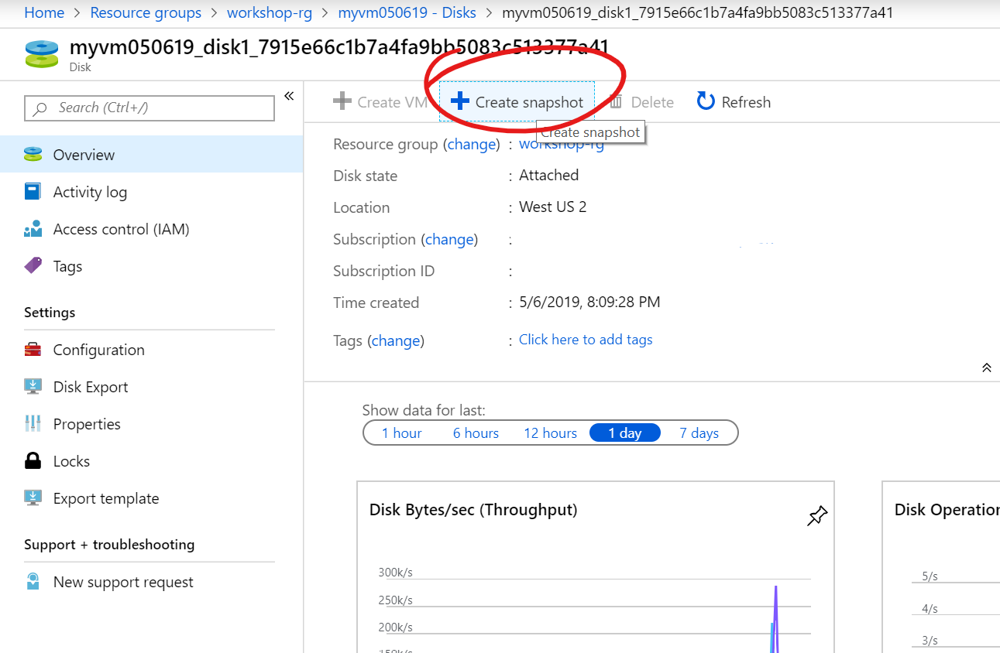

1. Enter a name for the snapshot and click **Create**

    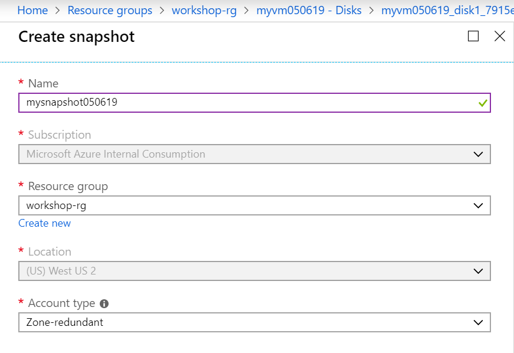

1. Using Cloud Shell, SSH back into the Linux VM and issue the following command to remove NGINX. This step is to simulate misconfiguration on the server which will be restored

    ```
    sudo apt remove nginx
    sudo reboot
    ```

1. Open a new browser in incognito mode and browse to the public IP address and verify the website is no longer responding

1. Stop the VM in Azure Portal

    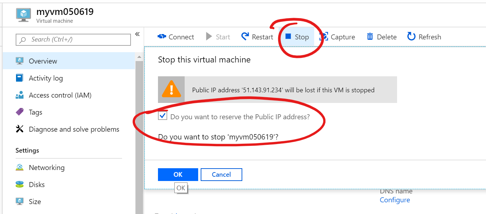

1. Using Cloud Shell and Bash AZ CLI, we'll create a new VM using the VM snapshot

    ```
    #Provide the subscription Id of the subscription where you want to create Managed Disks
    subscriptionId=<ENTER_YOUR_SUBSCRIPTION_ID>

    #Provide the name of your resource group
    resourceGroupName=<ENTER_YOUR_RESOURCE_GROUP_NAME>

    #Provide the name of the snapshot that will be used to create Managed Disks
    snapshotName=<ENTER_YOUR_SNAPSHOT_NAME>

    #Provide the name of the Managed Disk
    osDiskName=<ENTER_NEW_OS_DISK_NAME>

    #Provide the size of the disks in GB. It should be greater than the VHD file size.
    diskSize=128

    #Provide the storage type for Managed Disk. Premium_LRS or Standard_LRS.
    storageType=Standard_LRS

    #Provide the OS type
    osType=linux

    #Provide the name of the virtual machine
    virtualMachineName=<ENTER_NEW_VM_NAME>

    #Set the context to the subscription Id where Managed Disk will be created
    az account set --subscription $subscriptionId

    #Get the snapshot Id
    snapshotId=$(az snapshot show --name $snapshotName --resource-group $resourceGroupName --query [id] -o tsv)

    #Create a new Managed Disks using the snapshot Id
    az disk create --resource-group $resourceGroupName --name $osDiskName --sku $storageType --size-gb $diskSize --source $snapshotId

    #Create VM by attaching created managed disks as OS
    az vm create --name $virtualMachineName --resource-group $resourceGroupName --attach-os-disk $osDiskName --os-type $osType
    ```

    REF: https://docs.microsoft.com/en-us/azure/virtual-machines/scripts/virtual-machines-linux-cli-sample-create-vm-from-snapshot

1. After the VM has been created, navigate to the VM networking settings in Azure portal and add a new **Inbound port rule** to allow incoming traffic on port 80

    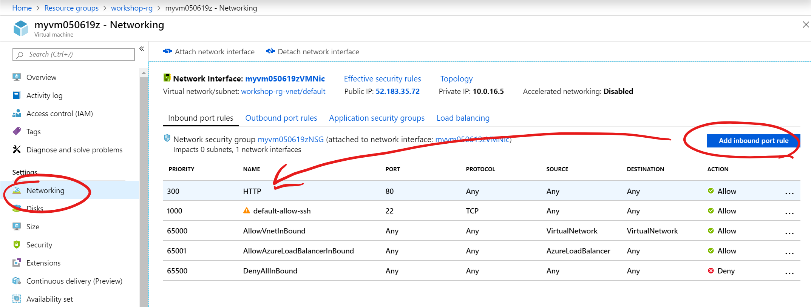

1. Open a new web browser in incognito mode and verify the NGINX web server has been restored.

## [Next Task: Configure Recovery Services Vault](../azure-backup/provision-recovery-services-vault.md)